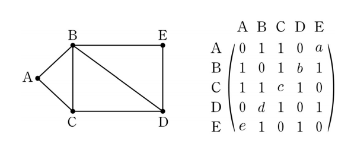

## 문제 4
그래프와 그 그래프의 각 꼭짓점 사이의 연결 관계를 나타내는 행렬이 다음과 같을 때, $a+b+c+d+e$의 값은? **[3점]**

1. 1  
2. 2  
3. 3  
4. 4  
5. 5  

### 해설
주어진 행렬은 인접 행렬로, 그래프의 각 꼭짓점 사이의 연결을 나타냅니다. 행렬의 각 항목은 해당 꼭짓점 사이의 연결이 있으면 1, 없으면 0을 나타냅니다. 

$a+b+c+d+e$를 구하기 위해서는 행렬에서 해당하는 항목들을 더하면 됩니다. 

$
a = \text{행렬의 (1,5) 위치} \\
b = \text{행렬의 (2,4) 위치} \\
c = \text{행렬의 (3,5) 위치} \\
d = \text{행렬의 (4,5) 위치} \\
e = \text{행렬의 (5,1) 위치}
$

이들 값을 모두 더하면 $a+b+c+d+e = 4$입니다. 따라서 정답은 4번입니다.

## Question 4
Given the following matrix that represents the connection relationship between the vertices of the graph, what is the value of $a+b+c+d+e$? **[3 points]**

1. 1  
2. 2  
3. 3  
4. 4  
5. 5  

## Solution
The given matrix is an adjacency matrix, representing the connections between the vertices of the graph. Each entry in the matrix indicates whether there is a connection between the corresponding vertices, with 1 indicating a connection and 0 indicating no connection.

To find $a+b+c+d+e$, we sum the relevant entries in the matrix.

$
a = \text{The entry at position (1,5) of the matrix} \\
b = \text{The entry at position (2,4) of the matrix} \\
c = \text{The entry at position (3,5) of the matrix} \\
e = \text{The entry at position (5,1) of the matrix} \\
d = \text{The entry at position (4,5) of the matrix} \\
$

Summing these values gives $a+b+c+d+e = 4$. Therefore, the correct answer is choice 4.