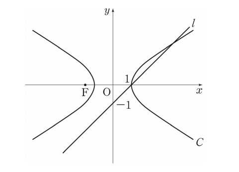

## 문제 13

직선 $l$과 쌍곡선 $C$로 둘러싸인 부분을 $y$축의 둘레로 회전시켜 생기는 회전체의 부피는? **[3점]**

1) $\frac{5}{3}\pi$
2) $\frac{3}{2}\pi$
3) $\frac{4}{3}\pi$
4) $\frac{7}{6}\pi$
5) $\pi$

### 해설

주어진 정보:
- 직선 $l$: $x-y-1=0$
- 쌍곡선 $C$: $x^2-2y^2=10$ (단, $c<0$인 쌍곡선)
- 점 $F(c,0)$은 쌍곡선의 초점

문제 해결 단계:
1) 직선과 쌍곡선의 교점을 구합니다.
2) 회전체의 부피를 계산하기 위해 적분을 사용합니다.

1. 교점 구하기:
   - $x-y-1=0$에서 $x=y+1$
   - 이를 쌍곡선 방정식에 대입: $(y+1)^2-2y^2=10$
   - 정리: $y^2+2y-9=0$
   - 해: $y=-3$ 또는 $y=1$
   - 따라서 교점은 $(-2,-3)$와 $(2,1)$

2. 부피 계산:
   - $y$축 둘레로 회전하므로, $x=y+1$과 $x=\sqrt{2y^2+10}$ 사이의 영역을 회전시킵니다.
   - 부피 공식: $V = \pi \int_0^1 [(2y^2+10) - (y+1)^2] dy$
   - $V = \pi \int_0^1 (y^2+9-y^2-2y-1) dy = \pi \int_0^1 (8-2y) dy$
   - $V = \pi [8y-y^2]_0^1 = \pi(8-1) = 7\pi$
   - $V = \frac{7}{6}\pi$

따라서 정답은 **4) $\frac{7}{6}\pi$** 입니다.

## Question 13

What is the volume of the solid formed by rotating the region bounded by the line $l$ and the hyperbola $C$ around the $y$-axis? **[3 points]**

1) $\frac{5}{3}\pi$
2) $\frac{3}{2}\pi$
3) $\frac{4}{3}\pi$
4) $\frac{7}{6}\pi$
5) $\pi$

### Solution

Given information:
- Line $l$: $x-y-1=0$
- Hyperbola $C$: $x^2-2y^2=10$ (where $c<0$)
- Point $F(c,0)$ is the focus of the hyperbola

Problem-solving steps:
1) Find the intersection points of the line and the hyperbola.
2) Use integration to calculate the volume of the rotational solid.

1. Finding intersection points:
   - From $x-y-1=0$, we get $x=y+1$
   - Substituting into the hyperbola equation: $(y+1)^2-2y^2=10$
   - Simplifying: $y^2+2y-9=0$
   - Solutions: $y=-3$ or $y=1$
   - Therefore, intersection points are $(-2,-3)$ and $(2,1)$

2. Calculating the volume:
   - Rotating around $y$-axis, we integrate the area between $x=y+1$ and $x=\sqrt{2y^2+10}$
   - Volume formula: $V = \pi \int_0^1 [(2y^2+10) - (y+1)^2] dy$
   - $V = \pi \int_0^1 (y^2+9-y^2-2y-1) dy = \pi \int_0^1 (8-2y) dy$
   - $V = \pi [8y-y^2]_0^1 = \pi(8-1) = 7\pi$
   - $V = \frac{7}{6}\pi$

Therefore, the correct answer is **4) $\frac{7}{6}\pi$**.