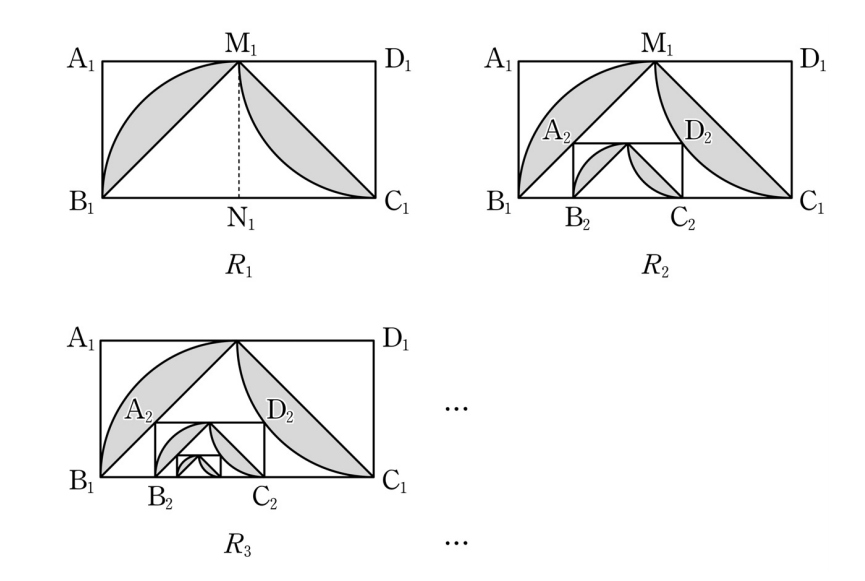

## 문제 15

직사각형 $A_1B_1C_1D_1$ 에서 $\overline{A_1D_1} = 1$, $\overline{A_1B_1} = 2$이다. 그림과 같이 선분 $A_1D_1$과 선분 $B_1C_1$의 중점을 각각 $M_1$, $N_1$이라 하자. 

중심이 $N_1$, 반지름의 길이가 $\overline{B_1N_1}$이고 중심각의 크기가 $\frac{\pi}{2}$인 부채꼴 $N_1M_1B_1$을 그리고, 중심이 $D_1$, 반지름의 길이가 $\overline{C_1D_1}$이고 중심각의 크기가 $\frac{\pi}{2}$인 부채꼴 $D_1M_1C_1$을 그린다.

부채꼴 $N_1M_1B_1$의 호 $M_1B_1$과 선분 $M_1B_1$로 둘러싸인 부분과 부채꼴 $D_1M_1C_1$의 호 $M_1C_1$와 선분 $M_1C_1$로 둘러싸인 부분을 $\bigwedge$ 모양에 색칠하여 얻은 그림을 $R_1$이라 하자.

그림 $R_1$에 선분 $M_1B_1$ 위의 점 $A_2$, 호 $M_1C_1$ 위의 점 $D_2$와 $B_1C_1$ 위의 두 점 $B_2$, $C_2$를 정사각형으로 하고 $\overline{A_2B_2} : \overline{A_2D_2} = 1 : 2$인 직사각형 $A_2B_2C_2D_2$를 그리고, 직사각형 $A_2B_2C_2D_2$에서 그림 $R_1$을 얻는 것과 같은 방법으로 만들어지는 $\bigwedge$ 모양에 색칠하여 얻은 그림을 $R_2$라 하자.

이와 같은 과정을 계속하여 $n$번째 얻은 그림 $R_n$에 색칠되어 있는 부분의 넓이를 $S_n$이라 할 때, $\lim_{n\to\infty} S_n$의 값은? [4점]

1) $\frac{25}{19}\left(\frac{\pi}{2}-1\right)$
2) $\frac{5}{4}\left(\frac{\pi}{2}-1\right)$
3) $\frac{25}{21}\left(\frac{\pi}{2}-1\right)$
4) $\frac{25}{22}\left(\frac{\pi}{2}-1\right)$
5) $\frac{25}{23}\left(\frac{\pi}{2}-1\right)$

### 해설

이 문제를 해결하기 위해 단계별로 접근해 보겠습니다.

1) 먼저, $R_1$의 넓이를 구합니다.
   - 직사각형 $A_1B_1C_1D_1$의 넓이: $2 \times 1 = 2$
   - 부채꼴 $N_1M_1B_1$의 넓이: $\frac{1}{4} \times \frac{\pi}{2} = \frac{\pi}{8}$
   - 부채꼴 $D_1M_1C_1$의 넓이: $\frac{1}{4} \times \frac{\pi}{2} = \frac{\pi}{8}$
   - $R_1$의 넓이 $S_1 = 2 - 2 \times \frac{\pi}{8} = 2 - \frac{\pi}{4}$

2) $R_2$의 넓이를 구합니다.
   - 직사각형 $A_2B_2C_2D_2$의 크기: $\frac{2}{3} \times \frac{1}{3} = \frac{2}{9}$
   - $R_2$에서 추가되는 넓이: $\frac{2}{9} \times (1 - \frac{\pi}{4}) = \frac{2}{9} - \frac{\pi}{18}$

3) 일반화하여 $R_n$의 넓이를 구합니다.
   - $n$번째 직사각형의 크기: $(\frac{2}{3})^n \times (\frac{1}{3})^n = (\frac{2}{9})^n$
   - $R_n$에서 추가되는 넓이: $(\frac{2}{9})^n \times (1 - \frac{\pi}{4})$

4) 전체 넓이의 합을 구합니다.
   $S_n = (2 - \frac{\pi}{4}) + (1 - \frac{\pi}{4})(\frac{2}{9} + (\frac{2}{9})^2 + ... + (\frac{2}{9})^{n-1})$

5) $n$이 무한대로 갈 때의 극한값을 구합니다.
   $\lim_{n\to\infty} S_n = (2 - \frac{\pi}{4}) + (1 - \frac{\pi}{4}) \times \frac{\frac{2}{9}}{1-\frac{2}{9}} = (2 - \frac{\pi}{4}) + (1 - \frac{\pi}{4}) \times \frac{2}{7} = \frac{25}{7} - \frac{25\pi}{28} = \frac{25}{7}(1 - \frac{\pi}{4}) = \frac{25}{28}(4 - \pi) = \frac{25}{21}(\frac{\pi}{2} - 1)$

따라서, 정답은 **3) $\frac{25}{21}(\frac{\pi}{2}-1)$** 입니다.

## Question 15

In a rectangle $A_1B_1C_1D_1$, $\overline{A_1D_1} = 1$ and $\overline{A_1B_1} = 2$. As shown in the figure, let $M_1$ and $N_1$ be the midpoints of segments $A_1D_1$ and $B_1C_1$ respectively.

Draw a sector $N_1M_1B_1$ with center $N_1$, radius $\overline{B_1N_1}$, and central angle $\frac{\pi}{2}$, and a sector $D_1M_1C_1$ with center $D_1$, radius $\overline{C_1D_1}$, and central angle $\frac{\pi}{2}$.

Let $R_1$ be the figure obtained by shading the $\bigwedge$-shaped areas enclosed by the arc $M_1B_1$ and segment $M_1B_1$ of sector $N_1M_1B_1$, and the arc $M_1C_1$ and segment $M_1C_1$ of sector $D_1M_1C_1$.

On figure $R_1$, draw a rectangle $A_2B_2C_2D_2$ where point $A_2$ is on segment $M_1B_1$, point $D_2$ is on arc $M_1C_1$, points $B_2$ and $C_2$ are on $B_1C_1$, forming a square, and $\overline{A_2B_2} : \overline{A_2D_2} = 1 : 2$. Let $R_2$ be the figure obtained by shading the $\bigwedge$-shaped area in rectangle $A_2B_2C_2D_2$ using the same method as in $R_1$.

Continuing this process, let $S_n$ be the area of the shaded part in the $n$-th figure $R_n$. What is the value of $\lim_{n\to\infty} S_n$? [4 points]

1) $\frac{25}{19}\left(\frac{\pi}{2}-1\right)$
2) $\frac{5}{4}\left(\frac{\pi}{2}-1\right)$
3) $\frac{25}{21}\left(\frac{\pi}{2}-1\right)$
4) $\frac{25}{22}\left(\frac{\pi}{2}-1\right)$
5) $\frac{25}{23}\left(\frac{\pi}{2}-1\right)$

### Solution

Let's approach this problem step by step:

1) First, calculate the area of $R_1$:
   - Area of rectangle $A_1B_1C_1D_1$: $2 \times 1 = 2$
   - Area of sector $N_1M_1B_1$: $\frac{1}{4} \times \frac{\pi}{2} = \frac{\pi}{8}$
   - Area of sector $D_1M_1C_1$: $\frac{1}{4} \times \frac{\pi}{2} = \frac{\pi}{8}$
   - Area of $R_1$: $S_1 = 2 - 2 \times \frac{\pi}{8} = 2 - \frac{\pi}{4}$

2) Calculate the area of $R_2$:
   - Size of rectangle $A_2B_2C_2D_2$: $\frac{2}{3} \times \frac{1}{3} = \frac{2}{9}$
   - Additional area in $R_2$: $\frac{2}{9} \times (1 - \frac{\pi}{4}) = \frac{2}{9} - \frac{\pi}{18}$

3) Generalize to find the area of $R_n$:
   - Size of the $n$-th rectangle: $(\frac{2}{3})^n \times (\frac{1}{3})^n = (\frac{2}{9})^n$
   - Additional area in $R_n$: $(\frac{2}{9})^n \times (1 - \frac{\pi}{4})$

4) Sum up the total area:
   $S_n = (2 - \frac{\pi}{4}) + (1 - \frac{\pi}{4})(\frac{2}{9} + (\frac{2}{9})^2 + ... + (\frac{2}{9})^{n-1})$

5) Find the limit as $n$ approaches infinity:
   $\lim_{n\to\infty} S_n = (2 - \frac{\pi}{4}) + (1 - \frac{\pi}{4}) \times \frac{\frac{2}{9}}{1-\frac{2}{9}} = (2 - \frac{\pi}{4}) + (1 - \frac{\pi}{4}) \times \frac{2}{7} = \frac{25}{7} - \frac{25\pi}{28} = \frac{25}{7}(1 - \frac{\pi}{4}) = \frac{25}{28}(4 - \pi) = \frac{25}{21}(\frac{\pi}{2} - 1)$

Therefore, the correct answer is **3) $\frac{25}{21}(\frac{\pi}{2}-1)$**.