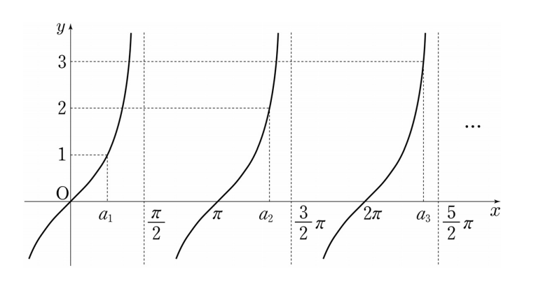

## 문제 18
자연수 $n$에 대하여 직선 $y=n$과 함수 $y=\tan x$의 그래프가 제1사분면에서 만나는 점의 $x$좌표를 작은 수부터 크기순으로 나열할 때, $n$번째 수를 $a_n$이라 하자.

$\lim_{n\to\infty}\frac{a_n}{n}$의 값은? **[4점]**

1) $\frac{\pi}{4}$
2) $\frac{\pi}{2}$
3) $\frac{3}{4}\pi$
4) $\pi$
5) $\frac{5}{4}\pi$

### 해설
1) 그래프를 통해 $a_1, a_2, a_3$의 값을 확인할 수 있습니다:
   $a_1 < \frac{\pi}{2}$, $\frac{\pi}{2} < a_2 < \frac{3\pi}{2}$, $\frac{3\pi}{2} < a_3 < \frac{5\pi}{2}$

2) 일반적으로, $\frac{(2n-1)\pi}{2} < a_n < \frac{(2n+1)\pi}{2}$ 입니다.

3) 이 부등식을 $n$으로 나누면:
   $\frac{(2n-1)\pi}{2n} < \frac{a_n}{n} < \frac{(2n+1)\pi}{2n}$

4) $n$이 무한대로 갈 때의 극한을 구하면:
   $\lim_{n\to\infty}\frac{(2n-1)\pi}{2n} = \lim_{n\to\infty}\frac{(2n+1)\pi}{2n} = \pi$

5) 따라서 샌드위치 정리에 의해:
   $\lim_{n\to\infty}\frac{a_n}{n} = \pi$

정답은 **4) $\pi$** 입니다.

## Question 18
For a natural number $n$, let $a_n$ be the $n$-th $x$-coordinate of the intersection points between the line $y=n$ and the function $y=\tan x$ in the first quadrant, arranged in ascending order.

What is the value of $\lim_{n\to\infty}\frac{a_n}{n}$? **[4 points]**

1) $\frac{\pi}{4}$
2) $\frac{\pi}{2}$
3) $\frac{3}{4}\pi$
4) $\pi$
5) $\frac{5}{4}\pi$

### Solution
1) From the graph, we can observe the values of $a_1, a_2, a_3$:
   $a_1 < \frac{\pi}{2}$, $\frac{\pi}{2} < a_2 < \frac{3\pi}{2}$, $\frac{3\pi}{2} < a_3 < \frac{5\pi}{2}$

2) In general, $\frac{(2n-1)\pi}{2} < a_n < \frac{(2n+1)\pi}{2}$

3) Dividing this inequality by $n$:
   $\frac{(2n-1)\pi}{2n} < \frac{a_n}{n} < \frac{(2n+1)\pi}{2n}$

4) Taking the limit as $n$ approaches infinity:
   $\lim_{n\to\infty}\frac{(2n-1)\pi}{2n} = \lim_{n\to\infty}\frac{(2n+1)\pi}{2n} = \pi$

5) Therefore, by the squeeze theorem:
   $\lim_{n\to\infty}\frac{a_n}{n} = \pi$

The correct answer is **4) $\pi$**.