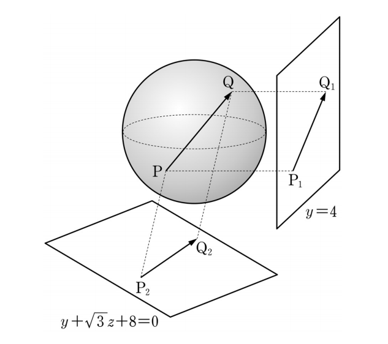

## 문제 29
좌표공간에서 구 $x^2+y^2+z^2=4$ 위를 움직이는 두 점 P, Q가 있다. 두 점 P, Q에서 평면 $y=4$에 내린 수선의 발을 각각 $P_1$, $Q_1$이라 하고, 평면 $y+\sqrt{3}z+8=0$에 내린 수선의 발을 각각 $P_2$, $Q_2$라 하자. $2|\overline{PQ}|^2-|\overline{P_1Q_1}|^2-|\overline{P_2Q_2}|^2$의 최댓값을 구하시오. **[4점]**

### 해설

1) 구의 방정식 $x^2+y^2+z^2=4$에서 구의 반지름은 2이다.

2) 평면 $y=4$와 $y+\sqrt{3}z+8=0$은 서로 수직이다. (내적이 0)

3) $\overline{PQ}$의 최대 길이는 구의 지름인 4이다.

4) $\overline{P_1Q_1}$은 $y=4$ 평면 위의 선분이므로, $\overline{PQ}$를 이 평면에 정사영한 것이다.
   $\overline{P_2Q_2}$도 마찬가지로 $y+\sqrt{3}z+8=0$ 평면 위의 선분이다.

5) 피타고라스 정리에 의해:
   $|\overline{PQ}|^2 = |\overline{P_1Q_1}|^2 + |\overline{P_2Q_2}|^2 + |\overline{P_3Q_3}|^2$
   여기서 $\overline{P_3Q_3}$는 두 평면에 모두 수직인 방향의 선분이다.

6) 따라서:
   $2|\overline{PQ}|^2-|\overline{P_1Q_1}|^2-|\overline{P_2Q_2}|^2 = |\overline{PQ}|^2 + |\overline{P_3Q_3}|^2$

7) 이 값의 최댓값은 $\overline{PQ}$가 최대일 때, 즉 4일 때 발생한다.

8) 최댓값 = $4^2 + 4^2 = 32$

따라서 최댓값은 32이다.

## Question 29
In the coordinate space, there are two points P and Q moving on the sphere $x^2+y^2+z^2=4$. Let $P_1$, $Q_1$ be the feet of the perpendiculars drawn from points P, Q to the plane $y=4$, and $P_2$, $Q_2$ be the feet of the perpendiculars to the plane $y+\sqrt{3}z+8=0$. Find the maximum value of $2|\overline{PQ}|^2-|\overline{P_1Q_1}|^2-|\overline{P_2Q_2}|^2$. **[4 points]**

### Solution

1) From the equation of the sphere $x^2+y^2+z^2=4$, the radius of the sphere is 2.

2) The planes $y=4$ and $y+\sqrt{3}z+8=0$ are perpendicular to each other. (Their dot product is 0)

3) The maximum length of $\overline{PQ}$ is the diameter of the sphere, which is 4.

4) $\overline{P_1Q_1}$ is a line segment on the plane $y=4$, so it's the orthogonal projection of $\overline{PQ}$ onto this plane.
   Similarly, $\overline{P_2Q_2}$ is on the plane $y+\sqrt{3}z+8=0$.

5) By the Pythagorean theorem:
   $|\overline{PQ}|^2 = |\overline{P_1Q_1}|^2 + |\overline{P_2Q_2}|^2 + |\overline{P_3Q_3}|^2$
   where $\overline{P_3Q_3}$ is the line segment perpendicular to both planes.

6) Therefore:
   $2|\overline{PQ}|^2-|\overline{P_1Q_1}|^2-|\overline{P_2Q_2}|^2 = |\overline{PQ}|^2 + |\overline{P_3Q_3}|^2$

7) This value is maximized when $\overline{PQ}$ is at its maximum, which is 4.

8) Maximum value = $4^2 + 4^2 = 32$

Thus, the maximum value is 32.