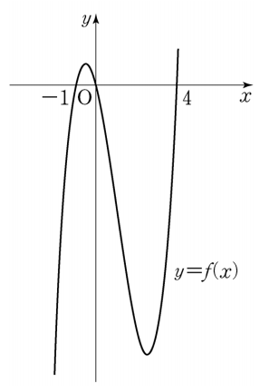

## [13~14] 함수 $ f(x) = x(x+1)(x-4) $에 대하여 13번과 14번의 두 물음에 답하시오.

## 문제 13
행렬 $ A = \begin{pmatrix} 2 & 1 \\ 0 & 3 \end{pmatrix} $에 대하여 $ A \begin{pmatrix} 0 \\ f(a) \end{pmatrix} = \begin{pmatrix} 0 \\ 0 \end{pmatrix} $을 만족시키는 모든 상수 $ a $의 값의 합은? **[3점]**

1. 1  
2. 2  
3. 3  
4. 4  
5. 5  

### 해설
주어진 문제에서 행렬 방정식 $ A \begin{pmatrix} 0 \\ f(a) \end{pmatrix} = \begin{pmatrix} 0 \\ 0 \end{pmatrix} $을 만족시키는 $ a $를 구해야 합니다.

1. 행렬 $ A $를 적용하면, 
    $
    A \begin{pmatrix} 0 \\ f(a) \end{pmatrix} = \begin{pmatrix} 2 & 1 \\ 0 & 3 \end{pmatrix} \begin{pmatrix} 0 \\ f(a) \end{pmatrix} = \begin{pmatrix} f(a) \\ 3f(a) \end{pmatrix}
    $
    이 식이 $ \begin{pmatrix} 0 \\ 0 \end{pmatrix} $과 같아야 하므로, $ f(a) = 0 $이 되어야 합니다.

2. 함수 $ f(x) = x(x+1)(x-4) $의 근을 구합니다.
    $
    f(x) = 0 \quad \text{일 때} \quad x(x+1)(x-4) = 0
    $
    따라서, $ x = 0, -1, 4 $입니다.

3. 이 값들의 합은 $ 0 + (-1) + 4 = 3 $입니다.

정답은 **3번: 3**입니다.

## Question 13
Given the matrix $ A = \begin{pmatrix} 2 & 1 \\ 0 & 3 \end{pmatrix} $, find the sum of all values of the constant $ a $ that satisfy $ A \begin{pmatrix} 0 \\ f(a) \end{pmatrix} = \begin{pmatrix} 0 \\ 0 \end{pmatrix} $. **[3 points]**

1. 1  
2. 2  
3. 3  
4. 4  
5. 5  

### Solution
To solve this problem, we need to find the values of $ a $ that satisfy the matrix equation $ A \begin{pmatrix} 0 \\ f(a) \end{pmatrix} = \begin{pmatrix} 0 \\ 0 \end{pmatrix} $.

1. Applying matrix $ A $ gives us:
    $
    A \begin{pmatrix} 0 \\ f(a) \end{pmatrix} = \begin{pmatrix} 2 & 1 \\ 0 & 3 \end{pmatrix} \begin{pmatrix} 0 \\ f(a) \end{pmatrix} = \begin{pmatrix} f(a) \\ 3f(a) \end{pmatrix}
    $
    For this to equal $ \begin{pmatrix} 0 \\ 0 \end{pmatrix} $, $ f(a) $ must be 0.

2. Solve for the roots of the function $ f(x) = x(x+1)(x-4) $:
    $
    f(x) = 0 \quad \text{gives us} \quad x(x+1)(x-4) = 0
    $
    So, the roots are $ x = 0, -1, 4 $.

3. The sum of these values is $ 0 + (-1) + 4 = 3 $.

The correct answer is **3: 3**.
