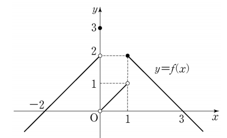

## 문제 8  
함수 $y = f(x)$의 그래프가 그림과 같다.  

$\lim\limits_{x \to -0} f(x) + \lim\limits_{x \to 1+0} f(x)$의 값은? **[3점]**

1. 1  
2. 2  
3. 3  
4. 4  
5. 5  

### 해설  
주어진 함수 $y = f(x)$의 그래프를 보고 $\lim\limits_{x \to -0} f(x)$과 $\lim\limits_{x \to 1+0} f(x)$의 값을 계산해봅시다.

1. $\lim\limits_{x \to -0} f(x)$은 $x = 0$에 왼쪽에서 접근할 때의 함수값을 의미합니다. 그래프에서 $x \to 0^-$일 때, $f(x) = 2$입니다.
   
2. $\lim\limits_{x \to 1+0} f(x)$은 $x = 1$에 오른쪽에서 접근할 때의 함수값을 의미합니다. 그래프에서 $x \to 1^+$일 때, $f(x) = 1$입니다.
   
3. 따라서, $\lim\limits_{x \to -0} f(x) + \lim\limits_{x \to 1+0} f(x) = 2 + 1 = 3$입니다.

정답은 **3번: 3** 입니다.

## Question 8  
The graph of the function $y = f(x)$ is shown.  

What is the value of $\lim\limits_{x \to -0} f(x) + \lim\limits_{x \to 1+0} f(x)$? **[3 points]**

1. 1  
2. 2  
3. 3  
4. 4  
5. 5  

## Solution  
Let's evaluate the limits based on the graph of the function $y = f(x)$.

1. $\lim\limits_{x \to -0} f(x)$ represents the function value as $x$ approaches $0$ from the left. According to the graph, as $x \to 0^-$, $f(x) = 2$.
   
2. $\lim\limits_{x \to 1+0} f(x)$ represents the function value as $x$ approaches $1$ from the right. According to the graph, as $x \to 1^+$, $f(x) = 1$.
   
3. Therefore, $\lim\limits_{x \to -0} f(x) + \lim\limits_{x \to 1+0} f(x) = 2 + 1 = 3$.

The correct answer is **3: 3**.
