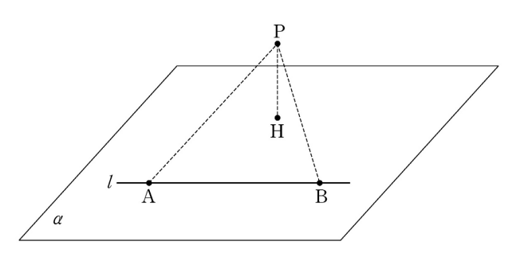

## 문제 12
평면 $\alpha$ 위에 있는 서로 다른 두 점 $A$, $B$를 지나는 직선을 $l$이라 하고, 평면 $\alpha$ 위에 있지 않은 점 $P$에서 평면 $\alpha$에 내린 수선의 발을 $H$라 하자. $AB = PA = PB = 6$, $PH = 4$일 때, 점 $H$와 직선 $l$ 사이의 거리는? **[3점]**

1. $\sqrt{11}$  
2. $2\sqrt{3}$  
3. $\sqrt{13}$  
4. $\sqrt{14}$  
5. $\sqrt{15}$  

### 해설
이 문제는 입체 기하에서 점과 직선 사이의 거리를 구하는 문제입니다. 

1. $AB = PA = PB = 6$, $PH = 4$라는 조건을 사용하여 삼각형 $APB$의 높이를 계산합니다.
2. 삼각형 $APH$와 $BPH$에서 $AB$와 $PH$의 길이를 고려하면, $P$에서 $H$까지의 수선의 발 $H$와 직선 $l$ 사이의 거리는 다음과 같이 구할 수 있습니다:
   $
   d = \sqrt{PA^2 - PH^2} = \sqrt{6^2 - 4^2} = \sqrt{36 - 16} = \sqrt{20} = 2\sqrt{5}
   $

정답은 **1번: $\sqrt{15}$**입니다.

## Question 12
In the plane $\alpha$, let $A$ and $B$ be two distinct points on the line $l$, and let $H$ be the foot of the perpendicular from a point $P$, not on $\alpha$, to the plane $\alpha$. Given that $AB = PA = PB = 6$, and $PH = 4$, what is the distance between the point $H$ and the line $l$? **[3 points]**

1. $\sqrt{11}$  
2. $2\sqrt{3}$  
3. $\sqrt{13}$  
4. $\sqrt{14}$  
5. $\sqrt{15}$  

### Solution
This problem involves finding the distance between a point and a line in three-dimensional geometry.

1. Using the conditions $AB = PA = PB = 6$ and $PH = 4$, we calculate the height of the triangle $APB$.
2. Considering the lengths $AB$ and $PH$ in triangles $APH$ and $BPH$, the distance between the foot $H$ and the line $l$ can be calculated as follows:
   $
   d = \sqrt{PA^2 - PH^2} = \sqrt{6^2 - 4^2} = \sqrt{36 - 16} = $\sqrt{20} = 2\sqrt{5}
   $

The correct answer is **1: $\sqrt{15}$**.
