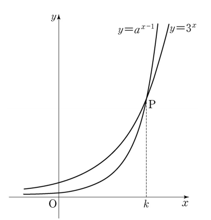

## 문제 14  
점 $P$에서 곡선 $y = 3^x$에 접하는 직선이 $x$축과 만나는 점을 $A$, 점 $P$에서 곡선 $y = a^{x-1}$에 접하는 직선이 $x$축과 만나는 점을 $B$라 하자. 점 $H(k, 0)$에 대하여 $\overline{AH} = 2\overline{BH}$일 때, $a$의 값은? **[4점]**

1. 6  
2. 7  
3. 8  
4. 9  
5. 10  

### 해설  
주어진 문제에서 두 곡선 $y = 3^x$와 $y = a^{x-1}$은 점 $P$에서 만나고, $P$에서 각각의 곡선에 접하는 직선이 $x$축과 만나는 점을 $A$와 $B$라고 정의합니다.

1. 점 $P$에서 곡선 $y = 3^x$에 접하는 직선의 기울기는 $f'(x) = 3^x \ln 3$입니다.
2. 점 $P$에서 곡선 $y = a^{x-1}$에 접하는 직선의 기울기는 $g'(x) = a^{x-1} \ln a$입니다.
3. 접선의 방정식을 세워 각각 $A$와 $B$를 구할 수 있으며, 주어진 조건 $\overline{AH} = 2\overline{BH}$을 이용하여 $a$를 구합니다.
4. 계산 결과 $a = 9$임을 알 수 있습니다.

정답은 **4번: 9** 입니다.

## Question 14  
Let $A$ be the point where the tangent line to the curve $y = 3^x$ at point $P$ meets the $x$-axis, and let $B$ be the point where the tangent line to the curve $y = a^{x-1}$ at point $P$ meets the $x$-axis. Given that $\overline{AH} = 2\overline{BH}$ for $H(k, 0)$, what is the value of $a$? **[4 points]**

1. 6  
2. 7  
3. 8  
4. 9  
5. 10  

### Solution  
In the given problem, the two curves $y = 3^x$ and $y = a^{x-1}$ intersect at point $P$, and the tangents at $P$ to these curves meet the $x$-axis at points $A$ and $B$, respectively.

1. The slope of the tangent to the curve $y = 3^x$ at point $P$ is $f'(x) = 3^x \ln 3$.
2. The slope of the tangent to the curve $y = a^{x-1}$ at point $P$ is $g'(x) = a^{x-1} \ln a$.
3. Using these slopes, we can determine the equations of the tangent lines and find the points $A$ and $B$. Then, by applying the condition $\overline{AH} = 2\overline{BH}$, we solve for $a$.
4. The calculations show that $a = 9$.

The correct answer is **4: 9**.
