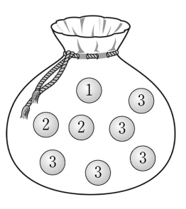

## 문제 18
주머니 속에 $1$의 숫자가 적혀 있는 공 $1$개, $2$의 숫자가 적혀 있는 공 $2$개, $3$의 숫자가 적혀 있는 공 $5$개가 들어있다. 이 주머니에서 임의로 $1$개의 공을 꺼내어 공에 적혀있는 수를 확인한 후 다시 넣는다. 이와 같은 시행을 $2$번 반복할 때, 꺼낸 공에 적혀 있는 수의 평균을 $\overline{X}$라 하자. $P(\overline{X} = 2)$의 값은? **[4점]**

1. $\frac{5}{32}$  
2. $\frac{11}{64}$  
3. $\frac{3}{16}$  
4. $\frac{13}{64}$  
5. $\frac{7}{32}$  

### 해설  
주머니 속의 공들은 숫자 $1$, $2$, $3$이 각각 $1$, $2$, $5$개 들어있습니다. 이들 공을 꺼내어 수를 확인한 후 다시 넣는 과정을 $2$번 반복할 때, 평균 $\overline{X}$가 $2$가 되는 경우의 수를 구해봅시다.

1. 우선 각 숫자가 선택될 확률은 다음과 같습니다:
   - $P(1) = \frac{1}{8}$
   - $P(2) = \frac{2}{8} = \frac{1}{4}$
   - $P(3) = \frac{5}{8}$

2. $\overline{X} = 2$가 되는 경우는 다음과 같습니다:
   - $1, 3$ 또는 $3, 1$: 평균이 $2$가 됩니다.
   - $2, 2$: 평균이 $2$가 됩니다.

3. 각 경우에 대한 확률을 계산하면:
   - $P(1, 3)$ 또는 $P(3, 1)$: $2 \times \frac{1}{8} \times \frac{5}{8} = \frac{5}{32}$
   - $P(2, 2)$: $\frac{1}{4} \times \frac{1}{4} = \frac{1}{16}$

4. 따라서 $P(\overline{X} = 2)$는 $P(1, 3) + P(3, 1) + P(2, 2) = \frac{5}{32} + \frac{1}{16} = \frac{5}{32} + \frac{2}{32} = \frac{7}{32}$이 됩니다.

정답은 **5번: $\frac{7}{32}$**입니다.

## Question 18 
A bag contains $1$ ball with the number $1$, $2$ balls with the number $2$, and $5$ balls with the number $3$. One ball is randomly drawn from the bag, the number on it is noted, and then the ball is placed back in the bag. This process is repeated $2$ times. Let $\overline{X}$ be the average of the numbers on the drawn balls. What is the value of $P(\overline{X} = 2)$? **[4 points]**

1. $\frac{5}{32}$  
2. $\frac{11}{64}$  
3. $\frac{3}{16}$  
4. $\frac{13}{64}$  
5. $\frac{7}{32}$  

### Solution  
The bag contains balls labeled with the numbers $1$, $2$, and $3$, with $1$, $2$, and $5$ balls respectively. We need to calculate the probability that the average $\overline{X}$ of the numbers on the drawn balls equals $2$ after repeating the process twice.

1. The probabilities of drawing each number are as follows:
   - $P(1) = \frac{1}{8}$
   - $P(2) = \frac{2}{8} = \frac{1}{4}$
   - $P(3) = \frac{5}{8}$

2. The average $\overline{X} = 2$ can occur in the following cases:
   - Drawing $1$ and $3$, or $3$ and $1$: The average is $2$.
   - Drawing $2$ and $2$: The average is $2$.

3. Calculating the probability for each case:
   - $P(1, 3)$ or $P(3, 1)$: $2 \times \frac{1}{8} \times \frac{5}{8} = \frac{5}{32}$
   - $P(2, 2)$: $\frac{1}{4} \times \frac{1}{4} = \frac{1}{16}$

4. Therefore, $P(\overline{X} = 2)$ is $P(1, 3) + P(3, 1) + P(2, 2) = \frac{5}{32} + \frac{1}{16} = \frac{5}{32} + \frac{2}{32} = \frac{7}{32}$.

The correct answer is **5: $\frac{7}{32}$**.
