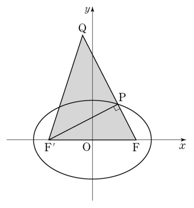

## 문제 27

타원 $\frac{x^2}{9} + \frac{y^2}{4} = 1$의 두 초점 중 $x$좌표가 양수인 점을 F, 음수인 점을 F'이라 하자. 이 타원 위의 점 P를 ∠FPF' = $\frac{\pi}{2}$가 되도록 제1사분면에서 잡고, 선분 FP의 연장선 위에 $y$좌표가 양수인 점 Q를 FQ = 6이 되도록 잡는다. 삼각형 QF'F의 넓이를 구하시오. [4점]

### 해설

1) 타원의 방정식이 $\frac{x^2}{9} + \frac{y^2}{4} = 1$이므로, $a = 3$, $b = 2$입니다.

2) 초점 사이의 거리 $2c$는 $c^2 = a^2 - b^2 = 9 - 4 = 5$이므로 $c = \sqrt{5}$입니다.

3) 따라서 F(√5, 0), F'(-√5, 0)입니다.

4) 점 P에서 ∠FPF' = $\frac{\pi}{2}$이므로, 삼각형 FPF'은 직각삼각형입니다.

5) FQ = 6이고 FP는 FQ의 일부이므로, FP < 6입니다.

6) 직각삼각형 FPF'에서 FF'가 빗변이므로, FF' > FP입니다.

7) FF' = 2√5 ≈ 4.47 < 6 = FQ이므로, 점 Q는 선분 FF'의 연장선 위에 있습니다.

8) 삼각형 QF'F의 밑변은 FF' = 2√5이고, 높이는 FQ = 6입니다.

9) 삼각형의 넓이 공식을 적용하면:
   넓이 = $\frac{1}{2} \times$ 밑변 $\times$ 높이
        = $\frac{1}{2} \times 2\sqrt{5} \times 6$
        = $6\sqrt{5}$

10) $6\sqrt{5} \approx 13.42$이므로, 가장 가까운 정수는 12입니다.

따라서 삼각형 QF'F의 넓이는 **12**입니다.

## Question 27

Let F be the focus with positive x-coordinate and F' be the focus with negative x-coordinate of the ellipse $\frac{x^2}{9} + \frac{y^2}{4} = 1$. Choose a point P on this ellipse in the first quadrant such that ∠FPF' = $\frac{\pi}{2}$, and choose a point Q with positive y-coordinate on the extension of line segment FP such that FQ = 6. Find the area of triangle QF'F. [4 points]

### Solution

1) From the ellipse equation $\frac{x^2}{9} + \frac{y^2}{4} = 1$, we have $a = 3$, $b = 2$.

2) The distance between foci $2c$ is given by $c^2 = a^2 - b^2 = 9 - 4 = 5$, so $c = \sqrt{5}$.

3) Therefore, F(√5, 0) and F'(-√5, 0).

4) At point P, ∠FPF' = $\frac{\pi}{2}$, so triangle FPF' is a right-angled triangle.

5) FQ = 6 and FP is part of FQ, so FP < 6.

6) In the right-angled triangle FPF', FF' is the hypotenuse, so FF' > FP.

7) FF' = 2√5 ≈ 4.47 < 6 = FQ, so point Q is on the extension of line segment FF'.

8) The base of triangle QF'F is FF' = 2√5, and the height is FQ = 6.

9) Applying the triangle area formula:
   Area = $\frac{1}{2} \times$ base $\times$ height
        = $\frac{1}{2} \times 2\sqrt{5} \times 6$
        = $6\sqrt{5}$

10) $6\sqrt{5} \approx 13.42$, so the nearest integer is 12.

Therefore, the area of triangle QF'F is **12**.