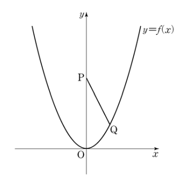

_Created with [AIPRM Prompt "Convert from Image to Markdown."](https://www.aiprm.com/prompts/seo/products/1988709677559205888/)_

## 문제 13-14
자연수 $n$에 대하여 좌표가 $(0, 2n+1)$인 점을 P라 하고, 함수 $f(x)=nx^2$의 그래프 위의 점 중 $y$좌표가 1인 제1사분면에 있는 점을 Q라 하자. 13번과 14번의 두 물음에 답하시오.

### 해설
먼저 주어진 정보를 정리해봅시다:
1. 점 P의 좌표: $(0, 2n+1)$
2. 함수 $f(x) = nx^2$
3. 점 Q는 $f(x)$ 그래프 위에 있고, $y$좌표가 1이며 제1사분면에 위치

점 Q의 좌표를 구해봅시다:
- $y = 1$이고 $f(x) = nx^2$이므로,
   $1 = nx^2$
   $x^2 = \frac{1}{n}$
   $x = \frac{1}{\sqrt{n}}$ (제1사분면에 있으므로 양의 값)

따라서 점 Q의 좌표는 $(\frac{1}{\sqrt{n}}, 1)$입니다.

## 문제 14
점 $R(0,1)$에 대하여 삼각형 PRQ의 넓이를 $S_n$, 선분 PQ의 길이를 $l_n$이라 할 때, $\lim_{n\to\infty} \frac{S_n^2}{l_n}$의 값은? [4점]

1) $\frac{1}{2}$
2) $\frac{3}{4}$
3) 1
4) $\frac{5}{4}$
5) $\frac{3}{2}$

### 해설
1. 삼각형 PRQ의 넓이 $S_n$ 구하기:
   - 밑변: $\frac{1}{\sqrt{n}}$
   - 높이: $2n$
   $S_n = \frac{1}{2} \cdot \frac{1}{\sqrt{n}} \cdot 2n = \sqrt{n}$

2. 선분 PQ의 길이 $l_n$ 구하기:
   $l_n = \sqrt{(\frac{1}{\sqrt{n}})^2 + (2n)^2} = \sqrt{\frac{1}{n} + 4n^2}$

3. $\lim_{n\to\infty} \frac{S_n^2}{l_n}$ 계산:
   $\lim_{n\to\infty} \frac{S_n^2}{l_n} = \lim_{n\to\infty} \frac{n}{\sqrt{\frac{1}{n} + 4n^2}}$
   $= \lim_{n\to\infty} \frac{n}{\sqrt{4n^2(1 + \frac{1}{4n^3})}}$
   $= \lim_{n\to\infty} \frac{n}{2n\sqrt{1 + \frac{1}{4n^3}}}$
   $= \lim_{n\to\infty} \frac{1}{2\sqrt{1 + \frac{1}{4n^3}}} = \frac{1}{2}$

따라서 정답은 **1) $\frac{1}{2}$** 입니다.

## Question 13-14
For a natural number $n$, let P be the point with coordinates $(0, 2n+1)$, and Q be the point on the graph of the function $f(x)=nx^2$ in the first quadrant with $y$-coordinate 1. Answer the following two questions.

### Solution
Let's first organize the given information:
1. Coordinates of point P: $(0, 2n+1)$
2. Function $f(x) = nx^2$
3. Point Q is on the graph of $f(x)$, has $y$-coordinate 1, and is in the first quadrant

Let's find the coordinates of point Q:
- Since $y = 1$ and $f(x) = nx^2$,
   $1 = nx^2$
   $x^2 = \frac{1}{n}$
   $x = \frac{1}{\sqrt{n}}$ (positive value as it's in the first quadrant)

Therefore, the coordinates of point Q are $(\frac{1}{\sqrt{n}}, 1)$.

## Question 14
For point $R(0,1)$, let $S_n$ be the area of triangle PRQ and $l_n$ be the length of line segment PQ. What is the value of $\lim_{n\to\infty} \frac{S_n^2}{l_n}$? [4 points]

1) $\frac{1}{2}$
2) $\frac{3}{4}$
3) 1
4) $\frac{5}{4}$
5) $\frac{3}{2}$

### Solution
1. Calculate the area of triangle PRQ, $S_n$:
   - Base: $\frac{1}{\sqrt{n}}$
   - Height: $2n$
   $S_n = \frac{1}{2} \cdot \frac{1}{\sqrt{n}} \cdot 2n = \sqrt{n}$

2. Calculate the length of line segment PQ, $l_n$:
   $l_n = \sqrt{(\frac{1}{\sqrt{n}})^2 + (2n)^2} = \sqrt{\frac{1}{n} + 4n^2}$

3. Calculate $\lim_{n\to\infty} \frac{S_n^2}{l_n}$:
   $\lim_{n\to\infty} \frac{S_n^2}{l_n} = \lim_{n\to\infty} \frac{n}{\sqrt{\frac{1}{n} + 4n^2}}$
   $= \lim_{n\to\infty} \frac{n}{\sqrt{4n^2(1 + \frac{1}{4n^3})}}$
   $= \lim_{n\to\infty} \frac{n}{2n\sqrt{1 + \frac{1}{4n^3}}}$
   $= \lim_{n\to\infty} \frac{1}{2\sqrt{1 + \frac{1}{4n^3}}} = \frac{1}{2}$

Therefore, the correct answer is **1) $\frac{1}{2}$**.