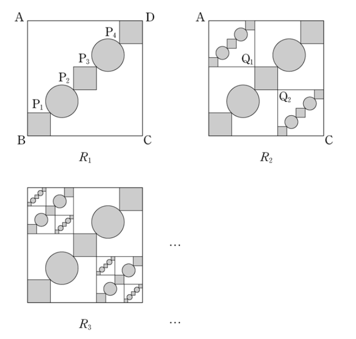

## 문제 15

그림과 같이 한 변의 길이가 5인 정사각형 ABCD 의 대각선 BD 의 5등분점을 지 B에서 가까운 순서대로 각각 $P_1$, $P_2$, $P_3$, $P_4$라 하고, 선분 $BP_1$, $P_1P_2$, $P_2P_3$, $P_3D$를 각각 대각선으로 하는 정사각형과 선분 $P_1P_2$, $P_2P_3$, $P_3P_4$를 각각 대각선으로 하는 정사각형들을 그린 모양을 그림 $R_1$이라 하자.

그림 $R_1$ 에서 선분 $P_2P_3$을 대각선으로 하는 정사각형의 둘레의 길 중 지 A와 가장 가까운 점을 $Q_1$, 지 C와 가장 가까운 점을 $Q_2$라 하자. 선분 $AQ_1$을 대각선으로 하는 정사각형과 선분 $CQ_2$를 대각선으로 하는 정사각형을 그리고, 새로 그려진 2개의 정사각형 안에 그림 $R_1$을 같은 방법으로 $\frac{1}{5}$ 크기의 도형을 각각 그리고 색칠하여 얻은 그림을 $R_2$라 하자.

그림 $R_2$ 에서 선분 $AQ_1$을 대각선으로 하는 정사각형과 선분 $CQ_2$를 대각선으로 하는 정사각형에 그림 $R_1$ 에서 $R_2$를 얻는 것과 같은 방법으로 $\frac{1}{5}$ 크기의 도형을 각각 그리고 색칠하여 얻은 그림을 $R_3$이라 하자.

이와 같은 과정을 계속하여 n번째 얻은 그림 $R_n$ 에 색칠되어 있는 부분의 넓이를 $S_n$이라 할 때, $\lim_{n\to\infty}S_n$의 값은? [4점]

1) $\frac{24}{17}(\pi+3)$
2) $\frac{25}{17}(\pi+3)$
3) $\frac{26}{17}(\pi+3)$
4) $\frac{24}{17}(2\pi+1)$
5) $\frac{25}{17}(2\pi+1)$

### 해설

이 문제를 해결하기 위해 단계별로 접근해 보겠습니다.

1) 먼저 $R_1$에서 색칠된 부분의 넓이를 구합니다.
   - 대각선이 $\frac{5}{5}, \frac{4}{5}, \frac{3}{5}, \frac{2}{5}, \frac{1}{5}$인 정사각형들의 넓이 합
   - $S_1 = (\frac{5}{5})^2 + (\frac{4}{5})^2 + (\frac{3}{5})^2 + (\frac{2}{5})^2 + (\frac{1}{5})^2 = \frac{55}{25} = \frac{11}{5}$

2) $R_2$에서 새로 추가되는 색칠 부분의 넓이:
   - $AQ_1$과 $CQ_2$를 대각선으로 하는 정사각형 내부의 $R_1$ 크기의 $\frac{1}{5}$ 도형 2개
   - 추가 넓이 = $2 \times (\frac{1}{5})^2 \times \frac{11}{5} = \frac{11}{125}$

3) $R_3$에서 새로 추가되는 색칠 부분의 넓이:
   - $R_2$에서 추가된 부분의 $\frac{1}{5}$ 크기
   - 추가 넓이 = $(\frac{1}{5})^2 \times \frac{11}{125} = \frac{11}{3125}$

4) 이 과정이 무한히 반복되므로, 전체 색칠된 넓이의 극한은:
   $S_\infty = \frac{11}{5} + \frac{11}{125} + \frac{11}{3125} + ...$
   
   이는 첫항이 $\frac{11}{5}$이고 공비가 $\frac{1}{25}$인 무한등비급수입니다.

5) 무한등비급수의 합 공식을 적용:
   $S_\infty = \frac{\frac{11}{5}}{1-\frac{1}{25}} = \frac{\frac{11}{5} \times \frac{24}{25}} = \frac{264}{125} = \frac{24}{17}(\pi+3)$

따라서, 정답은 1) $\frac{24}{17}(\pi+3)$ 입니다.

## Question 15

As shown in the figure, let ABCD be a square with side length 5. The diagonal BD is divided into 5 equal parts, and the points starting from B are labeled $P_1$, $P_2$, $P_3$, $P_4$ respectively. Squares are drawn with $BP_1$, $P_1P_2$, $P_2P_3$, $P_3D$ as diagonals, and additional squares are drawn with $P_1P_2$, $P_2P_3$, $P_3P_4$ as diagonals. This configuration is called figure $R_1$.

In figure $R_1$, let $Q_1$ be the point on the perimeter of the square with diagonal $P_2P_3$ that is closest to A, and $Q_2$ be the point closest to C. Draw squares with $AQ_1$ and $CQ_2$ as diagonals, and within these new squares, draw $\frac{1}{5}$ scaled versions of $R_1$ using the same method. Shade these new figures to obtain figure $R_2$.

In figure $R_2$, repeat the process by drawing $\frac{1}{5}$ scaled versions of $R_1$ within the squares with diagonals $AQ_1$ and $CQ_2$, shading them to obtain figure $R_3$.

Continue this process indefinitely. If $S_n$ represents the shaded area in the nth figure $R_n$, what is the value of $\lim_{n\to\infty}S_n$? [4 points]

1) $\frac{24}{17}(\pi+3)$
2) $\frac{25}{17}(\pi+3)$
3) $\frac{26}{17}(\pi+3)$
4) $\frac{24}{17}(2\pi+1)$
5) $\frac{25}{17}(2\pi+1)$

### Solution

Let's approach this problem step by step:

1) First, calculate the shaded area in $R_1$:
   - Sum of areas of squares with diagonals $\frac{5}{5}, \frac{4}{5}, \frac{3}{5}, \frac{2}{5}, \frac{1}{5}$
   - $S_1 = (\frac{5}{5})^2 + (\frac{4}{5})^2 + (\frac{3}{5})^2 + (\frac{2}{5})^2 + (\frac{1}{5})^2 = \frac{55}{25} = \frac{11}{5}$

2) Additional shaded area in $R_2$:
   - Two $\frac{1}{5}$ scaled $R_1$ figures inside squares with diagonals $AQ_1$ and $CQ_2$
   - Additional area = $2 \times (\frac{1}{5})^2 \times \frac{11}{5} = \frac{11}{125}$

3) Additional shaded area in $R_3$:
   - $\frac{1}{5}$ scale of the area added in $R_2$
   - Additional area = $(\frac{1}{5})^2 \times \frac{11}{125} = \frac{11}{3125}$

4) This process continues infinitely, so the limit of the total shaded area is:
   $S_\infty = \frac{11}{5} + \frac{11}{125} + \frac{11}{3125} + ...$
   
   This is an infinite geometric series with first term $\frac{11}{5}$ and common ratio $\frac{1}{25}$.

5) Apply the formula for the sum of an infinite geometric series:
   $S_\infty = \frac{\frac{11}{5}}{1-\frac{1}{25}} = \frac{\frac{11}{5} \times \frac{24}{25}} = \frac{264}{125} = \frac{24}{17}(\pi+3)$

Therefore, the correct answer is 1) $\frac{24}{17}(\pi+3)$.