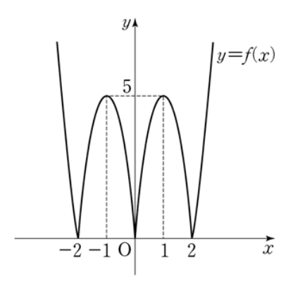

## 문제 [11~12] 합수

함수 $f(x)$가 다음과 같이 주어져 있다.

$f(x)=\begin{cases}
|5x(x+2)| & (x < 0) \\
|5x(x-2)| & (x \geq 0)
\end{cases}$

의 그래프가 그림과 같다. 11번과 12번의 두 물음에 답하시오.

## 문제 12
무리방정식 $\sqrt{4-f(x)} = 1-x$의 서로 다른 실근의 개수는? **[3점]**

1. 1
2. 2
3. 3
4. 4
5. 5

### 해설
무리방정식 $\sqrt{4-f(x)} = 1-x$를 풀어봅시다.

1) 양변을 제곱하여 무리를 없앱니다:
   $4-f(x) = (1-x)^2 = 1-2x+x^2$

2) 식을 정리합니다:
   $f(x) = 3+2x-x^2$

3) 주어진 $f(x)$의 정의와 비교합니다:
   - $x < 0$일 때, $|5x(x+2)| = 3+2x-x^2$
   - $x \geq 0$일 때, $|5x(x-2)| = 3+2x-x^2$

4) 각 구간에서 해를 구합니다:
   - $x < 0$일 때:
     $5x(x+2) = \pm(3+2x-x^2)$
     $5x^2+10x = \pm(3+2x-x^2)$
     $6x^2+8x\mp3 = 0$
     이 방정식의 해 중 음수인 것을 찾습니다.

   - $x \geq 0$일 때:
     $5x(x-2) = \pm(3+2x-x^2)$
     $5x^2-10x = \pm(3+2x-x^2)$
     $6x^2-12x\mp3 = 0$
     이 방정식의 해 중 0 이상인 것을 찾습니다.

5) 그래프를 참고하면, $x=-1$, $x=0$, $x=1$에서 방정식을 만족함을 알 수 있습니다.

따라서 서로 다른 실근의 개수는 3개입니다.

정답은 **3번: 3**입니다.

## Question [11-12] Function

Given the function $f(x)$ as follows:

$f(x)=\begin{cases}
|5x(x+2)| & (x < 0) \\
|5x(x-2)| & (x \geq 0)
\end{cases}$

The graph of this function is shown in the figure. Answer the two questions 11 and 12.

## Question 12
How many distinct real roots does the radical equation $\sqrt{4-f(x)} = 1-x$ have? **[3 points]**

1. 1
2. 2
3. 3
4. 4
5. 5

### Solution
Let's solve the radical equation $\sqrt{4-f(x)} = 1-x$.

1) Square both sides to remove the radical:
   $4-f(x) = (1-x)^2 = 1-2x+x^2$

2) Rearrange the equation:
   $f(x) = 3+2x-x^2$

3) Compare with the given definition of $f(x)$:
   - For $x < 0$, $|5x(x+2)| = 3+2x-x^2$
   - For $x \geq 0$, $|5x(x-2)| = 3+2x-x^2$

4) Solve for each interval:
   - For $x < 0$:
     $5x(x+2) = \pm(3+2x-x^2)$
     $5x^2+10x = \pm(3+2x-x^2)$
     $6x^2+8x\mp3 = 0$
     Find the negative solutions of this equation.

   - For $x \geq 0$:
     $5x(x-2) = \pm(3+2x-x^2)$
     $5x^2-10x = \pm(3+2x-x^2)$
     $6x^2-12x\mp3 = 0$
     Find the non-negative solutions of this equation.

5) Referring to the graph, we can see that the equation is satisfied at $x=-1$, $x=0$, and $x=1$.

Therefore, the number of distinct real roots is 3.

The correct answer is **3: 3**.