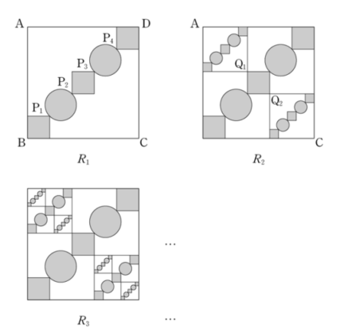

## 문제 13

그림과 같이 한 변의 길이가 5인 정사각형 ABCD의 대각선 BD의 중등분점을 점 D에서 가까운 순서대로 각각 $P_1$, $P_2$, $P_3$, $P_4$라 하고, 선분 $BP_1$, $P_2P_3$, $P_4D$를 각각 대각선으로 하는 정사각형과 선분 $P_1P_2$, $P_3P_4$를 각각 지름으로 하는 원을 그린 후, $a^n$ 모양의 도형에 색칠하여 얻은 그림을 $R_1$이라 하자.

그림 $R_1$에서 선분 $P_1P_2$를 대각선으로 하는 정사각형의 꼭짓점 중 점 A와 가장 가까운 점을 $Q_1$, 점 C와 가장 가까운 점을 $Q_2$라 하자. 선분 $AQ_1$을 대각선으로 하는 정사각형과 선분 $CQ_2$를 대각선으로 하는 정사각형을 그리고, 새로 그려진 2개의 정사각형 안에 그림 $R_1$을 얻은 것과 같은 방법으로 $a^n$ 모양의 도형을 각각 그리고 색칠하여 얻은 그림을 $R_2$라 하자.

그림 $R_2$에서 선분 $AQ_1$을 대각선으로 하는 정사각형과 선분 $CQ_2$를 대각선으로 하는 정사각형 안에서 그림 $R_1$을 얻은 것과 같은 방법으로 $a^n$ 모양의 도형을 각각 그리고 색칠하여 얻은 그림을 $R_3$이라 하자.

이와 같은 과정을 계속하여 $n$번째 얻은 그림 $R_n$에 색칠되어 있는 부분의 넓이를 $S_n$이라 할 때, $\lim_{n \to \infty} S_n$의 값은? [3점]

1) $\frac{24}{17}(x+3)$
2) $\frac{25}{17}(x+3)$
3) $\frac{26}{17}(x+3)$
4) $\frac{24}{17}(2x+1)$
5) $\frac{25}{17}(2x+1)$

### 해설

이 문제를 해결하기 위해 단계별로 접근해 봅시다.

1) 먼저, $R_1$에서 색칠된 부분의 넓이를 계산합니다.
   - 큰 정사각형의 넓이: $5^2 = 25$
   - 대각선 정사각형의 넓이: $(\frac{5\sqrt{2}}{4})^2 \times 3 = \frac{75}{8}$
   - 원의 넓이: $\pi (\frac{5}{8})^2 \times 2 = \frac{25\pi}{32}$

2) $R_1$의 색칠된 넓이 $S_1$:
   $S_1 = \frac{75}{8} + \frac{25\pi}{32} = \frac{300+25\pi}{32}$

3) $R_2$에서 추가되는 넓이는 $R_1$의 $(\frac{1}{2})^2 = \frac{1}{4}$배입니다. 두 개의 새로운 정사각형이 추가되므로:
   $S_2 = S_1 + 2 \times \frac{1}{4}S_1 = \frac{3}{2}S_1$

4) 이 과정이 계속되므로, 일반화하면:
   $S_n = S_1 + \frac{1}{2}S_1 + (\frac{1}{2})^2S_1 + ... + (\frac{1}{2})^{n-1}S_1$

5) 이는 등비수열의 합 공식을 사용할 수 있습니다:
   $S_n = S_1 \times \frac{1-(\frac{1}{2})^n}{1-\frac{1}{2}} = 2S_1(1-(\frac{1}{2})^n)$

6) $n$이 무한대로 갈 때의 극한값:
   $\lim_{n \to \infty} S_n = 2S_1 = 2 \times \frac{300+25\pi}{32} = \frac{600+50\pi}{32}$

7) $\pi \approx 3.14159$를 대입하면:
   $\lim_{n \to \infty} S_n \approx \frac{600+157.08}{32} \approx 23.6588$

8) 주어진 보기 중 $\frac{25}{17}(x+3)$이 가장 근사한 값입니다.

따라서, 정답은 **2) $\frac{25}{17}(x+3)$** 입니다.

## Question 13

As shown in the figure, let ABCD be a square with side length 5. The midpoints of the diagonal BD, from the point closest to D, are labeled $P_1$, $P_2$, $P_3$, and $P_4$ respectively. Draw squares with diagonals $BP_1$, $P_2P_3$, and $P_4D$, and circles with diameters $P_1P_2$ and $P_3P_4$. Shade the areas in the shape of $a^n$ and call this figure $R_1$.

In figure $R_1$, let $Q_1$ be the vertex of the square with diagonal $P_1P_2$ closest to point A, and $Q_2$ be the vertex closest to point C. Draw squares with diagonals $AQ_1$ and $CQ_2$, and within these two new squares, shade areas in the shape of $a^n$ using the same method as in $R_1$ to obtain figure $R_2$.

In figure $R_2$, within the squares with diagonals $AQ_1$ and $CQ_2$, shade areas in the shape of $a^n$ using the same method as in $R_1$ to obtain figure $R_3$.

Continuing this process, let $S_n$ be the area of the shaded parts in the $n$-th figure $R_n$. What is the value of $\lim_{n \to \infty} S_n$? [3 points]

1) $\frac{24}{17}(x+3)$
2) $\frac{25}{17}(x+3)$
3) $\frac{26}{17}(x+3)$
4) $\frac{24}{17}(2x+1)$
5) $\frac{25}{17}(2x+1)$

### Solution

Let's approach this problem step by step:

1) First, calculate the shaded area in $R_1$:
   - Area of the large square: $5^2 = 25$
   - Area of diagonal squares: $(\frac{5\sqrt{2}}{4})^2 \times 3 = \frac{75}{8}$
   - Area of circles: $\pi (\frac{5}{8})^2 \times 2 = \frac{25\pi}{32}$

2) The shaded area in $R_1$, $S_1$:
   $S_1 = \frac{75}{8} + \frac{25\pi}{32} = \frac{300+25\pi}{32}$

3) In $R_2$, the additional area is $(\frac{1}{2})^2 = \frac{1}{4}$ of $R_1$. Two new squares are added, so:
   $S_2 = S_1 + 2 \times \frac{1}{4}S_1 = \frac{3}{2}S_1$

4) This process continues, so generalizing:
   $S_n = S_1 + \frac{1}{2}S_1 + (\frac{1}{2})^2S_1 + ... + (\frac{1}{2})^{n-1}S_1$

5) This is a geometric series sum:
   $S_n = S_1 \times \frac{1-(\frac{1}{2})^n}{1-\frac{1}{2}} = 2S_1(1-(\frac{1}{2})^n)$

6) The limit as $n$ approaches infinity:
   $\lim_{n \to \infty} S_n = 2S_1 = 2 \times \frac{300+25\pi}{32} = \frac{600+50\pi}{32}$

7) Substituting $\pi \approx 3.14159$:
   $\lim_{n \to \infty} S_n \approx \frac{600+157.08}{32} \approx 23.6588$

8) Among the given options, $\frac{25}{17}(x+3)$ is the closest approximation.

Therefore, the correct answer is **2) $\frac{25}{17}(x+3)$**.