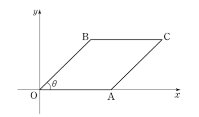

## 문제 15

좌표평면에서 점 A의 좌표는 $(1, 0)$이고, $0 < \theta < \frac{\pi}{2}$인 $\theta$에 대하여 점 B의 좌표는 $(\cos \theta, \sin \theta)$이다. 사각형 OACB가 평행사변형이 되도록 하는 제1사분면 위의 점 C에 대하여 사각형 OACB의 넓이를 $f(\theta)$, 선분 OC의 길이의 제곱을 $g(\theta)$라 하자. $f(\theta)+g(\theta)$의 최댓값은? (단, O는 원점이다.) **[4점]**

1) $2+ \sqrt{5}$
2) $2+ \sqrt{6}$
3) $2+ \sqrt{7}$
4) $2+2\sqrt{2}$
5) $5$

### 해설

1) 점 O의 좌표는 $(0,0)$, 점 A는 $(1,0)$, 점 B는 $(\cos \theta, \sin \theta)$입니다.

2) OACB가 평행사변형이므로, 점 C의 좌표는 A와 B의 벡터 합과 같습니다:
   $C = (1+\cos \theta, \sin \theta)$

3) 사각형 OACB의 넓이 $f(\theta)$는 두 벡터 OA와 OB의 외적의 크기와 같습니다:
   $f(\theta) = |OA \times OB| = |1 \cdot \sin \theta - 0 \cdot \cos \theta| = \sin \theta$

4) 선분 OC의 길이의 제곱 $g(\theta)$는:
   $g(\theta) = (1+\cos \theta)^2 + (\sin \theta)^2 = 1 + 2\cos \theta + \cos^2 \theta + \sin^2 \theta = 2 + 2\cos \theta$

5) 따라서 $f(\theta) + g(\theta) = \sin \theta + 2 + 2\cos \theta$

6) 최댓값을 구하기 위해 미분합니다:
   $\frac{d}{d\theta}(f(\theta) + g(\theta)) = \cos \theta - 2\sin \theta = 0$
   $\tan \theta = \frac{1}{2}$

7) $\sin^2 \theta + \cos^2 \theta = 1$이므로:
   $\sin \theta = \frac{1}{\sqrt{5}}$, $\cos \theta = \frac{2}{\sqrt{5}}$

8) 최댓값을 계산합니다:
   $f(\theta) + g(\theta) = \frac{1}{\sqrt{5}} + 2 + \frac{4}{\sqrt{5}} = 2 + \sqrt{5}$

따라서 $f(\theta) + g(\theta)$의 최댓값은 $2 + \sqrt{5}$입니다.

정답은 **1) $2+ \sqrt{5}$**입니다.

## Question 15

In the coordinate plane, point A has coordinates $(1, 0)$, and for $\theta$ where $0 < \theta < \frac{\pi}{2}$, point B has coordinates $(\cos \theta, \sin \theta)$. For point C in the first quadrant that makes quadrilateral OACB a parallelogram, let $f(\theta)$ be the area of quadrilateral OACB and $g(\theta)$ be the square of the length of line segment OC. What is the maximum value of $f(\theta)+g(\theta)$? (Note: O is the origin.) **[4 points]**

1) $2+ \sqrt{5}$
2) $2+ \sqrt{6}$
3) $2+ \sqrt{7}$
4) $2+2\sqrt{2}$
5) $5$

### Solution

1) The coordinates are: O $(0,0)$, A $(1,0)$, B $(\cos \theta, \sin \theta)$.

2) As OACB is a parallelogram, C's coordinates are the vector sum of A and B:
   $C = (1+\cos \theta, \sin \theta)$

3) The area of OACB, $f(\theta)$, is the magnitude of the cross product of vectors OA and OB:
   $f(\theta) = |OA \times OB| = |1 \cdot \sin \theta - 0 \cdot \cos \theta| = \sin \theta$

4) The square of OC's length, $g(\theta)$, is:
   $g(\theta) = (1+\cos \theta)^2 + (\sin \theta)^2 = 1 + 2\cos \theta + \cos^2 \theta + \sin^2 \theta = 2 + 2\cos \theta$

5) Thus, $f(\theta) + g(\theta) = \sin \theta + 2 + 2\cos \theta$

6) To find the maximum, we differentiate:
   $\frac{d}{d\theta}(f(\theta) + g(\theta)) = \cos \theta - 2\sin \theta = 0$
   $\tan \theta = \frac{1}{2}$

7) Using $\sin^2 \theta + \cos^2 \theta = 1$, we get:
   $\sin \theta = \frac{1}{\sqrt{5}}$, $\cos \theta = \frac{2}{\sqrt{5}}$

8) We calculate the maximum:
   $f(\theta) + g(\theta) = \frac{1}{\sqrt{5}} + 2 + \frac{4}{\sqrt{5}} = 2 + \sqrt{5}$

Therefore, the maximum value of $f(\theta) + g(\theta)$ is $2 + \sqrt{5}$.

The correct answer is **1) $2+ \sqrt{5}$**.