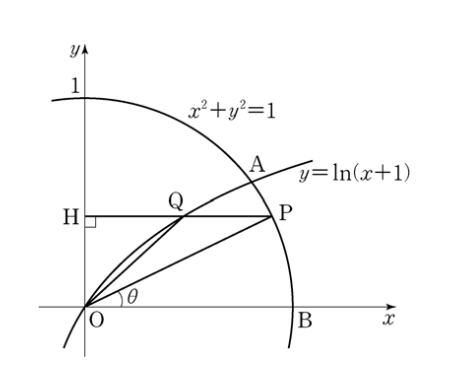

## 문제 28

그림과 같이 좌표평면에서 원 $x^2 + y^2 = 1$과 곡선 $y = \ln(x+1)$이 제1사분면에서 만나는 점을 A라 하자. 점 B(1, 0)에 대하여 호 AB 위의 점 P에서 y축에 내린 수선의 발을 H, 선분 PH와 곡선 $y = \ln(x+1)$이 만나는 점을 Q라 하자. $\angle POB = \theta$라 할 때, 삼각형 OPQ의 넓이를 $S(\theta)$, 선분 HQ의 길이를 $L(\theta)$라 하자. $\lim_{\theta \to 0} \frac{S(\theta)}{L(\theta)} = k$일 때,

60k의 값을 구하시오. (단, $0 < \theta < \frac{\pi}{6}$이고, O는 원점이다.)

**[4점]**

### 해설

이 문제를 해결하기 위해 다음 단계를 따라갑시다:

1) 먼저, 점 P의 좌표를 $(\cos \theta, \sin \theta)$로 표현할 수 있습니다.

2) 점 Q의 x좌표는 점 P의 x좌표와 같으므로, Q의 좌표는 $(\cos \theta, \ln(\cos \theta + 1))$입니다.

3) 삼각형 OPQ의 넓이 $S(\theta)$는 다음과 같이 계산됩니다:
   $S(\theta) = \frac{1}{2} \cdot \cos \theta \cdot [\sin \theta + \ln(\cos \theta + 1)]$

4) 선분 HQ의 길이 $L(\theta)$는 다음과 같습니다:
   $L(\theta) = \ln(\cos \theta + 1) - \sin \theta$

5) 이제 $\lim_{\theta \to 0} \frac{S(\theta)}{L(\theta)}$를 계산해야 합니다:

   $\lim_{\theta \to 0} \frac{S(\theta)}{L(\theta)} = \lim_{\theta \to 0} \frac{\frac{1}{2} \cdot \cos \theta \cdot [\sin \theta + \ln(\cos \theta + 1)]}{\ln(\cos \theta + 1) - \sin \theta}$

6) 이 극한값을 계산하기 위해 로피탈의 정리를 사용합니다. 분자와 분모를 $\theta$에 대해 미분합니다:

   $\lim_{\theta \to 0} \frac{-\frac{1}{2} \sin \theta [\sin \theta + \ln(\cos \theta + 1)] + \frac{1}{2} \cos \theta [\cos \theta + \frac{-\sin \theta}{\cos \theta + 1}]}{-\frac{\sin \theta}{\cos \theta + 1} - \cos \theta}$

7) $\theta \to 0$일 때, 이 식은 $\frac{1/2}{-1} = -\frac{1}{2}$로 수렴합니다.

8) 따라서 $k = -\frac{1}{2}$이고, $60k = -30$입니다.

정답은 **-30**입니다.

## Question 28

As shown in the figure, let A be the point where the circle $x^2 + y^2 = 1$ and the curve $y = \ln(x+1)$ meet in the first quadrant. For point B(1, 0), let H be the foot of the perpendicular drawn from a point P on the arc AB to the y-axis, and Q be the point where the line segment PH meets the curve $y = \ln(x+1)$. When $\angle POB = \theta$, let $S(\theta)$ be the area of triangle OPQ and $L(\theta)$ be the length of line segment HQ. If $\lim_{\theta \to 0} \frac{S(\theta)}{L(\theta)} = k$,

Find the value of 60k. (Note: $0 < \theta < \frac{\pi}{6}$ and O is the origin.)

**[4 points]**

### Solution

Let's solve this problem step by step:

1) First, we can express the coordinates of point P as $(\cos \theta, \sin \theta)$.

2) The x-coordinate of point Q is the same as that of point P, so Q's coordinates are $(\cos \theta, \ln(\cos \theta + 1))$.

3) The area of triangle OPQ, $S(\theta)$, is calculated as follows:
   $S(\theta) = \frac{1}{2} \cdot \cos \theta \cdot [\sin \theta + \ln(\cos \theta + 1)]$

4) The length of line segment HQ, $L(\theta)$, is:
   $L(\theta) = \ln(\cos \theta + 1) - \sin \theta$

5) Now we need to calculate $\lim_{\theta \to 0} \frac{S(\theta)}{L(\theta)}$:

   $\lim_{\theta \to 0} \frac{S(\theta)}{L(\theta)} = \lim_{\theta \to 0} \frac{\frac{1}{2} \cdot \cos \theta \cdot [\sin \theta + \ln(\cos \theta + 1)]}{\ln(\cos \theta + 1) - \sin \theta}$

6) To calculate this limit, we use L'Hôpital's rule. We differentiate both numerator and denominator with respect to $\theta$:

   $\lim_{\theta \to 0} \frac{-\frac{1}{2} \sin \theta [\sin \theta + \ln(\cos \theta + 1)] + \frac{1}{2} \cos \theta [\cos \theta + \frac{-\sin \theta}{\cos \theta + 1}]}{-\frac{\sin \theta}{\cos \theta + 1} - \cos \theta}$

7) As $\theta \to 0$, this expression converges to $\frac{1/2}{-1} = -\frac{1}{2}$.

8) Therefore, $k = -\frac{1}{2}$, and $60k = -30$.

The answer is **-30**.