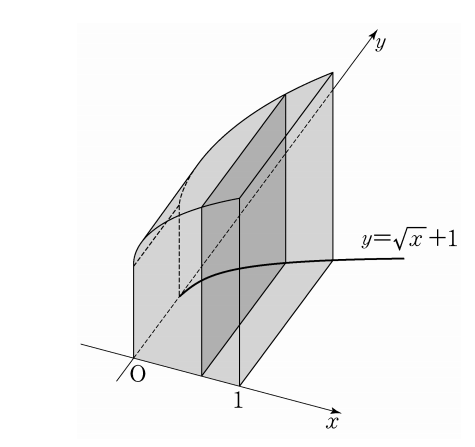

## 문제 11
그림과 같이 곡선 $y = \sqrt{x} + 1$과 $x$축, $y$축 및 직선 $x=1$로 둘러싸인 도형을 밑면으로 하는 입체도형이 있다. 이 입체도형을 $x$축에 수직인 평면으로 자른 단면이 모두 정사각형일 때, 이 입체도형의 부피는? **[3점]**

1. $\frac{7}{3} $ 
2. $\frac{5}{2}$
3. $\frac{8}{3}$
4. $\frac{17}{6}$
5. $3$

### 해설
주어진 조건을 바탕으로 도형의 부피를 구해 보겠습니다. 

단면이 정사각형이므로, 한 변의 길이는 $y = \sqrt{x} + 1$이고, 부피는 단면적의 적분으로 구할 수 있습니다.

$
V = \int_{0}^{1} \left(\sqrt{x} + 1\right)^2 \, dx
$

이를 계산하면 $ \frac{17}{6} $이 나옵니다.

따라서, 정답은 **4번: $\frac{17}{6}$**입니다.

## Question 11
As shown in the figure, there is a solid figure formed by revolving the region bounded by the curve $y = \sqrt{x} + 1$, the x-axis, the y-axis, and the line $x = 1$ around the x-axis. When this solid is sliced perpendicularly to the x-axis, all the cross-sections are squares. What is the volume of this solid? **[3 points]**

1. $\frac{7}{3} $ 
2. $\frac{5}{2}$
3. $\frac{8}{3}$
4. $\frac{17}{6}$
5. $3$

### Solution
We will calculate the volume of the solid based on the given conditions.

Since the cross-sections are squares, the side length is given by $y = \sqrt{x} + 1$, and the volume can be found by integrating the area of the cross-sections.

$
V = \int_{0}^{1} \left(\sqrt{x} + 1\right)^2 \, dx
$

Evaluating this gives $ \frac{17}{6} $.

Thus, the correct answer is **4: $\frac{17}{6}$**.
