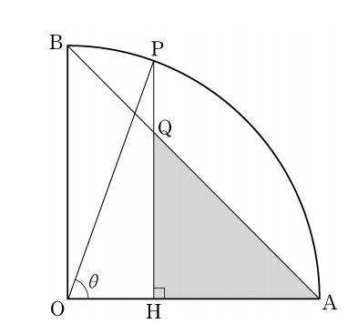

Here is the Markdown conversion of the problem and solution based on the provided image.

---

## 문제 14  
그림과 같이 반지름의 길이가 1이고 중심각의 크기가 $\frac{\pi}{2}$인 부채꼴 OAB가 있다. 호 AB 위의 점 P에서 선분 OA에 내린 수선의 발을 H, 선분 PH와 선분 AB의 교점을 Q라 하자. $\angle POH = \theta$일 때, 삼각형 AQH의 넓이를 $S(\theta)$라 하자.  
$\lim_{\theta \to 0^+} \frac{S(\theta)}{\theta^4}$의 값은? (단, $0 < \theta < \frac{\pi}{2}$) **[4점]**

$
\lim_{\theta \to 0^+} \frac{S(\theta)}{\theta^4}
$

1. $\frac{1}{8}$  
2. $\frac{1}{4}$  
3. $\frac{3}{8}$  
4. $\frac{1}{2}$  
5. $\frac{5}{8}$

### 해설  
주어진 문제는 $\theta \to 0^+$에서의 삼각형 AQH의 넓이 $S(\theta)$와 $\theta^4$의 비율의 극한 값을 구하는 문제입니다.  

1. 먼저, $\angle POH = \theta$에서 $\overline{OP} = 1$, $\overline{OA} = 1$이고, $\overline{OH} = \cos(\theta)$, $\overline{PH} = \sin(\theta)$입니다.
2. 삼각형 AQH의 넓이 $S(\theta)$는 $\frac{1}{2} \times \overline{AQ} \times \overline{HQ}$로 구할 수 있습니다.
3. $\overline{AQ}$와 $\overline{HQ}$는 $\overline{PH}$와 $\overline{HQ}$에 대한 비례식을 통해 $\overline{AQ} = 1 - \cos(\theta)$, $\overline{HQ} = \sin(\theta)$로 나타낼 수 있습니다.
4. 따라서 $S(\theta) = \frac{1}{2} \times (1 - \cos(\theta)) \times \sin(\theta)$가 됩니다.
5. 이 식을 $\theta^4$로 나누고, $\theta \to 0^+$의 극한을 구하면 $\lim_{\theta \to 0^+} \frac{S(\theta)}{\theta^4} = \frac{1}{8}$이 됩니다.

정답은 **1번: $\frac{1}{8}$** 입니다.

---

## Question 14  
In the figure, sector OAB has a radius of 1 and a central angle of $\frac{\pi}{2}$. Let point P be on arc AB, and let H be the foot of the perpendicular from P to line OA. Let Q be the intersection of lines PH and AB. When $\angle POH = \theta$, let the area of triangle AQH be $S(\theta)$.  
What is the value of $\lim_{\theta \to 0^+} \frac{S(\theta)}{\theta^4}$? (Assume $0 < \theta < \frac{\pi}{2}$) **[4 points]**

$
\lim_{\theta \to 0^+} \frac{S(\theta)}{\theta^4}
$

1. $\frac{1}{8}$  
2. $\frac{1}{4}$  
3. $\frac{3}{8}$  
4. $\frac{1}{2}$  
5. $\frac{5}{8}$

## Solution  
This problem requires finding the limit of the ratio between the area of triangle AQH, $S(\theta)$, and $\theta^4$ as $\theta$ approaches $0^+$.  

1. Given $\angle POH = \theta$, $\overline{OP} = 1$, $\overline{OA} = 1$, $\overline{OH} = \cos(\theta)$, and $\overline{PH} = \sin(\theta)$.
2. The area of triangle AQH, $S(\theta)$, can be found using $S(\theta) = \frac{1}{2} \times \overline{AQ} \times \overline{HQ}$.
3. From the proportional relationships, $\overline{AQ} = 1 - \cos(\theta)$ and $\overline{HQ} = \sin(\theta)$.
4. Therefore, $S(\theta) = \frac{1}{2} \times (1 - \cos(\theta)) \times \sin(\theta)$.
5. Dividing this by $\theta^4$ and taking the limit as $\theta$ approaches $0^+$ gives $\lim_{\theta \to 0^+} \frac{S(\theta)}{\theta^4} = \frac{1}{8}$.

The correct answer is **1: $\frac{1}{8}$**.