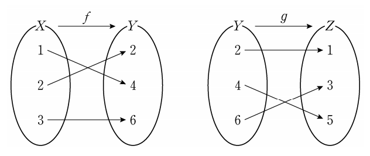

## 문제 4
그림은 두 함수 $f: X \rightarrow Y$, $g: Y \rightarrow Z$를 나타낸 것이다.

$(g \circ f)(2)$의 값은? **[3점]**

1. 1
2. 2
3. 3
4. 4
5. 5

### 해설
$(g \circ f)(2)$를 구하기 위해 다음 단계를 따릅니다:

1. 먼저 $f(2)$의 값을 찾습니다. 첫 번째 그래프에서 $X$의 2가 $Y$의 4에 대응됩니다. 따라서 $f(2) = 4$입니다.
2. 그 다음 $g(4)$의 값을 찾습니다. 두 번째 그래프에서 $Y$의 4가 $Z$의 3에 대응됩니다. 따라서 $g(4) = 3$입니다.
3. $(g \circ f)(2) = g(f(2)) = g(4) = 3$

따라서 정답은 **3번: 3**입니다.

## Question 4
The figure shows two functions $f: X \rightarrow Y$ and $g: Y \rightarrow Z$.

What is the value of $(g \circ f)(2)$? **[3 points]**

1. 1
2. 2
3. 3
4. 4
5. 5

### Solution
To find $(g \circ f)(2)$, we follow these steps:

1. First, we find the value of $f(2)$. In the first graph, 2 in $X$ corresponds to 4 in $Y$. So $f(2) = 4$.
2. Next, we find the value of $g(4)$. In the second graph, 4 in $Y$ corresponds to 3 in $Z$. So $g(4) = 3$.
3. Therefore, $(g \circ f)(2) = g(f(2)) = g(4) = 3$

The correct answer is **3: 3**.