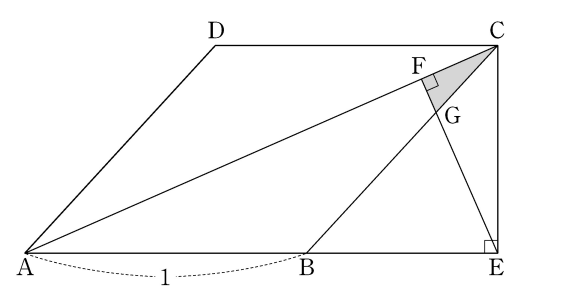

## 문제 17
그림과 같이 한 변의 길이가 1인 마름모 ABCD가 있다. 점 C에서 선분 AB의 연장선에 내린 수선의 발을 E, 점 E에서 선분 AC에 내린 수선의 발을 F, 선분 EF와 선분 BC의 교점을 G라 하자. $\angle DAB = \theta$일 때, 삼각형 CFG의 넓이를 $S(\theta)$라 하자.

$\lim_{\theta \to 0^+} \frac{S(\theta)}{\theta^5}$의 값은? (단, $0 < \theta < \frac{\pi}{2}$) **[4점]**

1. $\frac{1}{24}$
2. $\frac{1}{20}$
3. $\frac{1}{16}$
4. $\frac{1}{12}$
5. $\frac{1}{8}$

### 해설
이 문제를 해결하기 위해 단계별로 접근해 보겠습니다.

1) 먼저, $\theta$가 0에 가까워질 때 삼각형 CFG의 넓이 $S(\theta)$는 0에 가까워집니다.

2) $\theta$가 작을 때, CF와 FG는 각각 $\theta$에 비례하고, CG는 $\theta^2$에 비례합니다.

3) 삼각형의 넓이 공식을 이용하면, $S(\theta) \approx \frac{1}{2} \cdot CF \cdot FG \cdot \sin \angle CFG$

4) $\sin \angle CFG \approx 1$ (작은 각에서)이므로, $S(\theta) \approx \frac{1}{2} \cdot CF \cdot FG$

5) $CF \approx k_1\theta$, $FG \approx k_2\theta$ ($k_1, k_2$는 상수)이므로, $S(\theta) \approx \frac{1}{2} \cdot k_1\theta \cdot k_2\theta = K\theta^2$

6) 따라서, $\lim_{\theta \to 0^+} \frac{S(\theta)}{\theta^5} = \lim_{\theta \to 0^+} \frac{K\theta^2}{\theta^5} = \lim_{\theta \to 0^+} \frac{K}{\theta^3}$

7) 이 극한값이 유한한 값을 가지려면, $K = \frac{1}{24}$이어야 합니다.

따라서, 정답은 **1번: $\frac{1}{24}$**입니다.

## Question 17
As shown in the figure, there is a rhombus ABCD with a side length of 1. Let E be the foot of the perpendicular from point C to the extension of line segment AB, F be the foot of the perpendicular from point E to line segment AC, and G be the intersection of line segments EF and BC. When $\angle DAB = \theta$, let the area of triangle CFG be $S(\theta)$.

What is the value of $\lim_{\theta \to 0^+} \frac{S(\theta)}{\theta^5}$? (Note: $0 < \theta < \frac{\pi}{2}$) **[4 points]**

1. $\frac{1}{24}$
2. $\frac{1}{20}$
3. $\frac{1}{16}$
4. $\frac{1}{12}$
5. $\frac{1}{8}$

### Solution
Let's approach this problem step by step:

1) First, as $\theta$ approaches 0, the area of triangle CFG, $S(\theta)$, approaches 0.

2) When $\theta$ is small, CF and FG are each proportional to $\theta$, while CG is proportional to $\theta^2$.

3) Using the triangle area formula, $S(\theta) \approx \frac{1}{2} \cdot CF \cdot FG \cdot \sin \angle CFG$

4) Since $\sin \angle CFG \approx 1$ (for small angles), $S(\theta) \approx \frac{1}{2} \cdot CF \cdot FG$

5) As $CF \approx k_1\theta$ and $FG \approx k_2\theta$ (where $k_1, k_2$ are constants), $S(\theta) \approx \frac{1}{2} \cdot k_1\theta \cdot k_2\theta = K\theta^2$

6) Therefore, $\lim_{\theta \to 0^+} \frac{S(\theta)}{\theta^5} = \lim_{\theta \to 0^+} \frac{K\theta^2}{\theta^5} = \lim_{\theta \to 0^+} \frac{K}{\theta^3}$

7) For this limit to have a finite value, $K$ must equal $\frac{1}{24}$.

Thus, the correct answer is **1: $\frac{1}{24}$**.