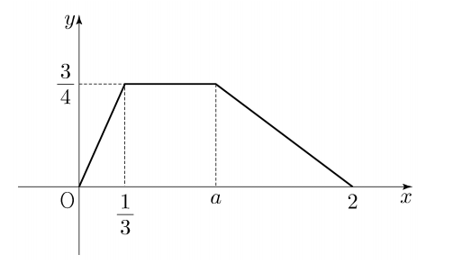

## 문제 10

연속확률변수 $X$가 갖는 값의 범위는 $0 \leq X \leq 2$이고, $X$의 확률밀도함수의 그래프가 그림과 같을 때, $P(\frac{1}{3} \leq X \leq a)$의 값은? (단, $a$는 상수이다.) **[3점]**

1. $\frac{11}{16}$
2. $\frac{5}{8}$
3. $\frac{9}{16}$
4. $\frac{1}{2}$
5. $\frac{7}{16}$

### 해설

1) 그래프의 전체 면적은 1이어야 합니다. 이를 이용해 최대 높이를 구합니다:
   $\frac{1}{2} \cdot 2 \cdot \frac{3}{4} = 1$, 따라서 최대 높이는 $\frac{3}{4}$입니다.

2) $x = \frac{1}{3}$에서 $x = a$까지의 면적을 구해야 합니다.

3) $x = \frac{1}{3}$에서의 높이: $\frac{3}{4} \cdot \frac{1}{3} = \frac{1}{4}$

4) $x = \frac{1}{3}$에서 $x = 1$까지의 면적:
   $\frac{1}{2} \cdot (\frac{2}{3} \cdot \frac{3}{4} + \frac{1}{4}) = \frac{3}{8}$

5) $x = 1$에서 $x = a$까지의 면적:
   $\frac{3}{4} \cdot (a - 1) = \frac{3a}{4} - \frac{3}{4}$

6) 총 면적: $\frac{3}{8} + (\frac{3a}{4} - \frac{3}{4}) = \frac{3a}{4} - \frac{3}{8} = \frac{9}{16}$

따라서 정답은 **3번: $\frac{9}{16}$**입니다.

## Question 10

The continuous random variable $X$ has a range of $0 \leq X \leq 2$, and its probability density function is shown in the graph. What is the value of $P(\frac{1}{3} \leq X \leq a)$? (Note: $a$ is a constant.) **[3 points]**

1. $\frac{11}{16}$
2. $\frac{5}{8}$
3. $\frac{9}{16}$
4. $\frac{1}{2}$
5. $\frac{7}{16}$

### Solution

1) The total area under the graph must be 1. Using this, we can find the maximum height:
   $\frac{1}{2} \cdot 2 \cdot \frac{3}{4} = 1$, so the maximum height is $\frac{3}{4}$.

2) We need to calculate the area from $x = \frac{1}{3}$ to $x = a$.

3) Height at $x = \frac{1}{3}$: $\frac{3}{4} \cdot \frac{1}{3} = \frac{1}{4}$

4) Area from $x = \frac{1}{3}$ to $x = 1$:
   $\frac{1}{2} \cdot (\frac{2}{3} \cdot \frac{3}{4} + \frac{1}{4}) = \frac{3}{8}$

5) Area from $x = 1$ to $x = a$:
   $\frac{3}{4} \cdot (a - 1) = \frac{3a}{4} - \frac{3}{4}$

6) Total area: $\frac{3}{8} + (\frac{3a}{4} - \frac{3}{4}) = \frac{3a}{4} - \frac{3}{8} = \frac{9}{16}$

Therefore, the correct answer is **3: $\frac{9}{16}$**.