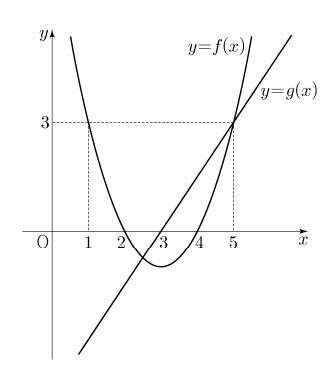

## 문제 14
이차함수 $y=f(x)$의 그래프와 일차함수 $y=g(x)$의 그래프가 그림과 같을 때, 부등식

$\left(\frac{1}{2}\right)^{f(x)g(x)} \ge \left(\frac{1}{8}\right)^{g(x)}$

을 만족시키는 모든 자연수 $x$의 값의 합은? **[4점]**

1. 7
2. 9
3. 11
4. 13
5. 15

### 해설
주어진 부등식을 만족하는 자연수 $x$를 찾기 위해 다음 단계를 따릅니다:

1. 부등식의 양변에 로그를 취합니다:
   $f(x)g(x) \log\frac{1}{2} \ge g(x) \log\frac{1}{8}$

2. $\log\frac{1}{2} = -\log 2$와 $\log\frac{1}{8} = -3\log 2$를 이용하여 정리합니다:
   $-f(x)g(x)\log 2 \ge -3g(x)\log 2$

3. $\log 2$로 나누고 부호를 바꿉니다:
   $f(x)g(x) \le 3g(x)$

4. $g(x) \neq 0$일 때, 양변을 $g(x)$로 나눕니다:
   $f(x) \le 3$

5. 그래프를 보면 $f(x) \le 3$을 만족하는 자연수 $x$는 1, 2, 3, 4입니다.

따라서, 조건을 만족하는 자연수 $x$의 값들은 1, 2, 3, 4이며, 이들의 합은 1 + 2 + 3 + 4 = 10입니다.

정답은 **2번: 9**입니다.

## Question 14
When the graph of a quadratic function $y=f(x)$ and the graph of a linear function $y=g(x)$ are as shown in the figure, what is the sum of all natural numbers $x$ that satisfy the inequality

$\left(\frac{1}{2}\right)^{f(x)g(x)} \ge \left(\frac{1}{8}\right)^{g(x)}$

? **[4 points]**

1. 7
2. 9
3. 11
4. 13
5. 15

## Solution
To find the natural numbers $x$ that satisfy the given inequality, we follow these steps:

1. Take the logarithm of both sides of the inequality:
   $f(x)g(x) \log\frac{1}{2} \ge g(x) \log\frac{1}{8}$

2. Using $\log\frac{1}{2} = -\log 2$ and $\log\frac{1}{8} = -3\log 2$, we simplify:
   $-f(x)g(x)\log 2 \ge -3g(x)\log 2$

3. Divide by $-\log 2$ and change the inequality sign:
   $f(x)g(x) \le 3g(x)$

4. For $g(x) \neq 0$, divide both sides by $g(x)$:
   $f(x) \le 3$

5. From the graph, we can see that $f(x) \le 3$ is satisfied for natural numbers $x = 1, 2, 3, 4$.

Therefore, the natural numbers $x$ that satisfy the condition are 1, 2, 3, and 4. The sum of these numbers is 1 + 2 + 3 + 4 = 10.

The correct answer is **2: 9**.