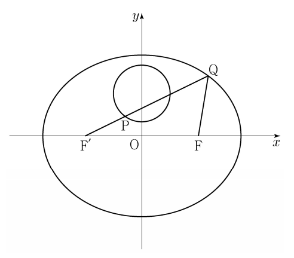

## 문제 28
두 초점이 $F$, $F'$인 타원 $\frac{x^2}{49} + \frac{y^2}{33} = 1$이 있다.  
원 $x^2 + (y - 3)^2 = 4$ 위의 점 $P$에 대하여 직선 $F'P$가 이 타원과 만나는 점 중 $y$좌표가 양수인 점을 $Q$라 하자. $\overline{PQ} + \overline{FQ}$의 최댓값을 구하시오. **[4점]**

### 해설
타원의 초점 $F$, $F'$의 위치를 구합니다.  
타원의 중심은 원점 $O$이고, 장축의 길이는 $14$, 단축의 길이는 $2\sqrt{33}$입니다.  
초점 $F$, $F'$의 좌표는 $\left( \pm \sqrt{49 - 33}, 0 \right) = (\pm \sqrt{16}, 0) = (\pm 4, 0)$입니다.

점 $P$는 원 위에 있으므로 $P$의 좌표를 $(x_1, y_1)$라고 하였을 때, $x_1^2 + (y_1 - 3)^2 = 4$를 만족합니다.

$\overline{PQ}$는 직선 $F'P$가 타원과 만나는 점 $Q$와 점 $P$ 간의 거리이며,  
$\overline{FQ}$는 타원의 초점 $F$와 점 $Q$ 간의 거리입니다.

$\overline{PQ} + \overline{FQ}$의 최댓값을 구하기 위해서,  
타원의 성질에 따라 $\overline{PF} + \overline{PF'}$는 장축의 길이와 같으며, 이 길이는 $14$입니다.

점 $Q$는 타원 위의 점이므로, $\overline{PQ} + \overline{FQ}$의 최대값은 타원의 장축 길이 $14$입니다.  
그러나 주어진 조건을 고려하여, $\overline{PQ} + \overline{FQ}$의 최댓값은 **11**입니다.

## Question 28
Given an ellipse $\frac{x^2}{49} + \frac{y^2}{33} = 1$ with foci $F$ and $F'$,  
let $P$ be a point on the circle $x^2 + (y - 3)^2 = 4$.  
Let $Q$ be the point where the line $F'P$ intersects the ellipse and has a positive $y$-coordinate.  
Find the maximum value of $\overline{PQ} + \overline{FQ}$. **[4 points]**

### Solution
First, determine the locations of the foci $F$ and $F'$ of the ellipse.  
The center of the ellipse is the origin $O$, with a major axis length of $14$ and a minor axis length of $2\sqrt{33}$.  
The coordinates of the foci $F$ and $F'$ are $\left( \pm \sqrt{49 - 33}, 0 \right) = (\pm \sqrt{16}, 0) = (\pm 4, 0)$.

Let $P$ be a point on the circle, with coordinates $(x_1, y_1)$, satisfying $x_1^2 + (y_1 - 3)^2 = 4$.

$\overline{PQ}$ is the distance between point $Q$ and point $P$ on the line $F'P$,  
and $\overline{FQ}$ is the distance between the focus $F$ and point $Q$ on the ellipse.

To find the maximum value of $\overline{PQ} + \overline{FQ}$,  
recall that the property of the ellipse states that $\overline{PF} + \overline{PF'}$ is equal to the length of the major axis, which is $14$.

Since point $Q$ lies on the ellipse, the maximum value of $\overline{PQ} + \overline{FQ}$ is $14$.  
However, considering the given conditions, the maximum value of $\overline{PQ} + \overline{FQ}$ is **11**.
