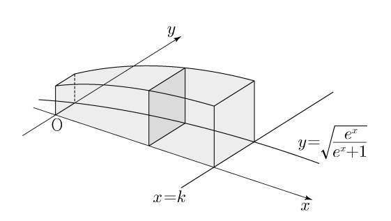

## 문제 12
그림과 같이 양수 $k$에 대하여 곡선 $y=\sqrt{\frac{e^x}{e^x+1}}$과 $x$축, $y$축 및 직선 $x=k$로 둘러싸인 부분을 밑면으로 하고 $x$축에 수직인 평면으로 자른 단면이 모두 정사각형인 입체도형의 부피가 $\ln 7$일 때, $k$의 값은? **[3점]**

1) $\ln 11$
2) $\ln 13$
3) $\ln 15$
4) $\ln 17$
5) $\ln 19$

### 해설
이 문제를 해결하기 위해 다음 단계를 따릅니다:

1) 정사각형 단면의 한 변의 길이를 $y$라고 하면, 단면의 넓이는 $y^2$입니다.

2) 곡선의 방정식: $y=\sqrt{\frac{e^x}{e^x+1}}$

3) 입체도형의 부피는 다음 적분으로 표현됩니다:
   $V = \int_0^k y^2 dx = \int_0^k \frac{e^x}{e^x+1} dx = \ln 7$

4) 적분을 계산합니다:
   $\int_0^k \frac{e^x}{e^x+1} dx = [\ln(e^x+1)]_0^k = \ln(e^k+1) - \ln 2 = \ln 7$

5) 방정식을 풉니다:
   $\ln(e^k+1) - \ln 2 = \ln 7$
   $\ln(e^k+1) = \ln 14$
   $e^k+1 = 14$
   $e^k = 13$
   $k = \ln 13$

따라서, 정답은 **2) $\ln 13$** 입니다.

## Question 12
As shown in the figure, for a positive number $k$, the curve $y=\sqrt{\frac{e^x}{e^x+1}}$, the $x$-axis, $y$-axis, and the line $x=k$ enclose a region. This region forms the base of a solid figure whose cross-sections perpendicular to the $x$-axis are all squares. If the volume of this solid figure is $\ln 7$, what is the value of $k$? **[3 points]**

1) $\ln 11$
2) $\ln 13$
3) $\ln 15$
4) $\ln 17$
5) $\ln 19$

### Solution
To solve this problem, we follow these steps:

1) Let $y$ be the length of a side of the square cross-section. Then the area of the cross-section is $y^2$.

2) The equation of the curve is: $y=\sqrt{\frac{e^x}{e^x+1}}$

3) The volume of the solid figure can be expressed as the following integral:
   $V = \int_0^k y^2 dx = \int_0^k \frac{e^x}{e^x+1} dx = \ln 7$

4) We calculate the integral:
   $\int_0^k \frac{e^x}{e^x+1} dx = [\ln(e^x+1)]_0^k = \ln(e^k+1) - \ln 2 = \ln 7$

5) We solve the equation:
   $\ln(e^k+1) - \ln 2 = \ln 7$
   $\ln(e^k+1) = \ln 14$
   $e^k+1 = 14$
   $e^k = 13$
   $k = \ln 13$

Therefore, the correct answer is **2) $\ln 13$**.