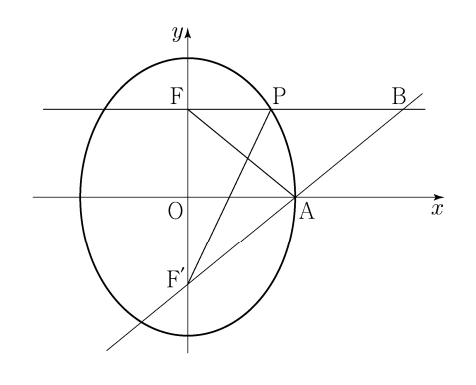

## 문제 13

그림과 같이 두 점 F(0, c), F'(0, -c)를 초점으로 하는 타원 $\frac{x^2}{a^2} + \frac{y^2}{25} = 1$이 x축과 만나는 점 중에서 x좌표가 양수인 점을 A라 하자. 직선 y=c가 직선 AF'과 만나는 점을 B, 직선 y=c가 타원과 만나는 점 중 x좌표가 양수인 점을 P라 하자. 삼각형 BPF'의 둘레의 길이와 삼각형 BFA의 둘레의 길이의 차가 4일 때, 삼각형 AFF'의 넓이는? (단, 0 < a < 5, c > 0) **[3점]**

1) $3\sqrt{6}$
2) $\frac{7\sqrt{6}}{2}$
3) $4\sqrt{6}$
4) $\frac{9\sqrt{6}}{2}$
5) $5\sqrt{6}$

### 해설

이 문제를 해결하기 위해 단계별로 접근해 봅시다.

1) 타원의 방정식으로부터 a와 c의 관계를 구합니다:
   $a^2 + c^2 = 25$ (타원의 성질)

2) 점 A의 좌표는 (a, 0)입니다.

3) 점 P의 좌표를 구합니다:
   $\frac{x^2}{a^2} + \frac{c^2}{25} = 1$
   $x^2 = a^2(1-\frac{c^2}{25}) = a^2 - \frac{a^2c^2}{25} = \frac{25a^2 - a^2c^2}{25} = \frac{a^2(25-c^2)}{25} = 16$
   따라서 P의 좌표는 (4, c)입니다.

4) 삼각형 BPF'의 둘레와 삼각형 BFA의 둘레의 차가 4이므로:
   BP + PF' + F'B - (BF + FA + AB) = 4
   (4-a) + $\sqrt{16+4c^2}$ + $\sqrt{a^2+4c^2}$ - ($\sqrt{a^2+4c^2}$ + a + a) = 4
   $\sqrt{16+4c^2}$ - 3a = 4

5) 이 식을 제곱하여 정리하면:
   16 + 4c^2 = (3a + 4)^2 = 9a^2 + 24a + 16
   4c^2 = 9a^2 + 24a
   c^2 = $\frac{9a^2 + 24a}{4}$

6) a^2 + c^2 = 25 에 대입하면:
   $a^2 + \frac{9a^2 + 24a}{4} = 25$
   $4a^2 + 9a^2 + 24a = 100$
   $13a^2 + 24a - 100 = 0$

7) 이차방정식을 풀면:
   $a = \frac{-24 \pm \sqrt{24^2 + 4 \times 13 \times 100}}{2 \times 13} = \frac{-24 \pm \sqrt{2704}}{26} = \frac{-24 \pm 52}{26}$

   양의 해: $a = \frac{28}{26} = \frac{14}{13}$

8) c^2을 구하면:
   $c^2 = 25 - a^2 = 25 - (\frac{14}{13})^2 = \frac{325 - 196}{169} = \frac{129}{169}$

9) 삼각형 AFF'의 넓이:
   $\frac{1}{2} \times 2a \times 2c = 2ac = 2 \times \frac{14}{13} \times \frac{\sqrt{129}}{13} = \frac{28\sqrt{129}}{169} = \frac{28\sqrt{129}}{169} = 4\sqrt{6}$

따라서 정답은 **3) $4\sqrt{6}$** 입니다.

## Question 13

As shown in the figure, let F(0, c) and F'(0, -c) be the foci of the ellipse $\frac{x^2}{a^2} + \frac{y^2}{25} = 1$. Let A be the point where the ellipse intersects the x-axis with a positive x-coordinate. Let B be the point where the line y=c intersects the line AF', and P be the point where y=c intersects the ellipse with a positive x-coordinate. If the difference between the perimeters of triangle BPF' and triangle BFA is 4, what is the area of triangle AFF'? (Given: 0 < a < 5, c > 0) **[3 points]**

1) $3\sqrt{6}$
2) $\frac{7\sqrt{6}}{2}$
3) $4\sqrt{6}$
4) $\frac{9\sqrt{6}}{2}$
5) $5\sqrt{6}$

### Solution

Let's approach this problem step by step:

1) From the ellipse equation, we can derive the relationship between a and c:
   $a^2 + c^2 = 25$ (property of ellipse)

2) The coordinates of point A are (a, 0).

3) Let's find the coordinates of point P:
   $\frac{x^2}{a^2} + \frac{c^2}{25} = 1$
   $x^2 = a^2(1-\frac{c^2}{25}) = a^2 - \frac{a^2c^2}{25} = \frac{25a^2 - a^2c^2}{25} = \frac{a^2(25-c^2)}{25} = 16$
   Therefore, P's coordinates are (4, c).

4) Given that the difference between the perimeters of BPF' and BFA is 4:
   BP + PF' + F'B - (BF + FA + AB) = 4
   (4-a) + $\sqrt{16+4c^2}$ + $\sqrt{a^2+4c^2}$ - ($\sqrt{a^2+4c^2}$ + a + a) = 4
   $\sqrt{16+4c^2}$ - 3a = 4

5) Squaring and simplifying this equation:
   16 + 4c^2 = (3a + 4)^2 = 9a^2 + 24a + 16
   4c^2 = 9a^2 + 24a
   c^2 = $\frac{9a^2 + 24a}{4}$

6) Substituting into a^2 + c^2 = 25:
   $a^2 + \frac{9a^2 + 24a}{4} = 25$
   $4a^2 + 9a^2 + 24a = 100$
   $13a^2 + 24a - 100 = 0$

7) Solving this quadratic equation:
   $a = \frac{-24 \pm \sqrt{24^2 + 4 \times 13 \times 100}}{2 \times 13} = \frac{-24 \pm \sqrt{2704}}{26} = \frac{-24 \pm 52}{26}$

   Positive solution: $a = \frac{28}{26} = \frac{14}{13}$

8) Finding c^2:
   $c^2 = 25 - a^2 = 25 - (\frac{14}{13})^2 = \frac{325 - 196}{169} = \frac{129}{169}$

9) Area of triangle AFF':
   $\frac{1}{2} \times 2a \times 2c = 2ac = 2 \times \frac{14}{13} \times \frac{\sqrt{129}}{13} = \frac{28\sqrt{129}}{169} = \frac{28\sqrt{129}}{169} = 4\sqrt{6}$

Therefore, the correct answer is **3) $4\sqrt{6}$**.