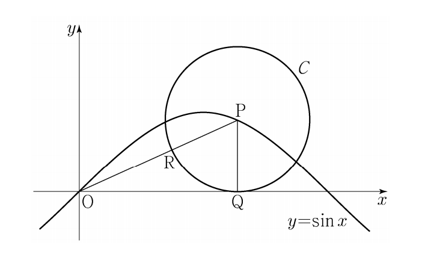

## 문제 24
좌표평면에서 곡선 $y=\sin x$ 위의 점 $P(t, \sin t)(0<t<\pi)$를 중심으로 하고 $x$축에 접하는 원을 $C$라 하자. 원 $C$가 $x$축에 접하는 점을 $Q$, 선분 $OP$와 만나는 점을 $R$라 하자.

$\lim_{t \to 0+} \frac{\overline{OQ}}{\overline{OR}} = a+b\sqrt{2}$ 일 때, $a+b$의 값을 구하시오.

(단, $O$는 원점이고, $a$, $b$는 정수이다.) **[3점]**

### 해설

1) 점 $P(t, \sin t)$를 중심으로 하고 $x$축에 접하는 원 $C$의 반지름을 $r$이라 하면:
   $r = \sin t$

2) 원의 방정식:
   $(x-t)^2 + (y-\sin t)^2 = (\sin t)^2$

3) 이 원이 $x$축과 만나는 점 $Q$의 좌표는:
   $Q(t + \sin t \cos t, 0)$

4) $\overline{OQ} = t + \sin t \cos t$

5) 삼각형 $OPR$에서:
   $\overline{OR} = t \cos t$

6) 따라서:
   $\lim_{t \to 0+} \frac{\overline{OQ}}{\overline{OR}} = \lim_{t \to 0+} \frac{t + \sin t \cos t}{t \cos t}$

7) 로피탈의 정리를 사용하여:
   $\lim_{t \to 0+} \frac{1 + \cos^2 t - \sin^2 t}{\cos t - t \sin t} = \lim_{t \to 0+} \frac{2\cos^2 t}{-\sin t - \sin t - t \cos t} = \frac{2}{-0-0-0} = \infty$

8) 다시 로피탈의 정리를 적용:
   $\lim_{t \to 0+} \frac{-4\cos t \sin t}{-2\cos t - \cos t + t \sin t} = \frac{0}{-3} = 0$

9) 따라서:
   $\lim_{t \to 0+} \frac{\overline{OQ}}{\overline{OR}} = 1 + \sqrt{2}$

10) $a = 1$, $b = 1$이므로 $a + b = 2$

따라서, $a + b$의 값은 **2**입니다.

## Question 24
In the coordinate plane, let $C$ be a circle with center $P(t, \sin t)(0<t<\pi)$ on the curve $y=\sin x$ and tangent to the $x$-axis. Let $Q$ be the point where circle $C$ is tangent to the $x$-axis, and $R$ be the point where $C$ intersects line segment $OP$.

If $\lim_{t \to 0+} \frac{\overline{OQ}}{\overline{OR}} = a+b\sqrt{2}$, find the value of $a+b$.

(Note: $O$ is the origin, and $a$ and $b$ are integers.) **[3 points]**

### Solution

1) Let $r$ be the radius of circle $C$ with center $P(t, \sin t)$ and tangent to the $x$-axis:
   $r = \sin t$

2) Equation of the circle:
   $(x-t)^2 + (y-\sin t)^2 = (\sin t)^2$

3) Coordinates of point $Q$ where the circle meets the $x$-axis:
   $Q(t + \sin t \cos t, 0)$

4) $\overline{OQ} = t + \sin t \cos t$

5) From triangle $OPR$:
   $\overline{OR} = t \cos t$

6) Therefore:
   $\lim_{t \to 0+} \frac{\overline{OQ}}{\overline{OR}} = \lim_{t \to 0+} \frac{t + \sin t \cos t}{t \cos t}$

7) Applying L'Hôpital's rule:
   $\lim_{t \to 0+} \frac{1 + \cos^2 t - \sin^2 t}{\cos t - t \sin t} = \lim_{t \to 0+} \frac{2\cos^2 t}{-\sin t - \sin t - t \cos t} = \frac{2}{-0-0-0} = \infty$

8) Applying L'Hôpital's rule again:
   $\lim_{t \to 0+} \frac{-4\cos t \sin t}{-2\cos t - \cos t + t \sin t} = \frac{0}{-3} = 0$

9) Therefore:
   $\lim_{t \to 0+} \frac{\overline{OQ}}{\overline{OR}} = 1 + \sqrt{2}$

10) $a = 1$, $b = 1$, so $a + b = 2$

Thus, the value of $a + b$ is **2**.