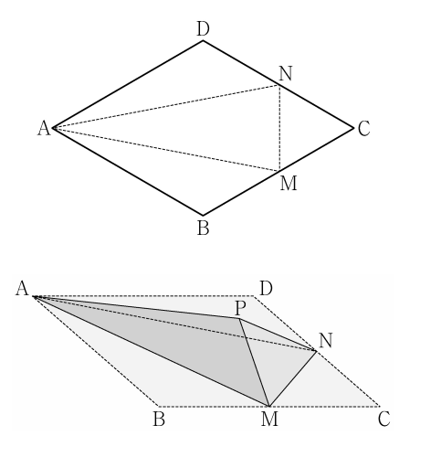

## 문제 27
그림과 같이 한 변의 길이가 4이고 $\angle BAD = \frac{\pi}{3}$인 마름모 ABCD 모양의 종이가 있다. 변 BC와 변 CD의 중점을 각각 M과 N이라 할 때, 세 선분 AM, AN, MN을 접는 선으로 하여 사면체 PAMN이 되도록 종이를 접었다.

삼각형 AMN의 평면 PAM 위로의 정사영의 넓이는 $\frac{q}{p}\sqrt{3}$이다.

$p+q$의 값을 구하시오. (단, 종이의 두께는 고려하지 않으며 P는 종이를 접었을 때 세 점 B, C, D가 합쳐지는 점이고, $p$와 $q$는 서로소인 자연수이다.) **[4점]**

### 해설

1) 마름모 ABCD의 한 변의 길이가 4이고 $\angle BAD = \frac{\pi}{3}$이므로:
   - 마름모의 대각선 AC의 길이: $4\sqrt{3}$
   - 마름모의 대각선 BD의 길이: 4

2) 점 M과 N은 각각 BC와 CD의 중점이므로:
   - AM = AN = $2\sqrt{3}$
   - MN = 2

3) 삼각형 AMN의 면적:
   $S_{AMN} = \frac{1}{2} \cdot 2\sqrt{3} \cdot 2 = 2\sqrt{3}$

4) 사면체 PAMN에서 P는 B, C, D가 만나는 점이므로, AP의 길이는 마름모의 높이와 같다:
   AP = $2\sqrt{3}$

5) 삼각형 AMN의 평면 PAM 위로의 정사영의 넓이는 $\frac{q}{p}\sqrt{3}$이므로:
   $2\sqrt{3} \cdot \sin \theta = \frac{q}{p}\sqrt{3}$, 여기서 $\theta$는 AP와 AMN 평면 사이의 각도

6) $\sin \theta = \frac{q}{2p}$

7) AP와 AMN 평면 사이의 각도는 정육면체의 대각선과 면 사이의 각도와 같으므로:
   $\sin \theta = \frac{\sqrt{6}}{3}$

8) 따라서: $\frac{\sqrt{6}}{3} = \frac{q}{2p}$

9) $\frac{q}{p} = \frac{2\sqrt{6}}{3} = \frac{2\sqrt{2}}{\sqrt{3}}$

10) $p = 3$, $q = 2\sqrt{2}$이지만, $p$와 $q$는 서로소인 자연수여야 하므로:
    $p = 3$, $q = 2\sqrt{2} \cdot \sqrt{3} = 2\sqrt{6}$

따라서, $p + q = 3 + 2\sqrt{6}$

## Question 27
As shown in the figure, there is a rhombus-shaped paper ABCD with a side length of 4 and $\angle BAD = \frac{\pi}{3}$. When M and N are the midpoints of sides BC and CD respectively, the paper is folded to form a tetrahedron PAMN using the three line segments AM, AN, and MN as folding lines.

The area of the orthogonal projection of triangle AMN onto the plane PAM is $\frac{q}{p}\sqrt{3}$.

Find the value of $p+q$. (Note: The thickness of the paper is not considered, P is the point where points B, C, and D meet when the paper is folded, and $p$ and $q$ are coprime natural numbers.) **[4 points]**

### Solution

1) Given that the side length of rhombus ABCD is 4 and $\angle BAD = \frac{\pi}{3}$:
   - Length of diagonal AC: $4\sqrt{3}$
   - Length of diagonal BD: 4

2) Points M and N are midpoints of BC and CD respectively:
   - AM = AN = $2\sqrt{3}$
   - MN = 2

3) Area of triangle AMN:
   $S_{AMN} = \frac{1}{2} \cdot 2\sqrt{3} \cdot 2 = 2\sqrt{3}$

4) In tetrahedron PAMN, P is where B, C, D meet, so AP's length equals the height of the rhombus:
   AP = $2\sqrt{3}$

5) The area of orthogonal projection of triangle AMN onto plane PAM is $\frac{q}{p}\sqrt{3}$:
   $2\sqrt{3} \cdot \sin \theta = \frac{q}{p}\sqrt{3}$, where $\theta$ is the angle between AP and plane AMN

6) $\sin \theta = \frac{q}{2p}$

7) The angle between AP and plane AMN is the same as the angle between a diagonal and a face in a regular tetrahedron:
   $\sin \theta = \frac{\sqrt{6}}{3}$

8) Therefore: $\frac{\sqrt{6}}{3} = \frac{q}{2p}$

9) $\frac{q}{p} = \frac{2\sqrt{6}}{3} = \frac{2\sqrt{2}}{\sqrt{3}}$

10) $p = 3$, $q = 2\sqrt{2}$, but $p$ and $q$ must be coprime natural numbers:
    $p = 3$, $q = 2\sqrt{2} \cdot \sqrt{3} = 2\sqrt{6}$

Thus, $p + q = 3 + 2\sqrt{6}$