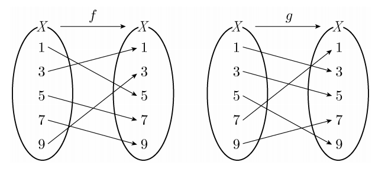

## 문제 4
그림은 두 함수 $f : X \rightarrow X$, $g : X \rightarrow X$를 나타낸 것이다.

$(g \circ f)(1)$의 값은? **[3점]**

1. 1
2. 3
3. 5
4. 7
5. 9

### 해설
주어진 함수 $f$와 $g$의 합성을 이용하여 $(g \circ f)(1)$의 값을 구해봅시다.

1. 먼저 $f(1)$의 값을 찾습니다. 그림에서 $f$의 화살표를 따라가면 $f(1) = 3$입니다.
2. 다음으로 $g(3)$의 값을 찾습니다. $g$의 화살표를 따라가면 $g(3) = 5$입니다.
3. 따라서 $(g \circ f)(1) = g(f(1)) = g(3) = 5$입니다.

정답은 **3번: 5**입니다.

## Question 4
The figure represents two functions $f : X \rightarrow X$ and $g : X \rightarrow X$.

What is the value of $(g \circ f)(1)$? **[3 points]**

1. 1
2. 3
3. 5
4. 7
5. 9

### Solution
Let's find the value of $(g \circ f)(1)$ using the composition of the given functions $f$ and $g$.

1. First, we find the value of $f(1)$. Following the arrows for $f$ in the figure, we see that $f(1) = 3$.
2. Next, we find the value of $g(3)$. Following the arrows for $g$, we see that $g(3) = 5$.
3. Therefore, $(g \circ f)(1) = g(f(1)) = g(3) = 5$.

The correct answer is **3: 5**.