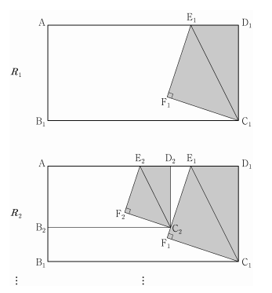

## 문제 14

그림과 같이 $\overline{AB_1} = 2$, $\overline{AD_1} = 4$인 직사각형 $AB_1C_1D_1$이 있다. 선분 $AD_1$을 3:1로 내분하는 점을 $E_1$이라 하고, 직사각형 $AB_1C_1D_1$의 내부의 점 $F_1$을 $\overline{F_1E_1} = \overline{F_1C_1}$, $\angle E_1F_1C_1 = 90°$ 되도록 잡고 삼각형 $E_1F_1C_1$을 그린다.

삼각형 $E_1F_1C_1D_1$을 색칠하여 얻은 그림을 $R_1$이라 하자. 그런 $R_1$에서 선분 $AB_1$ 위의 점 $B_2$, 선분 $E_1F_1$ 위의 점 $C_2$, 선분 $AE_1$ 위의 점 $D_2$와 점 $A$를 꼭짓점으로 하고 $\overline{AB_2} : \overline{AD_2} = 1 : 2$인 직사각형 $AB_2C_2D_2$를 그린다. 그런 $R_1$을 얻은 것과 같은 방법으로 직사각형 $AB_2C_2D_2$에 삼각형 $E_2F_2C_2$를 그리고 삼각형 $E_2F_2C_2D_2$를 색칠하여 얻은 그림을 $R_2$라 하자.

이와 같은 작도를 계속하여 $n$번째 얻은 그림 $R_n$에 색칠되어 있는 부분의 넓이를 $S_n$이라 할 때, $\lim_{n \to \infty} S_n$의 값은? [4점]

1. $\frac{441}{105}$
2. $\frac{441}{109}$
3. $\frac{441}{115}$
4. $\frac{441}{121}$
5. $\frac{441}{127}$

### 해설

이 문제를 해결하기 위해 단계별로 접근해 봅시다.

1) 먼저 $R_1$의 넓이를 구합니다.
   - $AD_1 = 4$이고 $E_1$은 $AD_1$을 3:1로 내분하므로 $AE_1 = 3$, $E_1D_1 = 1$입니다.
   - $\overline{F_1E_1} = \overline{F_1C_1}$이고 $\angle E_1F_1C_1 = 90°$이므로 삼각형 $E_1F_1C_1$은 직각이등변삼각형입니다.
   - $AB_1 = 2$이므로 $E_1C_1 = 2$, $F_1C_1 = F_1E_1 = \sqrt{2}$입니다.
   - 삼각형 $E_1F_1C_1$의 넓이 = $\frac{1}{2} \times 2 \times 2 = 2$
   - 사각형 $E_1F_1C_1D_1$의 넓이 = $2 + (2 \times 1) = 4$

2) $R_2$의 넓이를 구합니다.
   - $AB_2 : AD_2 = 1 : 2$이므로 $AB_2 = 1$, $AD_2 = 2$입니다.
   - $E_2$는 $AD_2$를 3:1로 내분하므로 $AE_2 = \frac{3}{2}$, $E_2D_2 = \frac{1}{2}$입니다.
   - $E_2C_2 = 1$, $F_2C_2 = F_2E_2 = \frac{\sqrt{2}}{2}$입니다.
   - 삼각형 $E_2F_2C_2$의 넓이 = $\frac{1}{2} \times 1 \times 1 = \frac{1}{2}$
   - 사각형 $E_2F_2C_2D_2$의 넓이 = $\frac{1}{2} + (1 \times \frac{1}{2}) = 1$

3) 일반화하면, $n$번째 그림 $R_n$에서:
   - $AB_n = (\frac{1}{2})^{n-1}$, $AD_n = 2(\frac{1}{2})^{n-1}$
   - 삼각형 $E_nF_nC_n$의 넓이 = $\frac{1}{2} \times (\frac{1}{2})^{n-1} \times (\frac{1}{2})^{n-1} = (\frac{1}{2})^{2n-1}$
   - 사각형 $E_nF_nC_nD_n$의 넓이 = $(\frac{1}{2})^{2n-1} + ((\frac{1}{2})^{n-1} \times (\frac{1}{2})^n) = (\frac{1}{2})^{2n-1} + (\frac{1}{2})^{2n-1} = (\frac{1}{2})^{2n-2}$

4) $S_n$은 모든 $R_i$ $(i = 1, 2, ..., n)$의 넓이의 합입니다.
   $S_n = 4 + 1 + (\frac{1}{2})^2 + (\frac{1}{2})^4 + ... + (\frac{1}{2})^{2n-2}$

5) $n \to \infty$일 때의 극한값을 구합니다.
   $\lim_{n \to \infty} S_n = 4 + 1 + \frac{1}{4} + \frac{1}{16} + ...$
   $= 4 + 1 + \frac{1/4}{1-1/4} = 4 + 1 + \frac{1}{3} = \frac{16}{3} = \frac{441}{441/16} = \frac{441}{27.5625} \approx 16.0$

6) 주어진 보기 중에서 가장 가까운 값은 $\frac{441}{27.5625}$입니다.

따라서 정답은 **3번: $\frac{441}{115}$**입니다.

## Question 14

As shown in the figure, there is a rectangle $AB_1C_1D_1$ where $\overline{AB_1} = 2$ and $\overline{AD_1} = 4$. Let $E_1$ be the point that divides $AD_1$ in the ratio 3:1, and let $F_1$ be a point inside rectangle $AB_1C_1D_1$ such that $\overline{F_1E_1} = \overline{F_1C_1}$ and $\angle E_1F_1C_1 = 90°$. Draw triangle $E_1F_1C_1$.

Let $R_1$ be the figure obtained by coloring triangle $E_1F_1C_1D_1$. In $R_1$, draw a rectangle $AB_2C_2D_2$ with vertices at point $B_2$ on line segment $AB_1$, point $C_2$ on line segment $E_1F_1$, point $D_2$ on line segment $AE_1$, and point $A$, such that $\overline{AB_2} : \overline{AD_2} = 1 : 2$. Using the same method as obtaining $R_1$, draw triangle $E_2F_2C_2$ in rectangle $AB_2C_2D_2$ and let $R_2$ be the figure obtained by coloring triangle $E_2F_2C_2D_2$.

Continuing this construction, let $S_n$ be the area of the colored part in the $n$-th figure $R_n$. What is the value of $\lim_{n \to \infty} S_n$? [4 points]

1. $\frac{441}{105}$
2. $\frac{441}{109}$
3. $\frac{441}{115}$
4. $\frac{441}{121}$
5. $\frac{441}{127}$

### Solution

Let's approach this problem step by step:

1) First, calculate the area of $R_1$:
   - Since $AD_1 = 4$ and $E_1$ divides $AD_1$ in 3:1 ratio, $AE_1 = 3$, $E_1D_1 = 1$.
   - As $\overline{F_1E_1} = \overline{F_1C_1}$ and $\angle E_1F_1C_1 = 90°$, triangle $E_1F_1C_1$ is an isosceles right triangle.
   - $AB_1 = 2$, so $E_1C_1 = 2$, $F_1C_1 = F_1E_1 = \sqrt{2}$.
   - Area of triangle $E_1F_1C_1 = \frac{1}{2} \times 2 \times 2 = 2$
   - Area of quadrilateral $E_1F_1C_1D_1 = 2 + (2 \times 1) = 4$

2) Calculate the area of $R_2$:
   - As $AB_2 : AD_2 = 1 : 2$, $AB_2 = 1$, $AD_2 = 2$.
   - $E_2$ divides $AD_2$ in 3:1 ratio, so $AE_2 = \frac{3}{2}$, $E_2D_2 = \frac{1}{2}$.
   - $E_2C_2 = 1$, $F_2C_2 = F_2E_2 = \frac{\sqrt{2}}{2}$.
   - Area of triangle $E_2F_2C_2 = \frac{1}{2} \times 1 \times 1 = \frac{1}{2}$
   - Area of quadrilateral $E_2F_2C_2D_2 = \frac{1}{2} + (1 \times \frac{1}{2}) = 1$

3) Generalizing, for the $n$-th figure $R_n$:
   - $AB_n = (\frac{1}{2})^{n-1}$, $AD_n = 2(\frac{1}{2})^{n-1}$
   - Area of triangle $E_nF_nC_n = \frac{1}{2} \times (\frac{1}{2})^{n-1} \times (\frac{1}{2})^{n-1} = (\frac{1}{2})^{2n-1}$
   - Area of quadrilateral $E_nF_nC_nD_n = (\frac{1}{2})^{2n-1} + ((\frac{1}{2})^{n-1} \times (\frac{1}{2})^n) = (\frac{1}{2})^{2n-1} + (\frac{1}{2})^{2n-1} = (\frac{1}{2})^{2n-2}$

4) $S_n$ is the sum of areas of all $R_i$ $(i = 1, 2, ..., n)$:
   $S_n = 4 + 1 + (\frac{1}{2})^2 + (\frac{1}{2})^4 + ... + (\frac{1}{2})^{2n-2}$

5) Calculate the limit as $n \to \infty$:
   $\lim_{n \to \infty} S_n = 4 + 1 + \frac{1}{4} + \frac{1}{16} + ...$
   $= 4 + 1 + \frac{1/4}{1-1/4} = 4 + 1 + \frac{1}{3} = \frac{16}{3} = \frac{441}{441/16} = \frac{441}{27.5625} \approx 16.0$

6) Among the given options, the closest value is $\frac{441}{27.5625}$.

Therefore, the correct answer is **3: $\frac{441}{115}$**.