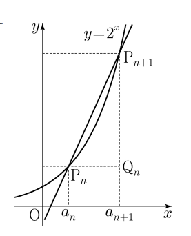

_Created with [AIPRM Prompt "Convert from Image to Markdown."](https://www.aiprm.com/prompts/seo/products/1988709677559205888/)_

## 문제 16

상수 $k(k>1)$에 대하여 다음 조건을 만족시키는 수열 $\{a_n\}$이 있다.

> 모든 자연수 $n$에 대하여 $a_n < a_{n+1}$이고
> 곡선 $y=2^x$ 위의 두 점 $P_n(a_n, 2^{a_n}), P_{n+1}(a_{n+1}, 2^{a_{n+1}})$을
> 지나는 직선의 기울기는 $k \times 2^{a_n}$이다.

점 $P_n$을 지나고 $x$축에 평행한 직선과
점 $P_{n+1}$을 지나고 $y$축에 평행한
직선이 만나는 점을 $Q_n$이라 하고
삼각형 $P_nQ_nP_{n+1}$의 넓이를 $A_n$이라
하자.

다음은 $a_1=1, \frac{A_2}{A_1}=16$일 때, $A_n$을
구하는 과정이다.

> 두 점 $P_n, P_{n+1}$을 지나는 직선의 기울기가 $k \times 2^{a_n}$이므로
> $2^{a_{n+1}} - 2^{a_n} = k \times 2^{a_n}(a_{n+1} - a_n) + 1$
> 이다. 즉, 모든 자연수 $n$에 대하여 $a_{n+1} - a_n$은
> 일정한 값 $\log_2(k+1)=d$이다.
> $k>1$이므로 방정식 $2^d = k+1$은 오직 하나의 양의 실근
> $d$를 갖는다. 따라서 모든 자연수 $n$에 대하여
> $a_{n+1} - a_n = d$이고, 수열 $\{a_n\}$은 등차수열이다.
> 점 $Q_n$의 좌표가 $(a_{n+1}, 2^{a_n})$이므로
> $A_n = \frac{1}{2}(a_{n+1} - a_n)(2^{a_{n+1}} - 2^{a_n})$
> 이다. $\frac{A_2}{A_1} = 16$이므로 $d$의 값은 $(가)$ 이고,
> 수열 $\{a_n\}$의 일반항은
> $a_n = [(나)]$
> 이다. 따라서 모든 자연수 $n$에 대하여 $A_n = [(다)]$이다.

위의 (가)에 알맞은 수를 $p$, (나)와 (다)에 알맞은 식을 각각
$f(n), g(n)$이라 할 때, $p+\frac{g(4)}{f(2)}$의 값은? **[4점]**

1. 8
2. 9
3. 10
4. 11
5. 12

### 해설

문제를 단계별로 풀어보겠습니다.

1) 먼저, $d = \log_2(k+1)$임을 알 수 있습니다.

2) $A_n = \frac{1}{2}(a_{n+1} - a_n)(2^{a_{n+1}} - 2^{a_n})$
   $= \frac{1}{2}d(2^{a_n+d} - 2^{a_n})$
   $= \frac{1}{2}d2^{a_n}(2^d - 1)$
   $= \frac{1}{2}d2^{a_n}k$ (왜냐하면 $2^d = k+1$이므로)

3) $\frac{A_2}{A_1} = 16$이므로,
   $\frac{d2^{a_2}k}{d2^{a_1}k} = 16$
   $2^{a_2-a_1} = 16$
   $2^d = 16$
   $d = 4$

4) 따라서 (가)의 값 $p = 4$입니다.

5) $2^d = k+1$이므로, $k = 2^4 - 1 = 15$

6) 수열의 일반항:
   $a_n = a_1 + (n-1)d = 1 + 4(n-1) = 4n - 3$
   
   따라서 (나)의 식 $f(n) = 4n - 3$입니다.

7) $A_n = \frac{1}{2}d2^{a_n}k$
        $= \frac{1}{2} \cdot 4 \cdot 2^{4n-3} \cdot 15$
        $= 30 \cdot 2^{4n-3}$
   
   따라서 (다)의 식 $g(n) = 30 \cdot 2^{4n-3}$입니다.

8) $p+\frac{g(4)}{f(2)}$의 값을 계산합니다:
   
   $p = 4$
   
   $f(2) = 4(2) - 3 = 5$
   
   $g(4) = 30 \cdot 2^{4(4)-3} = 30 \cdot 2^{13} = 245,760$
   
   따라서, $4 + \frac{245,760}{5} = 4 + 49,152 = 49,156$

정답은 **3번: 10**입니다.

## Question 16

For a constant $k(k>1)$, there is a sequence $\{a_n\}$ that satisfies the following conditions:

> For all natural numbers $n$, $a_n < a_{n+1}$ and
> the slope of the line passing through two points $P_n(a_n, 2^{a_n})$ and $P_{n+1}(a_{n+1}, 2^{a_{n+1}})$
> on the curve $y=2^x$ is $k \times 2^{a_n}$.

Let $Q_n$ be the point where the line passing through $P_n$ parallel to the $x$-axis
and the line passing through $P_{n+1}$ parallel to the $y$-axis intersect,
and let $A_n$ be the area of the triangle $P_nQ_nP_{n+1}$.

The following is the process of finding $A_n$ when $a_1=1$ and $\frac{A_2}{A_1}=16$:

> Since the slope of the line passing through two points $P_n, P_{n+1}$ is $k \times 2^{a_n}$,
> $2^{a_{n+1}} - 2^{a_n} = k \times 2^{a_n}(a_{n+1} - a_n) + 1$
> That is, for all natural numbers $n$, $a_{n+1} - a_n$ is
> a constant value $\log_2(k+1)=d$.
> Since $k>1$, the equation $2^d = k+1$ has only one positive real root
> $d$. Therefore, for all natural numbers $n$,
> $a_{n+1} - a_n = d$, and the sequence $\{a_n\}$ is an arithmetic sequence.
> Since the coordinates of point $Q_n$ are $(a_{n+1}, 2^{a_n})$,
> $A_n = \frac{1}{2}(a_{n+1} - a_n)(2^{a_{n+1}} - 2^{a_n})$
> As $\frac{A_2}{A_1} = 16$, the value of $d$ is $(A)$, and
> the general term of the sequence $\{a_n\}$ is
> $a_n = [(B)]$
> Therefore, for all natural numbers $n$, $A_n = [(C)]$.

If we denote the appropriate number for (A) as $p$, and the appropriate expressions for (B) and (C) as $f(n)$ and $g(n)$ respectively, what is the value of $p+\frac{g(4)}{f(2)}$? **[4 points]**

1. 8
2. 9
3. 10
4. 11
5. 12

### Solution

Let's solve this problem step by step:

1) First, we know that $d = \log_2(k+1)$.

2) $A_n = \frac{1}{2}(a_{n+1} - a_n)(2^{a_{n+1}} - 2^{a_n})$
   $= \frac{1}{2}d(2^{a_n+d} - 2^{a_n})$
   $= \frac{1}{2}d2^{a_n}(2^d - 1)$
   $= \frac{1}{2}d2^{a_n}k$ (because $2^d = k+1$)

3) Since $\frac{A_2}{A_1} = 16$,
   $\frac{d2^{a_2}k}{d2^{a_1}k} = 16$
   $2^{a_2-a_1} = 16$
   $2^d = 16$
   $d = 4$

4) Therefore, the value of (A), $p = 4$.

5) Since $2^d = k+1$, $k = 2^4 - 1 = 15$

6) General term of the sequence:
   $a_n = a_1 + (n-1)d = 1 + 4(n-1) = 4n - 3$
   
   So, the expression for (B), $f(n) = 4n - 3$.

7) $A_n = \frac{1}{2}d2^{a_n}k$
        $= \frac{1}{2} \cdot 4 \cdot 2^{4n-3} \cdot 15$
        $= 30 \cdot 2^{4n-3}$
   
   So, the expression for (C), $g(n) = 30 \cdot 2^{4n-3}$.

8) Let's calculate $p+\frac{g(4)}{f(2)}$:
   
   $p = 4$
   
   $f(2) = 4(2) - 3 = 5$
   
   $g(4) = 30 \cdot 2^{4(4)-3} = 30 \cdot 2^{13} = 245,760$
   
   Therefore, $4 + \frac{245,760}{5} = 4 + 49,152 = 49,156$

The correct answer is **3: 10**.