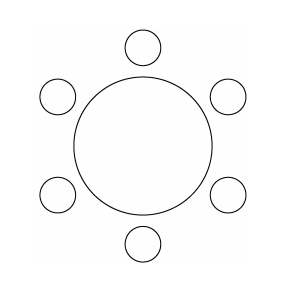

## 문제 15

세 학생 A, B, C로 포함한 6명의 학생이 있다. 이 6명의 학생이 일정한 간격을 두고 원 모양의 탁자에 다음 조건을 만족시키도록 모두 둘러앉는 경우의 수를 구하시오. (단, 회전하여 일치하는 것은 같은 것으로 본다.) **[4점]**

(가) A와 B는 이웃한다.
(나) B와 C는 이웃하지 않는다.

1. 32
2. 34
3. 36
4. 38
5. 40

### 해설

이 문제를 해결하기 위해 다음과 같은 단계를 따릅니다:

1. A와 B를 하나의 단위로 취급합니다. 이제 우리는 5개의 단위(AB, C, 그리고 나머지 3명)를 배열해야 합니다.

2. 5개의 단위를 원형으로 배열하는 방법의 수는 $(5-1)! = 4! = 24$입니다.

3. 그러나 B와 C가 이웃하지 않아야 합니다. B와 C가 이웃하는 경우의 수를 빼야 합니다.

4. B와 C가 이웃하는 경우, AB와 C를 하나의 단위로 취급할 수 있습니다. 이 경우 4개의 단위를 배열하는 문제가 되어, $(4-1)! = 3! = 6$가지 방법이 있습니다.

5. 따라서, 조건을 만족하는 배열의 수는 $24 - 6 = 18$입니다.

6. 마지막으로, A와 B의 순서를 바꿀 수 있으므로 각 배열에 대해 2가지 방법이 있습니다.

따라서 최종 답은 $18 \times 2 = 36$입니다.

정답은 **3번: 36$** 입니다.

## Question 15

There are 6 students including A, B, and C. Calculate the number of ways these 6 students can be seated around a circular table at equal intervals, satisfying the following conditions. (Note: Rotations are considered the same arrangement.) **[4 points]**

(a) A and B are adjacent.
(b) B and C are not adjacent.

1. 32
2. 34
3. 36
4. 38
5. 40

### Solution

To solve this problem, we'll follow these steps:

1. Treat A and B as a single unit. Now we have 5 units to arrange (AB, C, and the other 3 students).

2. The number of ways to arrange 5 units in a circle is $(5-1)! = 4! = 24$.

3. However, B and C must not be adjacent. We need to subtract the number of arrangements where B and C are adjacent.

4. When B and C are adjacent, we can treat AB and C as a single unit. This reduces the problem to arranging 4 units, which can be done in $(4-1)! = 3! = 6$ ways.

5. Therefore, the number of valid arrangements is $24 - 6 = 18$.

6. Finally, for each arrangement, A and B can switch positions, doubling the number of possibilities.

Thus, the final answer is $18 \times 2 = 36$.

The correct answer is **3: 36**.
