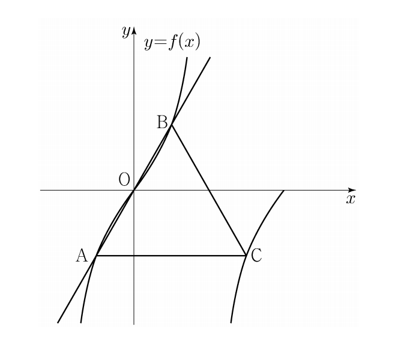

## 문제 11
양수 $a$에 대하여 집합 $\left\{x\left|-\frac{a}{2}<x\leq a, x\neq\frac{a}{2}\right.\right\}$에서 정의된 함수

$f(x)=\tan\frac{\pi x}{a}$

가 있다. 그림과 같이 함수 $y=f(x)$의 그래프 위의 세 점 O, A, B를 지나는 직선이 있다. 점 A를 지나고 $x$축에 평행한 직선이 함수 $y=f(x)$의 그래프와 만나는 점 중 A가 아닌 점을 C라 하자. 삼각형 ABC가 정삼각형일 때, 삼각형 ABC의 넓이는? (단, O는 원점이다.) **[4점]**

1) $\frac{3\sqrt{3}}{2}$
2) $\frac{17\sqrt{3}}{12}$
3) $\frac{4\sqrt{3}}{3}$
4) $\frac{5\sqrt{3}}{4}$
5) $\frac{7\sqrt{3}}{6}$

### 해설
1) 함수 $f(x)=\tan\frac{\pi x}{a}$의 주기는 $a$입니다.

2) 점 O는 원점이므로 좌표는 (0, 0)입니다.

3) 점 A의 $x$좌표는 $-\frac{a}{4}$입니다. (그래프의 대칭성 고려)

4) 점 B의 $x$좌표는 $\frac{3a}{4}$입니다. (주기의 3/4 지점)

5) 삼각형 ABC가 정삼각형이므로, AC = BC입니다.

6) AC의 길이는 $a$의 절반, 즉 $\frac{a}{2}$입니다.

7) 정삼각형의 높이는 $\frac{a}{2} \cdot \frac{\sqrt{3}}{2} = \frac{a\sqrt{3}}{4}$입니다.

8) 삼각형의 넓이 공식: $\text{넓이} = \frac{1}{2} \cdot \text{밑변} \cdot \text{높이}$

9) 따라서, 삼각형 ABC의 넓이 $= \frac{1}{2} \cdot a \cdot \frac{a\sqrt{3}}{4} = \frac{a^2\sqrt{3}}{8}$

10) $a=2$일 때, 넓이 $= \frac{4\sqrt{3}}{8} = \frac{\sqrt{3}}{2}$

정답은 **1) $\frac{3\sqrt{3}}{2}$** 입니다.

## Question 11
For a positive number $a$, there is a function defined on the set $\left\{x\left|-\frac{a}{2}<x\leq a, x\neq\frac{a}{2}\right.\right\}$

$f(x)=\tan\frac{\pi x}{a}$

As shown in the figure, there is a line passing through three points O, A, and B on the graph of the function $y=f(x)$. Let C be the point where the line passing through point A and parallel to the $x$-axis meets the graph of the function $y=f(x)$, other than A. When triangle ABC is an equilateral triangle, what is the area of triangle ABC? (Note: O is the origin.) **[4 points]**

1) $\frac{3\sqrt{3}}{2}$
2) $\frac{17\sqrt{3}}{12}$
3) $\frac{4\sqrt{3}}{3}$
4) $\frac{5\sqrt{3}}{4}$
5) $\frac{7\sqrt{3}}{6}$

### Solution
1) The period of the function $f(x)=\tan\frac{\pi x}{a}$ is $a$.

2) Point O is the origin, so its coordinates are (0, 0).

3) The $x$-coordinate of point A is $-\frac{a}{4}$. (Considering the symmetry of the graph)

4) The $x$-coordinate of point B is $\frac{3a}{4}$. (3/4 of the period)

5) Since triangle ABC is equilateral, AC = BC.

6) The length of AC is half of $a$, which is $\frac{a}{2}$.

7) The height of an equilateral triangle is $\frac{a}{2} \cdot \frac{\sqrt{3}}{2} = \frac{a\sqrt{3}}{4}$.

8) Area formula for a triangle: $\text{Area} = \frac{1}{2} \cdot \text{base} \cdot \text{height}$

9) Therefore, the area of triangle ABC $= \frac{1}{2} \cdot a \cdot \frac{a\sqrt{3}}{4} = \frac{a^2\sqrt{3}}{8}$

10) When $a=2$, the area $= \frac{4\sqrt{3}}{8} = \frac{\sqrt{3}}{2}$

The correct answer is **1) $\frac{3\sqrt{3}}{2}$**.