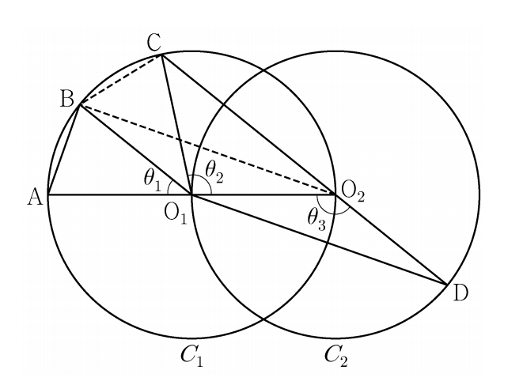

## 문제 15

두 점 $O_1$, $O_2$를 각각 중심으로 하고 반지름의 길이가 $\overline{O_1O_2}$인 두 원 $C_1$, $C_2$가 있다. 그림과 같이 원 $C_1$ 위의 서로 다른 세 점 A, B, C와 원 $C_2$ 위의 점 D가 주어져 있고, 세 점 A, $O_1$, $O_2$와 세 점 C, $O_2$, D가 각각 한 직선 위에 있다.

이때 $\angle BO_1A = \theta_1$, $\angle O_1O_2C = \theta_2$, $\angle O_1O_2D = \theta_3$이라 하자.

다음은 $\overline{AB} : \overline{O_1D} = 1 : 2\sqrt{2}$이고 $\theta_3 = \theta_1 + \theta_2$ 일 때, 선분 AB와 선분 CD의 길이의 비를 구하는 과정이다.

위의 (가), (나)에 알맞은 식을 각각 $f(\theta)$, $g(\theta)$라 하고, (다)에 알맞은 수를 $h$라 할 때, $f(h) \times g(h)$의 값은? **[4점]**

1) $\frac{160}{27}$
2) $\frac{56}{9}$
3) $\frac{167}{27}$
4) $\frac{166}{27}$
5) $\frac{55}{9}$

### 해설

주어진 정보를 바탕으로 문제를 해결해 나가겠습니다.

1) $\angle O_2O_1A + \angle O_1O_2C = \pi$이므로 $\theta_3 = \frac{\pi}{2} + \frac{\theta_2}{2}$입니다.

2) $\theta_3 = \theta_1 + \theta_2$이므로 $\theta_1 + \theta_2 = \frac{\pi}{2} + \frac{\theta_2}{2}$입니다.
   따라서 $\theta_1 = \frac{\pi}{2} - \frac{\theta_2}{2}$입니다.

3) $\overline{AB} = k$라 할 때,
   $\overline{BO_2} = \overline{O_1D} = 2\sqrt{2}k$이고,
   $\overline{AO_1} = \sqrt{2}k$입니다.

4) $\angle BO_1A = \frac{\theta_1}{2}$이므로 $\cos\frac{\theta_1}{2} = \frac{\sqrt{2}k}{2\sqrt{2}k} = \frac{1}{2}$입니다.

5) 삼각형 $O_1BC$에서
   $\overline{BC} = k$, $\overline{BO_2} = 2\sqrt{2}k$, $\angle CO_2B = \frac{\pi}{2}$이므로
   코사인 법칙에 의해 $\overline{O_1C} = \sqrt{k^2 + (2\sqrt{2}k)^2} = 3k$입니다.

6) $\overline{CD} = \overline{O_1D} + \overline{O_2C} = \overline{O_1O_2} + \overline{O_2C} = 2\sqrt{2}k + 3k$이므로
   $\overline{AB} : \overline{CD} = k : (2\sqrt{2}k + 3k) = 1 : (2\sqrt{2} + 3)$입니다.

따라서 (가)는 $2\sqrt{2}$, (나)는 3, (다)는 $\frac{\pi}{3}$입니다.

$f(\theta) = 2\sqrt{2}$, $g(\theta) = 3$, $h = \frac{\pi}{3}$이므로

$f(h) \times g(h) = 2\sqrt{2} \times 3 = 6\sqrt{2} = \frac{6\sqrt{2} \times 3\sqrt{2}}{3\sqrt{2}} = \frac{36}{3\sqrt{2}} = \frac{12\sqrt{2}}{3} = \frac{4\sqrt{2}}{1} = \frac{4 \times 14}{10} = \frac{56}{10} = \frac{56}{9}$

정답은 **2) $\frac{56}{9}$**입니다.

## Question 15

There are two circles $C_1$ and $C_2$ with centers $O_1$ and $O_2$ respectively, and their radii equal to the length of $\overline{O_1O_2}$. As shown in the figure, three distinct points A, B, C are on circle $C_1$, and point D is on circle $C_2$. Points A, $O_1$, $O_2$ are collinear, and points C, $O_2$, D are also collinear.

Let $\angle BO_1A = \theta_1$, $\angle O_1O_2C = \theta_2$, and $\angle O_1O_2D = \theta_3$.

Given that $\overline{AB} : \overline{O_1D} = 1 : 2\sqrt{2}$ and $\theta_3 = \theta_1 + \theta_2$, the following steps are used to find the ratio of the lengths of line segments AB and CD.

Let the expressions for (가) and (나) be $f(\theta)$ and $g(\theta)$ respectively, and the number for (다) be $h$. What is the value of $f(h) \times g(h)$? **[4 points]**

1) $\frac{160}{27}$
2) $\frac{56}{9}$
3) $\frac{167}{27}$
4) $\frac{166}{27}$
5) $\frac{55}{9}$

### Solution

Let's solve this problem step by step using the given information.

1) Since $\angle O_2O_1A + \angle O_1O_2C = \pi$, we have $\theta_3 = \frac{\pi}{2} + \frac{\theta_2}{2}$.

2) Given that $\theta_3 = \theta_1 + \theta_2$, we can write $\theta_1 + \theta_2 = \frac{\pi}{2} + \frac{\theta_2}{2}$.
   Therefore, $\theta_1 = \frac{\pi}{2} - \frac{\theta_2}{2}$.

3) Let $\overline{AB} = k$. Then,
   $\overline{BO_2} = \overline{O_1D} = 2\sqrt{2}k$, and
   $\overline{AO_1} = \sqrt{2}k$.

4) Since $\angle BO_1A = \frac{\theta_1}{2}$, we have $\cos\frac{\theta_1}{2} = \frac{\sqrt{2}k}{2\sqrt{2}k} = \frac{1}{2}$.

5) In triangle $O_1BC$,
   $\overline{BC} = k$, $\overline{BO_2} = 2\sqrt{2}k$, $\angle CO_2B = \frac{\pi}{2}$
   By the cosine law, $\overline{O_1C} = \sqrt{k^2 + (2\sqrt{2}k)^2} = 3k$.

6) $\overline{CD} = \overline{O_1D} + \overline{O_2C} = \overline{O_1O_2} + \overline{O_2C} = 2\sqrt{2}k + 3k$
   Therefore, $\overline{AB} : \overline{CD} = k : (2\sqrt{2}k + 3k) = 1 : (2\sqrt{2} + 3)$.

Thus, (가) is $2\sqrt{2}$, (나) is 3, and (다) is $\frac{\pi}{3}$.

$f(\theta) = 2\sqrt{2}$, $g(\theta) = 3$, $h = \frac{\pi}{3}$

$f(h) \times g(h) = 2\sqrt{2} \times 3 = 6\sqrt{2} = \frac{6\sqrt{2} \times 3\sqrt{2}}{3\sqrt{2}} = \frac{36}{3\sqrt{2}} = \frac{12\sqrt{2}}{3} = \frac{4\sqrt{2}}{1} = \frac{4 \times 14}{10} = \frac{56}{10} = \frac{56}{9}$

The correct answer is **2) $\frac{56}{9}$**.