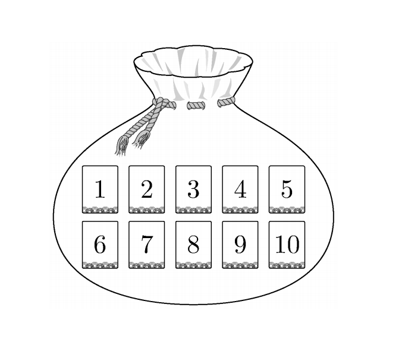

## 문제 26

1부터 10까지 자연수가 하나씩 적혀 있는 10장의 카드가 들어 있는 주머니가 있다. 이 주머니에서 임의로 카드 3장을 동시에 꺼낼 때, 꺼낸 카드에 적혀 있는 세 자연수 중에서 가장 작은 수가 4 이하이거나 7 이상일 확률은? **[3점]**

1) $\frac{4}{5}$
2) $\frac{5}{6}$
3) $\frac{13}{15}$
4) $\frac{9}{10}$
5) $\frac{14}{15}$

### 해설

이 문제를 해결하기 위해 다음 단계를 따라갑시다:

1) 전체 경우의 수:
   10장 중 3장을 뽑는 조합의 수 = $\binom{10}{3} = 120$

2) 가장 작은 수가 4 이하일 확률:
   - 1, 2, 3, 4 중 하나 이상이 포함된 경우의 수
   - 이는 전체에서 1, 2, 3, 4가 모두 포함되지 않은 경우를 빼면 됨
   - 5, 6, 7, 8, 9, 10 중 3장을 뽑는 경우의 수 = $\binom{6}{3} = 20$
   - 따라서, 4 이하가 포함된 경우의 수 = 120 - 20 = 100

3) 가장 작은 수가 7 이상일 확률:
   - 7, 8, 9, 10 중에서만 3장을 뽑는 경우의 수
   - $\binom{4}{3} = 4$

4) 구하는 확률:
   $(100 + 4) / 120 = 104 / 120 = 13 / 15$

따라서, 정답은 **3) $\frac{13}{15}$** 입니다.

## Question 26

There is a bag containing 10 cards, each with a natural number from 1 to 10 written on it. When randomly drawing 3 cards simultaneously from this bag, what is the probability that the smallest number among the three drawn numbers is either 4 or less, or 7 or greater? **[3 points]**

1) $\frac{4}{5}$
2) $\frac{5}{6}$
3) $\frac{13}{15}$
4) $\frac{9}{10}$
5) $\frac{14}{15}$

### Solution

Let's solve this problem step by step:

1) Total number of possible outcomes:
   Number of ways to choose 3 cards out of 10 = $\binom{10}{3} = 120$

2) Probability of the smallest number being 4 or less:
   - Cases where at least one of 1, 2, 3, 4 is included
   - This is equal to the total minus cases where none of 1, 2, 3, 4 are included
   - Number of ways to choose 3 cards from 5, 6, 7, 8, 9, 10 = $\binom{6}{3} = 20$
   - Therefore, number of cases with 4 or less = 120 - 20 = 100

3) Probability of the smallest number being 7 or greater:
   - Number of ways to choose 3 cards only from 7, 8, 9, 10
   - $\binom{4}{3} = 4$

4) Required probability:
   $(100 + 4) / 120 = 104 / 120 = 13 / 15$

Thus, the correct answer is **3) $\frac{13}{15}$**.