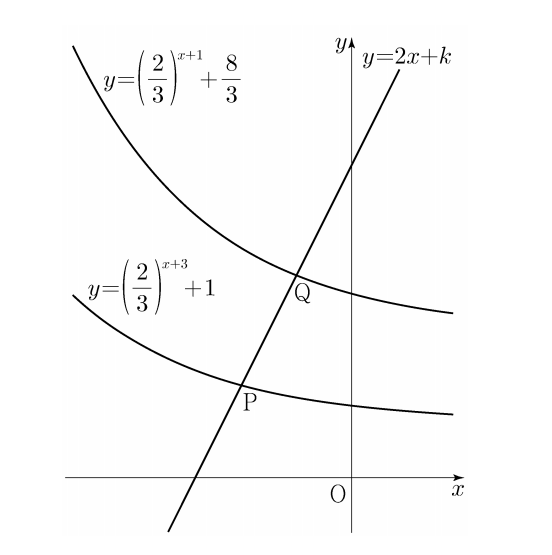

## 문제 9
직선 $y=2x+k$가 두 함수

$y=\left(\frac{2}{3}\right)^{x+3}+1$, $y=\left(\frac{2}{3}\right)^{x+1}+\frac{8}{3}$

의 그래프와 만나는 점을 각각 P, Q라 하자. $\overline{PQ} = \sqrt{5}$일 때, 상수 $k$의 값은? **[4점]**

1) $\frac{31}{6}$
2) $\frac{16}{3}$
3) $\frac{11}{2}$
4) $\frac{17}{3}$
5) $\frac{35}{6}$

### 해설
1) 두 함수의 그래프와 직선의 교점 P와 Q의 x좌표를 각각 $a$, $b$라고 하자.

2) P점의 좌표: $(a, 2a+k)$
   $2a+k = \left(\frac{2}{3}\right)^{a+3}+1$

3) Q점의 좌표: $(b, 2b+k)$
   $2b+k = \left(\frac{2}{3}\right)^{b+1}+\frac{8}{3}$

4) $\overline{PQ} = \sqrt{5}$이므로,
   $(b-a)^2 + (2b+k-(2a+k))^2 = 5$
   $(b-a)^2 + 4(b-a)^2 = 5$
   $5(b-a)^2 = 5$
   $b-a = 1$

5) $b = a+1$을 Q점의 방정식에 대입:
   $2(a+1)+k = \left(\frac{2}{3}\right)^{(a+1)+1}+\frac{8}{3}$
   $2a+2+k = \left(\frac{2}{3}\right)^{a+2}+\frac{8}{3}$

6) P점의 방정식과 비교:
   $2a+k = \left(\frac{2}{3}\right)^{a+3}+1$
   $2a+2+k = \left(\frac{2}{3}\right)^{a+2}+\frac{8}{3}$

7) 두 식을 빼면:
   $2 = \left(\frac{2}{3}\right)^{a+2}-\left(\frac{2}{3}\right)^{a+3}+\frac{5}{3}$
   $\frac{1}{3} = \left(\frac{2}{3}\right)^{a+2}-\left(\frac{2}{3}\right)^{a+3}$
   $\frac{1}{3} = \left(\frac{2}{3}\right)^{a+2}\left(1-\frac{2}{3}\right)$
   $\frac{1}{3} = \left(\frac{2}{3}\right)^{a+2}\cdot\frac{1}{3}$
   $1 = \left(\frac{2}{3}\right)^{a+2}$

8) 따라서 $a+2=0$, $a=-2$

9) $a=-2$를 P점의 방정식에 대입:
   $-4+k = \left(\frac{2}{3}\right)^{1}+1$
   $-4+k = \frac{2}{3}+1 = \frac{5}{3}$
   $k = \frac{5}{3}+4 = \frac{17}{3}$

따라서 정답은 **4) $\frac{17}{3}$** 입니다.

## Question 9
Let P and Q be the points where the line $y=2x+k$ intersects the graphs of the two functions

$y=\left(\frac{2}{3}\right)^{x+3}+1$, $y=\left(\frac{2}{3}\right)^{x+1}+\frac{8}{3}$

respectively. If $\overline{PQ} = \sqrt{5}$, what is the value of the constant $k$? **[4 points]**

1) $\frac{31}{6}$
2) $\frac{16}{3}$
3) $\frac{11}{2}$
4) $\frac{17}{3}$
5) $\frac{35}{6}$

### Solution
1) Let the x-coordinates of the intersection points P and Q be $a$ and $b$ respectively.

2) Coordinates of point P: $(a, 2a+k)$
   $2a+k = \left(\frac{2}{3}\right)^{a+3}+1$

3) Coordinates of point Q: $(b, 2b+k)$
   $2b+k = \left(\frac{2}{3}\right)^{b+1}+\frac{8}{3}$

4) Since $\overline{PQ} = \sqrt{5}$,
   $(b-a)^2 + (2b+k-(2a+k))^2 = 5$
   $(b-a)^2 + 4(b-a)^2 = 5$
   $5(b-a)^2 = 5$
   $b-a = 1$

5) Substitute $b = a+1$ into Q's equation:
   $2(a+1)+k = \left(\frac{2}{3}\right)^{(a+1)+1}+\frac{8}{3}$
   $2a+2+k = \left(\frac{2}{3}\right)^{a+2}+\frac{8}{3}$

6) Compare with P's equation:
   $2a+k = \left(\frac{2}{3}\right)^{a+3}+1$
   $2a+2+k = \left(\frac{2}{3}\right)^{a+2}+\frac{8}{3}$

7) Subtract these equations:
   $2 = \left(\frac{2}{3}\right)^{a+2}-\left(\frac{2}{3}\right)^{a+3}+\frac{5}{3}$
   $\frac{1}{3} = \left(\frac{2}{3}\right)^{a+2}-\left(\frac{2}{3}\right)^{a+3}$
   $\frac{1}{3} = \left(\frac{2}{3}\right)^{a+2}\left(1-\frac{2}{3}\right)$
   $\frac{1}{3} = \left(\frac{2}{3}\right)^{a+2}\cdot\frac{1}{3}$
   $1 = \left(\frac{2}{3}\right)^{a+2}$

8) Therefore, $a+2=0$, $a=-2$

9) Substitute $a=-2$ into P's equation:
   $-4+k = \left(\frac{2}{3}\right)^{1}+1$
   $-4+k = \frac{2}{3}+1 = \frac{5}{3}$
   $k = \frac{5}{3}+4 = \frac{17}{3}$

Thus, the correct answer is **4) $\frac{17}{3}$**.