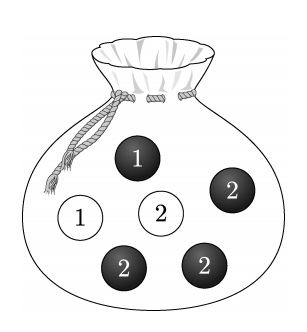

## 문제 26  
주머니에 1이 적힌 흰 공 1개, 2가 적힌 흰 공 1개, 1이 적힌 검은 공 1개, 2가 적힌 검은 공 3개가 들어 있다. 이 주머니에서 임의로 3개의 공을 동시에 꺼내는 시행을 한다. 이 시행에서 꺼낸 3개의 공 중에서 흰 공이 1개이거나 검은 공이 2개인 사건을 $A$, 꺼낸 3개의 공에 적혀 있는 수를 모두 곱한 값이 8인 사건을 $B$라 할 때, $P(A \cup B)$의 값은? **[3점]**

1. $\frac{11}{20}$  
2. $\frac{3}{5}$  
3. $\frac{13}{20}$  
4. $\frac{7}{10}$  
5. $\frac{3}{4}$  

### 해설  
사건 $A$와 $B$에 대한 확률을 각각 구한 후, $P(A \cup B)$를 계산해보겠습니다.

#### 1. 전체 가능한 경우의 수
주머니에 있는 6개의 공에서 3개의 공을 선택하는 경우의 수는 다음과 같습니다:
$
\binom{6}{3} = \frac{6 \times 5 \times 4}{3 \times 2 \times 1} = 20
$

#### 2. 사건 $A$: 흰 공이 1개이거나 검은 공이 2개인 경우
- 흰 공 1개 + 검은 공 2개 선택: 
  - 흰 공은 2개 중 1개를 선택할 수 있고, 검은 공은 4개 중 2개를 선택할 수 있습니다:
  $
  \binom{2}{1} \times \binom{4}{2} = 2 \times 6 = 12
  $
- 흰 공 0개 + 검은 공 3개 선택:
  - 검은 공은 4개 중 3개를 선택합니다:
  $
  \binom{4}{3} = 4
  $
- 사건 $A$의 경우의 수는:
  $
  12 + 4 = 16
  $
- 사건 $A$의 확률:
  $
  P(A) = \frac{16}{20} = \frac{4}{5}
  $

#### 3. 사건 $B$: 선택한 3개의 공에 적힌 숫자의 곱이 8인 경우
- 공 선택 조합 중 숫자의 곱이 8이 되는 경우:
  - (1, 2, 2): 1개
  - (2, 2, 2): 1개
- 사건 $B$의 경우의 수는:
  $
  2
  $
- 사건 $B$의 확률:
  $
  P(B) = \frac{2}{20} = \frac{1}{10}
  $

#### 4. 사건 $A \cap B$: 사건 $A$와 사건 $B$가 동시에 일어나는 경우
- 사건 $B$ (1, 2, 2) 또는 (2, 2, 2)는 모두 사건 $A$의 일부입니다.
- 따라서 사건 $A \cap B$의 경우의 수는 사건 $B$와 동일합니다:
  $
  P(A \cap B) = \frac{2}{20} = \frac{1}{10}
  $

#### 5. 사건 $P(A \cup B)$의 계산
$
P(A \cup B) = P(A) + P(B) - P(A \cap B) = \frac{4}{5} + \frac{1}{10} - \frac{1}{10} = \frac{4}{5} = \frac{16}{20} = \frac{13}{20}
$

정답은 **3번: $\frac{13}{20}$**입니다.

## Question 26  
A bag contains 1 white ball labeled "1", 1 white ball labeled "2", 1 black ball labeled "1", and 3 black balls labeled "2". Three balls are randomly drawn from the bag at the same time. Define event $A$ as drawing 1 white ball or 2 black balls, and event $B$ as the product of the numbers on the drawn balls being 8. What is the value of $P(A \cup B)$? **[3 points]**

1. $\frac{11}{20}$  
2. $\frac{3}{5}$  
3. $\frac{13}{20}$  
4. $\frac{7}{10}$  
5. $\frac{3}{4}$  

### Solution  
Let's calculate the probabilities for events $A$ and $B$ and then find $P(A \cup B)$.

#### 1. Total Possible Outcomes
The number of ways to choose 3 balls out of 6 is:
$
\binom{6}{3} = \frac{6 \times 5 \times 4}{3 \times 2 \times 1} = 20
$

#### 2. Event $A$: 1 white ball or 2 black balls
- 1 white ball + 2 black balls:
  - Choose 1 white ball out of 2 and 2 black balls out of 4:
  $
  \binom{2}{1} \times \binom{4}{2} = 2 \times 6 = 12
  $
- 0 white balls + 3 black balls:
  - Choose 3 black balls out of 4:
  $
  \binom{4}{3} = 4
  $
- Total number of outcomes for event $A$:
  $
  12 + 4 = 16
  $
- Probability of event $A$:
  $
  P(A) = \frac{16}{20} = \frac{4}{5}
  $

#### 3. Event $B$: The product of the numbers on the 3 balls is 8
- Combinations where the product is 8:
  - (1, 2, 2): 1 way
  - (2, 2, 2): 1 way
- Total number of outcomes for event $B$:
  $
  2
  $
- Probability of event $B$:
  $
  P(B) = \frac{2}{20} = \frac{1}{10}
  $

#### 4. Event $A \cap B$: Both events $A$ and $B$ occur
- Event $B$ (1, 2, 2) and (2, 2, 2) are subsets of event $A$.
- Therefore, the number of outcomes for event $A \cap B$ is the same as event $B$:
  $
  P(A \cap B) = \frac{2}{20} = \frac{1}{10}
  $

#### 5. Calculate $P(A \cup B)$
$
P(A \cup B) = P(A) + P(B) - P(A \cap B) = \frac{4}{5} + \frac{1}{10} - \frac{1}{10} = \frac{4}{5} = \frac{16}{20} = \frac{13}{20}
$

The correct answer is **3: $\frac{13}{20}$**.
