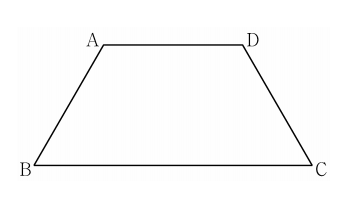

## 문제 29

평면 $\alpha$ 위에 $\overline{AB} = \overline{CD} = \overline{AD} = 2$, $\angle ABC = \angle BCD = \frac{\pi}{3}$인 사다리꼴 ABCD가 있다. 다음 조건을 만족시키는 평면 $\alpha$ 위의 두 점 $P$, $Q$에 대하여 $\overline{CP} \cdot \overline{DQ}$의 값을 구하시오. **[4점]**

(가) $\overline{AC} = 2(\overline{AD} + \overline{BP})$
(나) $\overline{AC} \cdot \overline{PQ} = 6$
(다) $2 \times \angle BQA = \angle PBQ < \frac{\pi}{2}$

### 해설

이 문제를 단계별로 해결해 보겠습니다.

1) 먼저 사다리꼴 ABCD의 성질을 이용하여 $\overline{AC}$의 길이를 구합니다.
   - $\overline{AB} = \overline{CD} = \overline{AD} = 2$이고, $\angle ABC = \angle BCD = \frac{\pi}{3}$입니다.
   - 이등변 삼각형 ABC에서 $\overline{AC} = 2\sqrt{3}$입니다.

2) 조건 (가)를 이용하여 $\overline{BP}$를 구합니다.
   $\overline{AC} = 2(\overline{AD} + \overline{BP})$
   $2\sqrt{3} = 2(2 + \overline{BP})$
   $\sqrt{3} = 2 + \overline{BP}$
   $\overline{BP} = \sqrt{3} - 2$

3) 조건 (나)를 이용하여 $\overline{PQ}$를 구합니다.
   $\overline{AC} \cdot \overline{PQ} = 6$
   $2\sqrt{3} \cdot \overline{PQ} = 6$
   $\overline{PQ} = \frac{3}{\sqrt{3}} = \sqrt{3}$

4) 삼각형 BPQ에서 $\overline{BQ}$를 구합니다.
   - $\overline{BP} = \sqrt{3} - 2$, $\overline{PQ} = \sqrt{3}$
   - 피타고라스 정리를 이용하면:
     $\overline{BQ}^2 = \overline{BP}^2 + \overline{PQ}^2 = (\sqrt{3} - 2)^2 + 3 = 7 - 2\sqrt{3}$
   - 따라서 $\overline{BQ} = \sqrt{7 - 2\sqrt{3}}$

5) 삼각형 CPQ에서 $\overline{CP}$를 구합니다.
   - $\overline{CQ} = \overline{AB} = 2$
   - 피타고라스 정리를 이용하면:
     $\overline{CP}^2 = \overline{CQ}^2 - \overline{PQ}^2 = 2^2 - 3 = 1$
   - 따라서 $\overline{CP} = 1$

6) 마지막으로 $\overline{DQ}$를 구합니다.
   - 삼각형 BDQ에서 $\overline{BD} = 2\sqrt{3}$, $\overline{BQ} = \sqrt{7 - 2\sqrt{3}}$
   - 코사인 법칙을 이용하면:
     $\overline{DQ}^2 = \overline{BD}^2 + \overline{BQ}^2 - 2\overline{BD}\cdot\overline{BQ}\cos\frac{\pi}{3}$
     $= 12 + (7 - 2\sqrt{3}) - 2\cdot2\sqrt{3}\cdot\sqrt{7 - 2\sqrt{3}}\cdot\frac{1}{2}$
     $= 19 - 2\sqrt{3} - 2\sqrt{3}\sqrt{7 - 2\sqrt{3}}$
   - 따라서 $\overline{DQ} = \sqrt{19 - 2\sqrt{3} - 2\sqrt{3}\sqrt{7 - 2\sqrt{3}}}$

7) 최종적으로 $\overline{CP} \cdot \overline{DQ}$의 값을 구합니다.
   $\overline{CP} \cdot \overline{DQ} = 1 \cdot \sqrt{19 - 2\sqrt{3} - 2\sqrt{3}\sqrt{7 - 2\sqrt{3}}}$

따라서, $\overline{CP} \cdot \overline{DQ} = \sqrt{19 - 2\sqrt{3} - 2\sqrt{3}\sqrt{7 - 2\sqrt{3}}}$입니다.

## Question 29

On a plane $\alpha$, there is a trapezoid ABCD where $\overline{AB} = \overline{CD} = \overline{AD} = 2$, and $\angle ABC = \angle BCD = \frac{\pi}{3}$. Find the value of $\overline{CP} \cdot \overline{DQ}$ for two points $P$ and $Q$ on plane $\alpha$ that satisfy the following conditions: **[4 points]**

(a) $\overline{AC} = 2(\overline{AD} + \overline{BP})$
(b) $\overline{AC} \cdot \overline{PQ} = 6$
(c) $2 \times \angle BQA = \angle PBQ < \frac{\pi}{2}$

### Solution

Let's solve this problem step by step:

1) First, we find the length of $\overline{AC}$ using the properties of trapezoid ABCD.
   - $\overline{AB} = \overline{CD} = \overline{AD} = 2$, and $\angle ABC = \angle BCD = \frac{\pi}{3}$
   - In the isosceles triangle ABC, $\overline{AC} = 2\sqrt{3}$

2) Using condition (a), we find $\overline{BP}$:
   $\overline{AC} = 2(\overline{AD} + \overline{BP})$
   $2\sqrt{3} = 2(2 + \overline{BP})$
   $\sqrt{3} = 2 + \overline{BP}$
   $\overline{BP} = \sqrt{3} - 2$

3) Using condition (b), we find $\overline{PQ}$:
   $\overline{AC} \cdot \overline{PQ} = 6$
   $2\sqrt{3} \cdot \overline{PQ} = 6$
   $\overline{PQ} = \frac{3}{\sqrt{3}} = \sqrt{3}$

4) In triangle BPQ, we find $\overline{BQ}$:
   - $\overline{BP} = \sqrt{3} - 2$, $\overline{PQ} = \sqrt{3}$
   - Using the Pythagorean theorem:
     $\overline{BQ}^2 = \overline{BP}^2 + \overline{PQ}^2 = (\sqrt{3} - 2)^2 + 3 = 7 - 2\sqrt{3}$
   - Therefore, $\overline{BQ} = \sqrt{7 - 2\sqrt{3}}$

5) In triangle CPQ, we find $\overline{CP}$:
   - $\overline{CQ} = \overline{AB} = 2$
   - Using the Pythagorean theorem:
     $\overline{CP}^2 = \overline{CQ}^2 - \overline{PQ}^2 = 2^2 - 3 = 1$
   - Therefore, $\overline{CP} = 1$

6) Finally, we find $\overline{DQ}$:
   - In triangle BDQ, $\overline{BD} = 2\sqrt{3}$, $\overline{BQ} = \sqrt{7 - 2\sqrt{3}}$
   - Using the law of cosines:
     $\overline{DQ}^2 = \overline{BD}^2 + \overline{BQ}^2 - 2\overline{BD}\cdot\overline{BQ}\cos\frac{\pi}{3}$
     $= 12 + (7 - 2\sqrt{3}) - 2\cdot2\sqrt{3}\cdot\sqrt{7 - 2\sqrt{3}}\cdot\frac{1}{2}$
     $= 19 - 2\sqrt{3} - 2\sqrt{3}\sqrt{7 - 2\sqrt{3}}$
   - Therefore, $\overline{DQ} = \sqrt{19 - 2\sqrt{3} - 2\sqrt{3}\sqrt{7 - 2\sqrt{3}}}$

7) Finally, we calculate $\overline{CP} \cdot \overline{DQ}$:
   $\overline{CP} \cdot \overline{DQ} = 1 \cdot \sqrt{19 - 2\sqrt{3} - 2\sqrt{3}\sqrt{7 - 2\sqrt{3}}}$

Thus, $\overline{CP} \cdot \overline{DQ} = \sqrt{19 - 2\sqrt{3} - 2\sqrt{3}\sqrt{7 - 2\sqrt{3}}}$.