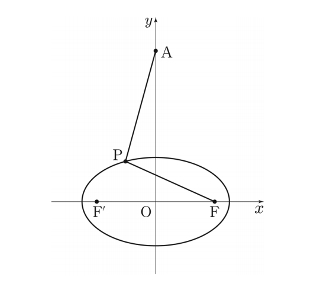

## 문제 27
그림과 같이 $y$축 위의 점 $A(0, a)$와 두 점 $F, F'$을 초점으로 하는 타원 $\frac{x^2}{25} + \frac{y^2}{9} = 1$ 위를 움직이는 점 $P$가 있다. $\overline{AP} - \overline{FP}$의 최솟값이 1일 때, $a^2$의 값을 구하시오. **[4점]**

### 해설
1) 타원의 방정식이 $\frac{x^2}{25} + \frac{y^2}{9} = 1$이므로, 장축의 길이는 10, 단축의 길이는 6입니다.

2) 초점간의 거리 $2c$는 $c^2 = a^2 - b^2 = 25 - 9 = 16$이므로 $c = 4$입니다.

3) 초점 $F$의 좌표는 $(4, 0)$이고, $F'$의 좌표는 $(-4, 0)$입니다.

4) 점 $A$의 좌표는 $(0, a)$입니다.

5) $\overline{AP} - \overline{FP}$의 최솟값이 1이라는 것은 점 $A$가 타원의 한 초점에서 1만큼 더 멀리 있다는 의미입니다.

6) 따라서, $\overline{AF} = 1 + 2a = \sqrt{a^2 + 4^2}$

7) 이 식을 정리하면: $(1 + 2a)^2 = a^2 + 16$
   $1 + 4a + 4a^2 = a^2 + 16$
   $3a^2 - 4a - 15 = 0$

8) 이차방정식을 풀면:
   $a = \frac{4 \pm \sqrt{16 + 180}}{6} = \frac{4 \pm \sqrt{196}}{6} = \frac{4 \pm 14}{6}$

9) $a$는 양수이므로, $a = \frac{4 + 14}{6} = 3$

10) 따라서 $a^2 = 9$

정답은 **9**입니다.

## Question 27
As shown in the figure, there is a point $A(0, a)$ on the $y$-axis and a point $P$ moving on the ellipse $\frac{x^2}{25} + \frac{y^2}{9} = 1$ with foci $F$ and $F'$. When the minimum value of $\overline{AP} - \overline{FP}$ is 1, find the value of $a^2$. **[4 points]**

### Solution
1) Given the ellipse equation $\frac{x^2}{25} + \frac{y^2}{9} = 1$, the length of the major axis is 10 and the minor axis is 6.

2) The distance between foci $2c$ is calculated as $c^2 = a^2 - b^2 = 25 - 9 = 16$, so $c = 4$.

3) The coordinates of focus $F$ are $(4, 0)$, and $F'$ is at $(-4, 0)$.

4) Point $A$ has coordinates $(0, a)$.

5) The minimum value of $\overline{AP} - \overline{FP}$ being 1 means that point $A$ is 1 unit farther from one focus of the ellipse.

6) Therefore, $\overline{AF} = 1 + 2a = \sqrt{a^2 + 4^2}$

7) Simplifying this equation: $(1 + 2a)^2 = a^2 + 16$
   $1 + 4a + 4a^2 = a^2 + 16$
   $3a^2 - 4a - 15 = 0$

8) Solving this quadratic equation:
   $a = \frac{4 \pm \sqrt{16 + 180}}{6} = \frac{4 \pm \sqrt{196}}{6} = \frac{4 \pm 14}{6}$

9) Since $a$ is positive, $a = \frac{4 + 14}{6} = 3$

10) Therefore, $a^2 = 9$

The correct answer is **9**.