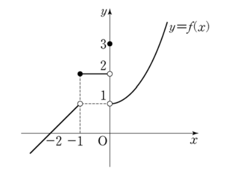

## 문제 8
함수 $y=f(x)$의 그래프가 그림과 같다.

$\lim_{x \to 1^{-}} f(x) + \lim_{x \to 1^{+}} f(x)$의 값은? **[3점]**

1) 1
2) 2
3) 3
4) 4
5) 5

### 해설
그래프를 분석하여 문제를 해결해봅시다:

1. $x=1$에서 함수의 좌극한:
   $\lim_{x \to 1^{-}} f(x) = 2$

2. $x=1$에서 함수의 우극한:
   $\lim_{x \to 1^{+}} f(x) = 1$

3. 두 극한값의 합:
   $\lim_{x \to 1^{-}} f(x) + \lim_{x \to 1^{+}} f(x) = 2 + 1 = 3$

따라서, 정답은 **3번: 3**입니다.

## Question 8
The graph of the function $y=f(x)$ is shown in the figure.

What is the value of $\lim_{x \to 1^{-}} f(x) + \lim_{x \to 1^{+}} f(x)$? **[3 points]**

1) 1
2) 2
3) 3
4) 4
5) 5

### Solution
Let's analyze the graph to solve the problem:

1. Left-hand limit of the function at $x=1$:
   $\lim_{x \to 1^{-}} f(x) = 2$

2. Right-hand limit of the function at $x=1$:
   $\lim_{x \to 1^{+}} f(x) = 1$

3. Sum of the two limit values:
   $\lim_{x \to 1^{-}} f(x) + \lim_{x \to 1^{+}} f(x) = 2 + 1 = 3$

Therefore, the correct answer is **3: 3**.