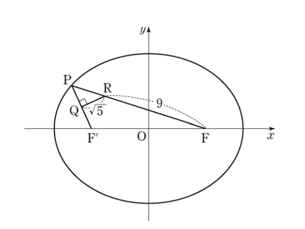

## 문제 26
그림과 같이 두 초점이 $F(c, 0)$, $F'(-c, 0)$인 타원

$\frac{x^2}{a^2} + \frac{y^2}{b^2} = 1$이 있다. 타원 위에 있고 제2사분면에 있는 
점 P에 대하여 선분 PF'의 중점을 Q, 선분 PF를 1:3으로 
내분하는 점을 R이라 하자. $\angle PQR = \frac{\pi}{2}$, $\overline{QR} = \sqrt{5}$, $\overline{RF} = 9$ 
일 때, $a^2 + b^2$의 값을 구하시오. (단, $a$, $b$, $c$는 양수이다.)

**[4점]**

### 해설
이 문제를 단계별로 해결해 보겠습니다.

1) 먼저, 타원의 방정식에서 $a > b > c$임을 알 수 있습니다.

2) 점 R은 PF를 1:3으로 내분하므로, $\overline{PR} : \overline{RF} = 1 : 3$입니다.
   $\overline{RF} = 9$이므로, $\overline{PR} = 3$입니다.

3) $\overline{PF} = \overline{PR} + \overline{RF} = 3 + 9 = 12$

4) 타원의 정의에 의해, $\overline{PF} + \overline{PF'} = 2a$
   따라서 $\overline{PF'} = 2a - 12$

5) Q는 PF'의 중점이므로, $\overline{PQ} = \frac{1}{2}\overline{PF'} = a - 6$

6) 직각삼각형 PQR에서 피타고라스 정리를 적용하면:
   $\overline{PQ}^2 + \overline{QR}^2 = \overline{PR}^2$
   $(a-6)^2 + 5 = 3^2$
   $a^2 - 12a + 36 + 5 = 9$
   $a^2 - 12a + 32 = 0$

7) 이차방정식을 풀면:
   $(a-8)(a-4) = 0$
   $a = 8$ (a > b이므로)

8) 타원의 방정식에서 $c^2 = a^2 - b^2$이고, $\overline{FF'} = 2c = 12$이므로:
   $c = 6$
   $b^2 = a^2 - c^2 = 64 - 36 = 28$

9) 따라서 $a^2 + b^2 = 64 + 28 = 92$

정답은 **92**입니다.

## Question 26
As shown in the figure, there is an ellipse with two foci $F(c, 0)$ and $F'(-c, 0)$

The equation of the ellipse is $\frac{x^2}{a^2} + \frac{y^2}{b^2} = 1$. For point P on the ellipse in the second quadrant, 
let Q be the midpoint of line segment PF', and R be the point that divides line segment PF in the ratio 1:3. 
Given that $\angle PQR = \frac{\pi}{2}$, $\overline{QR} = \sqrt{5}$, and $\overline{RF} = 9$, 
find the value of $a^2 + b^2$. (Note: $a$, $b$, and $c$ are positive.)

**[4 points]**

### Solution
Let's solve this problem step by step:

1) From the ellipse equation, we know that $a > b > c$.

2) Point R divides PF in the ratio 1:3, so $\overline{PR} : \overline{RF} = 1 : 3$.
   Given $\overline{RF} = 9$, we can deduce that $\overline{PR} = 3$.

3) $\overline{PF} = \overline{PR} + \overline{RF} = 3 + 9 = 12$

4) By the definition of an ellipse, $\overline{PF} + \overline{PF'} = 2a$
   Therefore, $\overline{PF'} = 2a - 12$

5) Q is the midpoint of PF', so $\overline{PQ} = \frac{1}{2}\overline{PF'} = a - 6$

6) Applying the Pythagorean theorem to the right triangle PQR:
   $\overline{PQ}^2 + \overline{QR}^2 = \overline{PR}^2$
   $(a-6)^2 + 5 = 3^2$
   $a^2 - 12a + 36 + 5 = 9$
   $a^2 - 12a + 32 = 0$

7) Solving the quadratic equation:
   $(a-8)(a-4) = 0$
   $a = 8$ (since a > b)

8) From the ellipse equation, $c^2 = a^2 - b^2$, and $\overline{FF'} = 2c = 12$, so:
   $c = 6$
   $b^2 = a^2 - c^2 = 64 - 36 = 28$

9) Therefore, $a^2 + b^2 = 64 + 28 = 92$

The answer is **92**.