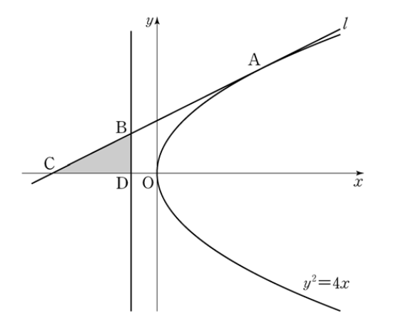

## 문제 9
포물선 $y^2 = 4x$ 위의 점 A(4, 4)에서의 접선을 $l$이라 하자. 
직선 $l$과 포물선의 준선이 만나는 점을 B, 직선 $l$과 $x$축이 만나는 점을 C, 포물선의 준선과 $x$축이 만나는 점을 D라 하자. 삼각형 BCD의 넓이는? [3점]

1) $\frac{7}{4}$
2) 2
3) $\frac{9}{4}$
4) $\frac{5}{2}$
5) $\frac{11}{4}$

### 해설
이 문제를 해결하기 위해 단계별로 접근해 봅시다.

1) 포물선 $y^2 = 4x$의 준선 방정식을 구합니다.
   - 포물선의 초점은 (1, 0)이고, 준선의 방정식은 $x = -1$입니다.

2) 점 A(4, 4)에서의 접선의 방정식을 구합니다.
   - 접선의 기울기: $m = \frac{y}{2x} = \frac{4}{2(4)} = \frac{1}{2}$
   - 접선의 방정식: $y - 4 = \frac{1}{2}(x - 4)$ 또는 $y = \frac{1}{2}x + 2$

3) 점 B의 좌표를 구합니다.
   - 접선과 준선의 교점: $-1 = \frac{1}{2}x + 2$
   - $x = -6$, $y = -1$
   - B의 좌표: (-6, -1)

4) 점 C의 좌표를 구합니다.
   - 접선과 x축의 교점: $0 = \frac{1}{2}x + 2$
   - $x = -4$, $y = 0$
   - C의 좌표: (-4, 0)

5) 점 D의 좌표는 준선과 x축의 교점이므로 (-1, 0)입니다.

6) 삼각형 BCD의 넓이를 구합니다.
   - 밑변 CD의 길이: 3
   - 높이 (B에서 x축까지의 거리): 1
   - 넓이 = $\frac{1}{2} \times 3 \times 1 = \frac{3}{2}$

따라서, 삼각형 BCD의 넓이는 $\frac{3}{2} = \frac{6}{4} = \frac{3}{2}$입니다.

정답은 **2) 2**입니다.

## Question 9
Let $l$ be the tangent line to the parabola $y^2 = 4x$ at point A(4, 4). 
Let B be the point where line $l$ meets the directrix of the parabola, C be the point where line $l$ meets the $x$-axis, and D be the point where the directrix of the parabola meets the $x$-axis. What is the area of triangle BCD? [3 points]

1) $\frac{7}{4}$
2) 2
3) $\frac{9}{4}$
4) $\frac{5}{2}$
5) $\frac{11}{4}$

### Solution
Let's approach this problem step by step.

1) Find the equation of the directrix of the parabola $y^2 = 4x$.
   - The focus of the parabola is at (1, 0), so the directrix is $x = -1$.

2) Find the equation of the tangent line at point A(4, 4).
   - Slope of the tangent: $m = \frac{y}{2x} = \frac{4}{2(4)} = \frac{1}{2}$
   - Equation of the tangent: $y - 4 = \frac{1}{2}(x - 4)$ or $y = \frac{1}{2}x + 2$

3) Find the coordinates of point B.
   - Intersection of tangent and directrix: $-1 = \frac{1}{2}x + 2$
   - $x = -6$, $y = -1$
   - Coordinates of B: (-6, -1)

4) Find the coordinates of point C.
   - Intersection of tangent and x-axis: $0 = \frac{1}{2}x + 2$
   - $x = -4$, $y = 0$
   - Coordinates of C: (-4, 0)

5) The coordinates of point D are (-1, 0), where the directrix meets the x-axis.

6) Calculate the area of triangle BCD.
   - Length of base CD: 3
   - Height (distance from B to x-axis): 1
   - Area = $\frac{1}{2} \times 3 \times 1 = \frac{3}{2}$

Therefore, the area of triangle BCD is $\frac{3}{2} = \frac{6}{4} = \frac{3}{2}$.

The correct answer is **2) 2**.