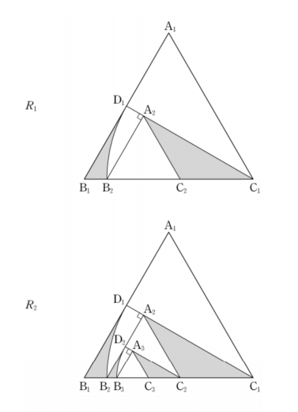

## 문제 19

그림과 같이 한 변의 길이가 1인 정삼각형 $A_1B_1C_1$이 있다.
선분 $A_1B_1$의 중점을 $D_1$이라 하고, 선분 $B_1C_1$ 위의 
$\overline{C_1D_1} = C_1B_1 \cdot x_1$ 인 점 $E_1$에 대하여 중점이 $C_1$인 부채꼴 
$C_1D_1E_1$를 그린다. 점 $E_1$에서 선분 $C_1D_1$에 내린 수선의 발을 
$A_2$, 선분 $C_1E_1$의 중점을 $C_2$라 하자. 두 선분 $B_1E_1$, $B_1D_1$과 
호 $D_1E_1$으로 둘러싸인 영역을 제외한 $C_1A_1C_2$의 부분에 
색칠하여 얻은 그림을 $R_1$이라 하자.

그림 $R_1$에서 선분 $A_2B_2$의 중점을 $D_2$라 하고, 선분 $B_2C_2$ 
위의 $\overline{C_2D_2} = C_2B_2 \cdot x_2$ 인 점 $E_2$에 대하여 중점이 $C_2$인 부채꼴 
$C_2D_2E_2$를 그린다. 점 $E_2$에서 선분 $C_2D_2$에 내린 수선의 발을 
$A_3$, 선분 $C_2E_2$의 중점을 $C_3$라 하자. 두 선분 $B_2E_2$, $B_2D_2$와 
호 $D_2E_2$로 둘러싸인 영역을 제외한 $C_2A_2C_3$의 부분에 
색칠하여 얻은 그림을 $R_2$라 하자.

이와 같은 과정을 계속하여 n번째 얻은 그림 $R_n$에 색칠되어 
있는 부분의 넓이를 $S_n$이라 할 때, $\lim_{n \to \infty} S_n$의 값은? [4점]

1) $\frac{11\sqrt{3}-4\pi}{54}$
2) $\frac{11\sqrt{3}-4\pi}{52}$
3) $\frac{15\sqrt{3}-6\pi}{50}$
4) $\frac{15\sqrt{3}-6\pi}{52}$
5) $\frac{13\sqrt{3}-4\pi}{52}$

### 해설

이 문제를 해결하기 위해 단계별로 접근해 보겠습니다.

1) 먼저, 정삼각형의 넓이를 구합니다.
   $S_{\triangle} = \frac{\sqrt{3}}{4}$

2) 첫 번째 단계에서 색칠된 부분의 넓이를 구합니다.
   - 부채꼴의 넓이: $S_{부채꼴} = \frac{1}{3} \cdot \frac{\pi}{3} = \frac{\pi}{9}$
   - 삼각형 $C_1D_1E_1$의 넓이: $S_{\triangle C_1D_1E_1} = \frac{1}{4} \cdot \frac{\sqrt{3}}{4} = \frac{\sqrt{3}}{16}$
   - 색칠된 부분의 넓이: $S_1 = \frac{\sqrt{3}}{4} - (\frac{\pi}{9} - \frac{\sqrt{3}}{16}) = \frac{13\sqrt{3}-4\pi}{36}$

3) 다음 단계에서는 이전 단계의 1/4 크기로 축소됩니다.

4) 따라서, 색칠된 부분의 넓이는 다음과 같은 수열을 따릅니다:
   $S_n = S_1 \cdot (1 + (\frac{1}{4}) + (\frac{1}{4})^2 + ... + (\frac{1}{4})^{n-1})$

5) $n$이 무한대로 갈 때, 이 수열의 합은 다음과 같습니다:
   $\lim_{n \to \infty} S_n = S_1 \cdot \frac{1}{1-\frac{1}{4}} = \frac{4}{3} \cdot \frac{13\sqrt{3}-4\pi}{36} = \frac{13\sqrt{3}-4\pi}{52}$

따라서, 정답은 **5) $\frac{13\sqrt{3}-4\pi}{52}$** 입니다.

## Question 19

As shown in the figure, there is an equilateral triangle $A_1B_1C_1$ with a side length of 1.
Let $D_1$ be the midpoint of segment $A_1B_1$, and $E_1$ be a point on segment $B_1C_1$ 
such that $\overline{C_1D_1} = C_1B_1 \cdot x_1$. Draw a sector $C_1D_1E_1$ with center $C_1$. 
Let $A_2$ be the foot of the perpendicular from point $E_1$ to segment $C_1D_1$, 
and $C_2$ be the midpoint of segment $C_1E_1$. Let $R_1$ be the figure obtained by 
coloring the part of $C_1A_1C_2$ excluding the region enclosed by two segments $B_1E_1$, $B_1D_1$ 
and arc $D_1E_1$.

In figure $R_1$, let $D_2$ be the midpoint of segment $A_2B_2$, and $E_2$ be a point 
on segment $B_2C_2$ such that $\overline{C_2D_2} = C_2B_2 \cdot x_2$. Draw a sector $C_2D_2E_2$ 
with center $C_2$. Let $A_3$ be the foot of the perpendicular from point $E_2$ to 
segment $C_2D_2$, and $C_3$ be the midpoint of segment $C_2E_2$. Let $R_2$ be the figure 
obtained by coloring the part of $C_2A_2C_3$ excluding the region enclosed by two 
segments $B_2E_2$, $B_2D_2$ and arc $D_2E_2$.

Continuing this process, let $S_n$ be the area of the colored part in the nth figure $R_n$. 
What is the value of $\lim_{n \to \infty} S_n$? [4 points]

1) $\frac{11\sqrt{3}-4\pi}{54}$
2) $\frac{11\sqrt{3}-4\pi}{52}$
3) $\frac{15\sqrt{3}-6\pi}{50}$
4) $\frac{15\sqrt{3}-6\pi}{52}$
5) $\frac{13\sqrt{3}-4\pi}{52}$

### Solution

Let's approach this problem step by step:

1) First, calculate the area of the equilateral triangle:
   $S_{\triangle} = \frac{\sqrt{3}}{4}$

2) Calculate the colored area in the first step:
   - Area of the sector: $S_{sector} = \frac{1}{3} \cdot \frac{\pi}{3} = \frac{\pi}{9}$
   - Area of triangle $C_1D_1E_1$: $S_{\triangle C_1D_1E_1} = \frac{1}{4} \cdot \frac{\sqrt{3}}{4} = \frac{\sqrt{3}}{16}$
   - Colored area: $S_1 = \frac{\sqrt{3}}{4} - (\frac{\pi}{9} - \frac{\sqrt{3}}{16}) = \frac{13\sqrt{3}-4\pi}{36}$

3) In each subsequent step, the figure is reduced to 1/4 of its previous size.

4) Therefore, the colored area follows this sequence:
   $S_n = S_1 \cdot (1 + (\frac{1}{4}) + (\frac{1}{4})^2 + ... + (\frac{1}{4})^{n-1})$

5) As $n$ approaches infinity, the sum of this sequence is:
   $\lim_{n \to \infty} S_n = S_1 \cdot \frac{1}{1-\frac{1}{4}} = \frac{4}{3} \cdot \frac{13\sqrt{3}-4\pi}{36} = \frac{13\sqrt{3}-4\pi}{52}$

Therefore, the correct answer is **5) $\frac{13\sqrt{3}-4\pi}{52}$**.