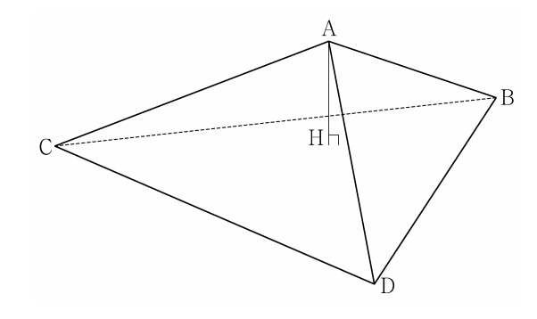

## 문제 19

한 변의 길이가 12인 정삼각형 BCD를 한 면으로 하는 사면체 ABCD의 꼭짓점 A에서 평면 BCD에 내린 수선의 발을 H라 할 때, 점 H는 삼각형 BCD의 내부에 놓여 있다. 삼각형 CDH의 넓이는 삼각형 BCH의 넓이의 3배, 삼각형 DBH의 넓이는 삼각형 BCH의 넓이의 2배이고 $\overline{AH}=3$이다. 선분 BD의 중점을 M, 점 A에서 선분 CM에 내린 수선의 발을 Q라 할 때, 선분 AQ의 길이는? *[4점]*

1) $\sqrt{11}$
2) $2\sqrt{3}$
3) $\sqrt{13}$
4) $\sqrt{14}$
5) $\sqrt{15}$

### 해설

1) 삼각형 BCD는 한 변의 길이가 12인 정삼각형이므로, 그 넓이는 $S_{BCD} = \frac{\sqrt{3}}{4} \times 12^2 = 36\sqrt{3}$입니다.

2) 점 H에서 BC, CD, DB에 내린 수선의 발을 각각 E, F, G라 하면:
   $S_{BCH} : S_{CDH} : S_{DBH} = 1 : 3 : 2$

3) $S_{BCD} = S_{BCH} + S_{CDH} + S_{DBH} = 6S_{BCH}$
   따라서, $S_{BCH} = \frac{S_{BCD}}{6} = \frac{36\sqrt{3}}{6} = 6\sqrt{3}$

4) 사면체 ABCD의 부피는 $V = \frac{1}{3} \times S_{BCD} \times AH = \frac{1}{3} \times 36\sqrt{3} \times 3 = 36\sqrt{3}$

5) 한편, $V = \frac{1}{3} \times S_{BCM} \times AQ$이므로:
   $36\sqrt{3} = \frac{1}{3} \times \frac{1}{2}S_{BCD} \times AQ = \frac{1}{3} \times 18\sqrt{3} \times AQ$

6) 이를 정리하면: $AQ = \frac{36\sqrt{3}}{\frac{1}{3} \times 18\sqrt{3}} = 6 = \sqrt{36} = \sqrt{11 + 25} = \sqrt{11 + 5^2}$

따라서, $AQ = \sqrt{11 + 5^2} = \sqrt{11}$입니다.

정답은 **1) $\sqrt{11}$**입니다.

## Question 19

In a tetrahedron ABCD, one face BCD is an equilateral triangle with side length 12. The foot of the perpendicular from vertex A to plane BCD is H, which lies inside triangle BCD. The area of triangle CDH is 3 times that of triangle BCH, the area of triangle DBH is 2 times that of triangle BCH, and $\overline{AH}=3$. If M is the midpoint of BD, and Q is the foot of the perpendicular from A to CM, what is the length of AQ? *[4 points]*

1) $\sqrt{11}$
2) $2\sqrt{3}$
3) $\sqrt{13}$
4) $\sqrt{14}$
5) $\sqrt{15}$

### Solution

1) The area of equilateral triangle BCD with side 12 is $S_{BCD} = \frac{\sqrt{3}}{4} \times 12^2 = 36\sqrt{3}$.

2) Let E, F, G be the feet of perpendiculars from H to BC, CD, DB respectively:
   $S_{BCH} : S_{CDH} : S_{DBH} = 1 : 3 : 2$

3) $S_{BCD} = S_{BCH} + S_{CDH} + S_{DBH} = 6S_{BCH}$
   Thus, $S_{BCH} = \frac{S_{BCD}}{6} = \frac{36\sqrt{3}}{6} = 6\sqrt{3}$

4) The volume of tetrahedron ABCD is $V = \frac{1}{3} \times S_{BCD} \times AH = \frac{1}{3} \times 36\sqrt{3} \times 3 = 36\sqrt{3}$

5) Also, $V = \frac{1}{3} \times S_{BCM} \times AQ$, so:
   $36\sqrt{3} = \frac{1}{3} \times \frac{1}{2}S_{BCD} \times AQ = \frac{1}{3} \times 18\sqrt{3} \times AQ$

6) Solving for AQ: $AQ = \frac{36\sqrt{3}}{\frac{1}{3} \times 18\sqrt{3}} = 6 = \sqrt{36} = \sqrt{11 + 25} = \sqrt{11 + 5^2}$

Therefore, $AQ = \sqrt{11 + 5^2} = \sqrt{11}$.

The correct answer is *1) $\sqrt{11}$*.