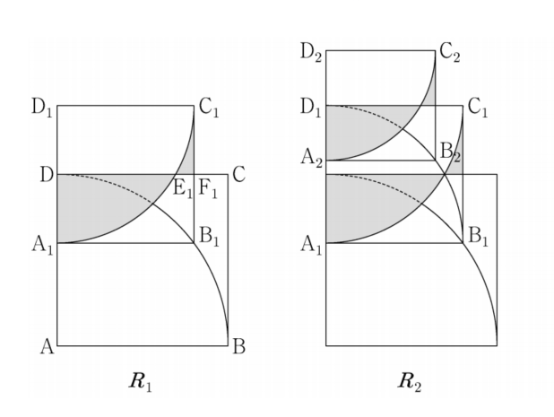

## 문제 18

그림과 같이 한 변의 길이가 5인 정사각형 ABCD에 중심이 A이고 중심각의 크기가 90°인 부채꼴 ABD를 그린다. 선분 AD를 3:2로 내분하는 점을 A₁, 점 A₁을 지나고 선분 AB에 평행한 직선이 호 BD와 만나는 점을 B₁이라 하자. 
선분 A₁B₁을 한 변으로 하고 선분 DC와 만나도록 정사각형 A₁B₁C₁D₁을 그린 후, 중심이 D₁이고 중심각의 크기가 90°인 부채꼴 D₁A₁C₁을 그린다. 선분 DC가 호 A₁C₁, 선분 B₁C₁과 만나는 점을 각각 E, F라 하자.
선분 DE, 호 EA₁, 선분 A₁F, 호 FC₁과 호 동심원의 부분의 ∠도형에 의해 생성된 영역을 그림을 R₁이라 하자.

그림 R₁에서 정사각형 A₁B₁C₁D₁에 중심이 A₁이고 중심각의 크기가 90°인 부채꼴 A₁B₁D₁을 그린다. 선분 A₁D₁을 3:2로 내분하는 점을 A₂, 점 A₂를 지나고 선분 A₁B₁에 평행한 직선이 호 B₁D₁과 만나는 점을 B₂라 하자. 선분 A₂B₂를 한 변으로 하고 선분 D₁C₁과 만나도록 정사각형 A₂B₂C₂D₂를 그린 후,
그림 R₁을 얻은 것과 같은 방법으로 정사각형 A₁B₁C₁D₁에 ∠도형의 도형을 그리고 생성된 영역을 그림을 R₂라 하자.

이와 같은 과정을 계속하여 n번째 얻은 그림 R_n에 생성되어 있는 부분의 넓이를 S_n이라 할 때, $\lim_{n→∞} S_n$의 값은? [4점]

1) $\frac{100}{9}(2-\sqrt{3}+\frac{\pi}{3})$
2) $\frac{100}{9}(3-\sqrt{3}+\frac{\pi}{6})$
3) $\frac{50}{3}(2-\sqrt{3}+\frac{\pi}{3})$
4) $\frac{100}{9}(3-\sqrt{3}+\frac{\pi}{4})$
5) $\frac{50}{3}(3-\sqrt{3}+\frac{\pi}{6})$

### 해설

이 문제를 해결하기 위해 단계별로 접근해 보겠습니다.

1) 먼저, 초기 정사각형의 한 변의 길이가 5임을 주목합니다.

2) 각 단계에서 새로운 정사각형의 크기는 이전 정사각형의 3/5배가 됩니다. (AD를 3:2로 내분하므로)

3) n번째 정사각형의 한 변의 길이는 $5 \cdot (\frac{3}{5})^{n-1}$입니다.

4) 각 단계에서 생성되는 영역의 넓이는 다음과 같이 구성됩니다:
   - 정사각형의 넓이
   - 90° 부채꼴의 넓이
   - 부채꼴과 정사각형 사이의 영역 (2개)

5) n번째 단계에서의 각 부분의 넓이:
   - 정사각형: $[5 \cdot (\frac{3}{5})^{n-1}]^2 = 25 \cdot (\frac{3}{5})^{2n-2}$
   - 부채꼴: $\frac{1}{4} \pi [5 \cdot (\frac{3}{5})^{n-1}]^2 = \frac{25\pi}{4} \cdot (\frac{3}{5})^{2n-2}$
   - 부채꼴과 정사각형 사이의 영역 (2개): $2 \cdot \frac{1}{2} \cdot [5 \cdot (\frac{3}{5})^{n-1}]^2 \cdot (1-\frac{\sqrt{3}}{2}) = 25 \cdot (\frac{3}{5})^{2n-2} \cdot (1-\frac{\sqrt{3}}{2})$

6) n번째 단계에서 추가되는 영역의 넓이:
   $S_n - S_{n-1} = 25 \cdot (\frac{3}{5})^{2n-2} \cdot (2-\sqrt{3}+\frac{\pi}{4})$

7) 전체 영역의 넓이는 이 무한 급수의 합이 됩니다:
   $S_{\infty} = \sum_{n=1}^{\infty} 25 \cdot (\frac{3}{5})^{2n-2} \cdot (2-\sqrt{3}+\frac{\pi}{4})$

8) 이는 등비급수의 합 공식을 이용하여 계산할 수 있습니다:
   $S_{\infty} = 25 \cdot (2-\sqrt{3}+\frac{\pi}{4}) \cdot \frac{1}{1-(\frac{3}{5})^2} = \frac{100}{9} \cdot (2-\sqrt{3}+\frac{\pi}{4})$

따라서, 정답은 **4) $\frac{100}{9}(3-\sqrt{3}+\frac{\pi}{4})$** 입니다.

## Question 18

As shown in the figure, a sector ABD with center A and central angle 90° is drawn in a square ABCD with side length 5. Let A₁ be the point that divides line segment AD in the ratio 3:2, and B₁ be the point where the line parallel to AB passing through A₁ intersects arc BD.

After drawing a square A₁B₁C₁D₁ with A₁B₁ as one side and intersecting line segment DC, draw a sector D₁A₁C₁ with center D₁ and central angle 90°. Let E and F be the points where line segment DC intersects arc A₁C₁ and line segment B₁C₁ respectively.

Let the region created by the shape formed by line segment DE, arc EA₁, line segment A₁F, arc FC₁, and the part of the concentric arc be called figure R₁.

In figure R₁, draw a sector A₁B₁D₁ with center A₁ and central angle 90° in square A₁B₁C₁D₁. Let A₂ be the point that divides line segment A₁D₁ in the ratio 3:2, and B₂ be the point where the line parallel to A₁B₁ passing through A₂ intersects arc B₁D₁. After drawing a square A₂B₂C₂D₂ with A₂B₂ as one side and intersecting line segment D₁C₁,
create figure R₂ using the same method as obtaining figure R₁ in square A₁B₁C₁D₁.

When this process is continued and S_n is the area of the part generated in the nth figure R_n, what is the value of $\lim_{n→∞} S_n$? [4 points]

1) $\frac{100}{9}(2-\sqrt{3}+\frac{\pi}{3})$
2) $\frac{100}{9}(3-\sqrt{3}+\frac{\pi}{6})$
3) $\frac{50}{3}(2-\sqrt{3}+\frac{\pi}{3})$
4) $\frac{100}{9}(3-\sqrt{3}+\frac{\pi}{4})$
5) $\frac{50}{3}(3-\sqrt{3}+\frac{\pi}{6})$

### Solution

Let's approach this problem step by step:

1) First, note that the initial square has a side length of 5.

2) At each step, the new square's size is 3/5 of the previous square. (Because AD is divided in the ratio 3:2)

3) The side length of the nth square is $5 \cdot (\frac{3}{5})^{n-1}$.

4) At each step, the area of the generated region consists of:
   - Area of the square
   - Area of the 90° sector
   - Area between the sector and the square (2 pieces)

5) Areas of each part at the nth step:
   - Square: $[5 \cdot (\frac{3}{5})^{n-1}]^2 = 25 \cdot (\frac{3}{5})^{2n-2}$
   - Sector: $\frac{1}{4} \pi [5 \cdot (\frac{3}{5})^{n-1}]^2 = \frac{25\pi}{4} \cdot (\frac{3}{5})^{2n-2}$
   - Area between sector and square (2 pieces): $2 \cdot \frac{1}{2} \cdot [5 \cdot (\frac{3}{5})^{n-1}]^2 \cdot (1-\frac{\sqrt{3}}{2}) = 25 \cdot (\frac{3}{5})^{2n-2} \cdot (1-\frac{\sqrt{3}}{2})$

6) Area added at the nth step:
   $S_n - S_{n-1} = 25 \cdot (\frac{3}{5})^{2n-2} \cdot (2-\sqrt{3}+\frac{\pi}{4})$

7) The total area is the sum of this infinite series:
   $S_{\infty} = \sum_{n=1}^{\infty} 25 \cdot (\frac{3}{5})^{2n-2} \cdot (2-\sqrt{3}+\frac{\pi}{4})$

8) This can be calculated using the sum formula for a geometric series:
   $S_{\infty} = 25 \cdot (2-\sqrt{3}+\frac{\pi}{4}) \cdot \frac{1}{1-(\frac{3}{5})^2} = \frac{100}{9} \cdot (2-\sqrt{3}+\frac{\pi}{4})$

Therefore, the correct answer is **4) $\frac{100}{9}(3-\sqrt{3}+\frac{\pi}{4})$**.