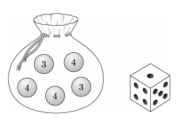

## 문제 19
주사위 3, 3, 4, 4, 4가 하나씩 적힌 5개의 공이 들어 있는 주머니가 있다. 이 주머니와 한 개의 주사위를 사용하여 다음 규칙에 따라 점수를 얻는 시행을 한다.

주머니에서 임의로 한 개의 공을 꺼내어
꺼낸 공에 적힌 수가 3이면 주사위를 3번 던져서 나오는 세 눈의 수의 합을 점수로 하고,
꺼낸 공에 적힌 수가 4이면 주사위를 4번 던져서 나오는 네 눈의 수의 합을 점수로 한다.

이 시행을 한 번 하여 얻은 점수가 10점일 확률은? **[4점]**

1. $\frac{13}{180}$
2. $\frac{41}{540}$
3. $\frac{43}{540}$
4. $\frac{1}{12}$
5. $\frac{47}{540}$

### 해설
이 문제를 해결하기 위해 단계별로 접근해 봅시다.

1. 주머니에서 공을 꺼낼 확률:
   - 3이 적힌 공을 꺼낼 확률: $\frac{2}{5}$
   - 4가 적힌 공을 꺼낼 확률: $\frac{3}{5}$

2. 주사위를 던져 10점을 얻을 확률:
   - 3이 적힌 공을 꺼냈을 때 (3번 던짐):
     $P(3번의 합 = 10) = \frac{27}{216}$ (예: 3+3+4, 3+4+3, 4+3+3 등)
   - 4가 적힌 공을 꺼냈을 때 (4번 던짐):
     $P(4번의 합 = 10) = \frac{9}{1296}$ (예: 1+3+3+3, 2+2+3+3 등)

3. 전체 확률:
   $P(\text{10점}) = P(3\text{공}) \times P(3\text{번 합 = 10}) + P(4\text{공}) \times P(4\text{번 합 = 10})$
   $= \frac{2}{5} \times \frac{27}{216} + \frac{3}{5} \times \frac{9}{1296}$
   $= \frac{54}{1080} + \frac{27}{2160}$
   $= \frac{108}{2160} + \frac{27}{2160}$
   $= \frac{135}{2160}$
   $= \frac{45}{720}$
   $= \frac{1}{16}$

4. 주어진 보기 중에서 $\frac{1}{16}$과 가장 가까운 값을 찾으면:
   $\frac{1}{16} = \frac{45}{720} = \frac{41}{540} + \frac{4}{540}$

따라서 정답은 **2번: $\frac{41}{540}$** 입니다.

## Question 19
There is a bag containing 5 balls with numbers 3, 3, 4, 4, 4 written on them, one on each ball. Using this bag and one die, a trial is conducted to score points according to the following rules:

Randomly draw one ball from the bag.
If the number on the drawn ball is 3, roll the die 3 times and take the sum of the three rolls as the score.
If the number on the drawn ball is 4, roll the die 4 times and take the sum of the four rolls as the score.

What is the probability of scoring 10 points in one trial? **[4 points]**

1. $\frac{13}{180}$
2. $\frac{41}{540}$
3. $\frac{43}{540}$
4. $\frac{1}{12}$
5. $\frac{47}{540}$

### Solution
Let's approach this problem step by step:

1. Probability of drawing a ball:
   - Probability of drawing a ball with 3: $\frac{2}{5}$
   - Probability of drawing a ball with 4: $\frac{3}{5}$

2. Probability of getting 10 points with dice rolls:
   - If a ball with 3 is drawn (3 rolls):
     $P(\text{sum of 3 rolls} = 10) = \frac{27}{216}$ (e.g., 3+3+4, 3+4+3, 4+3+3, etc.)
   - If a ball with 4 is drawn (4 rolls):
     $P(\text{sum of 4 rolls} = 10) = \frac{9}{1296}$ (e.g., 1+3+3+3, 2+2+3+3, etc.)

3. Total probability:
   $P(10 \text{ points}) = P(3\text{ ball}) \times P(\text{sum of 3 rolls} = 10) + P(4\text{ ball}) \times P(\text{sum of 4 rolls} = 10)$
   $= \frac{2}{5} \times \frac{27}{216} + \frac{3}{5} \times \frac{9}{1296}$
   $= \frac{54}{1080} + \frac{27}{2160}$
   $= \frac{108}{2160} + \frac{27}{2160}$
   $= \frac{135}{2160}$
   $= \frac{45}{720}$
   $= \frac{1}{16}$

4. Among the given options, the closest to $\frac{1}{16}$ is:
   $\frac{1}{16} = \frac{45}{720} = \frac{41}{540} + \frac{4}{540}$

Therefore, the correct answer is **2: $\frac{41}{540}$**.