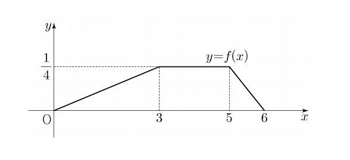

## 문제 29
두 연속확률변수 $X$와 $Y$가 갖는 값의 범위는 $0 \leq X \leq 6$, $0 \leq Y \leq 6$이고, $X$와 $Y$의 확률밀도함수는 각각 $f(x)$, $g(x)$이다. 확률변수 $X$의 확률밀도함수 $f(x)$의 그래프는 그림과 같다.

$0 \leq x \leq 6$인 모든 $x$에 대하여

$f(x) + g(x) = k$ ($k$는 상수)

를 만족시킬 때, $P(6k \leq Y \leq 15k) = \frac{q}{p}$이다. $p+q$의 값을 구하시오. (단, $p$와 $q$는 서로소인 자연수이다.) **[4점]**

### 해설

1) 먼저 $f(x)$의 그래프를 분석합니다:
   - $0 \leq x < 3$에서 $f(x)$ 는 $\frac{1}{12}x$
   - $3 \leq x < 5$에서 $f(x) = \frac{1}{4}$
   - $5 \leq x \leq 6$에서 $f(x)$ 는 $-\frac{1}{4}x + \frac{3}{2}$

2) $f(x) + g(x) = k$ 이므로, $g(x) = k - f(x)$ 입니다.

3) 확률밀도함수의 성질에 의해 전체 면적은 1이어야 합니다:
   $\int_0^6 f(x)dx + \int_0^6 g(x)dx = 1$
   $\int_0^6 f(x)dx + \int_0^6 (k - f(x))dx = 1$
   $6k - \int_0^6 f(x)dx = 1$

4) $\int_0^6 f(x)dx$ 를 계산합니다:
   $\int_0^3 \frac{1}{12}x dx + \int_3^5 \frac{1}{4} dx + \int_5^6 (-\frac{1}{4}x + \frac{3}{2}) dx = \frac{3}{4}$

5) 따라서:
   $6k - \frac{3}{4} = 1$
   $6k = \frac{7}{4}$
   $k = \frac{7}{24}$

6) $Y$의 확률밀도함수는 $g(x) = \frac{7}{24} - f(x)$ 입니다.

7) $P(6k \leq Y \leq 15k) = \frac{q}{p}$ 에서:
   $P(\frac{7}{4} \leq Y \leq \frac{35}{8}) = \frac{q}{p}$

8) 이 확률을 계산하면:
   $\int_{\frac{7}{4}}^{\frac{35}{8}} g(x) dx = \frac{35}{64}$

따라서, $\frac{q}{p} = \frac{35}{64}$ 이고, $p + q = 64 + 35 = 99$ 입니다.

정답은 **99**입니다.

## Question 29
Two continuous random variables $X$ and $Y$ have ranges $0 \leq X \leq 6$ and $0 \leq Y \leq 6$, and their probability density functions are $f(x)$ and $g(x)$ respectively. The graph of the probability density function $f(x)$ of the random variable $X$ is as shown in the figure.

For all $x$ where $0 \leq x \leq 6$,

$f(x) + g(x) = k$ ($k$ is a constant)

When this condition is satisfied, $P(6k \leq Y \leq 15k) = \frac{q}{p}$. Find the value of $p+q$. (Note: $p$ and $q$ are coprime natural numbers.) **[4 points]**

### Solution

1) First, analyze the graph of $f(x)$:
   - For $0 \leq x < 3$, $f(x) = \frac{1}{12}x$
   - For $3 \leq x < 5$, $f(x) = \frac{1}{4}$
   - For $5 \leq x \leq 6$, $f(x) = -\frac{1}{4}x + \frac{3}{2}$

2) Since $f(x) + g(x) = k$, we have $g(x) = k - f(x)$.

3) By the property of probability density functions, the total area must be 1:
   $\int_0^6 f(x)dx + \int_0^6 g(x)dx = 1$
   $\int_0^6 f(x)dx + \int_0^6 (k - f(x))dx = 1$
   $6k - \int_0^6 f(x)dx = 1$

4) Calculate $\int_0^6 f(x)dx$:
   $\int_0^3 \frac{1}{12}x dx + \int_3^5 \frac{1}{4} dx + \int_5^6 (-\frac{1}{4}x + \frac{3}{2}) dx = \frac{3}{4}$

5) Therefore:
   $6k - \frac{3}{4} = 1$
   $6k = \frac{7}{4}$
   $k = \frac{7}{24}$

6) The probability density function of $Y$ is $g(x) = \frac{7}{24} - f(x)$.

7) From $P(6k \leq Y \leq 15k) = \frac{q}{p}$:
   $P(\frac{7}{4} \leq Y \leq \frac{35}{8}) = \frac{q}{p}$

8) Calculating this probability:
   $\int_{\frac{7}{4}}^{\frac{35}{8}} g(x) dx = \frac{35}{64}$

Therefore, $\frac{q}{p} = \frac{35}{64}$, and $p + q = 64 + 35 = 99$.

The answer is **99**.