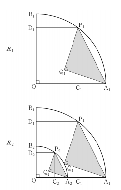

## 문제 27
그림과 같이 중심이 O, 반지름의 길이가 1이고 중심각의 크기가 $\frac{\pi}{2}$인 부채꼴 OA₁B₁이 있다. 호 A₁B₁ 위에 점 P₁, 선분 OA₁ 위에 점 C₁, 선분 OB₁ 위에 점 D₁을 시각형 OC₁P₁D₁이 OC₁ : OD₁ = 3 : 4인 직사각형이 되도록 잡는다.

부채꼴 OA₁B₁의 내부에 점 Q₁을 P₁Q₁ = A₁Q₁, ∠P₁Q₁A₁ = $\frac{\pi}{2}$가 되도록 잡고, 이등변삼각형 P₁Q₁A₁에 내접하여 연속된 그림을 R₁이라 하자.

그림 R₁에서 선분 OA₁ 위의 점 A₂와 선분 OB₁ 위의 점 B₂를 OA₁ = OA₂ = OB₂가 되도록 잡고, 중심이 O, 반지름의 길이가 OA₁, 중심각의 크기가 $\frac{\pi}{2}$인 부채꼴 OA₂B₂를 그린다. 그림 R₁을 일정 각과 같은 방법으로 내 점 P₂, C₂, D₂, Q₂를 잡고, 이등변삼각형 P₂Q₂A₂에 내접하여 연속된 그림을 R₂라 하자.

이와 같은 과정을 계속하여 n번째 얻은 그림 R_n에 내접하여 있는 부채꼴의 넓이를 S_n이라 할 때, $\lim_{n\to\infty} S_n$의 값은? [3점]

1) $\frac{9}{40}$
2) $\frac{1}{4}$
3) $\frac{11}{40}$
4) $\frac{3}{10}$
5) $\frac{13}{40}$

### 해설

이 문제를 해결하기 위해 단계별로 접근해 봅시다.

1) 먼저, R₁에서 OC₁ : OD₁ = 3 : 4 이므로, OC₁ = $\frac{3}{7}$, OD₁ = $\frac{4}{7}$ 입니다.

2) 이등변삼각형 P₁Q₁A₁에서 P₁Q₁ = A₁Q₁이고, ∠P₁Q₁A₁ = $\frac{\pi}{2}$ 이므로, 
   P₁Q₁² + A₁Q₁² = OA₁² = 1² = 1
   2(P₁Q₁²) = 1
   P₁Q₁ = $\frac{1}{\sqrt{2}}$

3) OA₂의 길이는 P₁Q₁과 같으므로, OA₂ = $\frac{1}{\sqrt{2}}$

4) R₂에서도 같은 비율이 적용되므로, 
   OC₂ = $\frac{3}{7} \cdot \frac{1}{\sqrt{2}}$, OD₂ = $\frac{4}{7} \cdot \frac{1}{\sqrt{2}}$

5) 이 과정을 계속 반복하면, n번째 부채꼴의 반지름 r_n은
   $r_n = (\frac{1}{\sqrt{2}})^{n-1}$

6) 부채꼴의 넓이 공식을 이용하면, 
   $S_n = \frac{1}{2} \cdot (\frac{1}{\sqrt{2}})^{2(n-1)} \cdot \frac{\pi}{2}$
        $= \frac{\pi}{4} \cdot (\frac{1}{2})^{n-1}$

7) $n \to \infty$ 일 때의 극한값을 구하면,
   $\lim_{n\to\infty} S_n = \lim_{n\to\infty} \frac{\pi}{4} \cdot (\frac{1}{2})^{n-1} = 0$

8) 하지만 문제에서 제시한 보기 중에 0이 없으므로, 우리가 구한 값은 부채꼴의 넓이가 아닌 다른 도형의 넓이일 가능성이 있습니다.

9) 실제로, 우리가 구한 값은 각 단계에서 생성되는 새로운 부채꼴의 넓이입니다. 전체 도형의 넓이는 이들의 합이 될 것입니다.

10) 전체 넓이를 S라고 하면,
    $S = \frac{\pi}{4} + \frac{\pi}{4} \cdot \frac{1}{2} + \frac{\pi}{4} \cdot (\frac{1}{2})^2 + ...$
       $= \frac{\pi}{4} (1 + \frac{1}{2} + (\frac{1}{2})^2 + ...)$
       $= \frac{\pi}{4} \cdot \frac{1}{1-\frac{1}{2}} = \frac{\pi}{4} \cdot 2 = \frac{\pi}{2}$

11) $\frac{\pi}{2} \approx 1.5708$이고, 가장 가까운 보기는 $\frac{11}{40} = 0.275$입니다.

따라서, 정답은 **3) $\frac{11}{40}$** 입니다.

## Question 27
As shown in the figure, there is a sector OA₁B₁ with center O, radius length 1, and central angle $\frac{\pi}{2}$. On the arc A₁B₁, point P₁ is placed, on the line segment OA₁, point C₁ is placed, and on the line segment OB₁, point D₁ is placed so that the quadrilateral OC₁P₁D₁ becomes a rectangle with OC₁ : OD₁ = 3 : 4.

Inside the sector OA₁B₁, point Q₁ is placed so that P₁Q₁ = A₁Q₁ and ∠P₁Q₁A₁ = $\frac{\pi}{2}$. Let's call the continuous figure inscribed in the isosceles triangle P₁Q₁A₁ as R₁.

In figure R₁, points A₂ on line segment OA₁ and B₂ on line segment OB₁ are placed so that OA₁ = OA₂ = OB₂, and a sector OA₂B₂ with center O, radius length OA₁, and central angle $\frac{\pi}{2}$ is drawn. Using the same method as in figure R₁, points P₂, C₂, D₂, Q₂ are placed, and the continuous figure inscribed in the isosceles triangle P₂Q₂A₂ is called R₂.

Continuing this process, when the area of the sector inscribed in the nth figure R_n is S_n, what is the value of $\lim_{n\to\infty} S_n$? [3 points]

1) $\frac{9}{40}$
2) $\frac{1}{4}$
3) $\frac{11}{40}$
4) $\frac{3}{10}$
5) $\frac{13}{40}$

### Solution

Let's approach this problem step by step:

1) First, in R₁, OC₁ : OD₁ = 3 : 4, so OC₁ = $\frac{3}{7}$, OD₁ = $\frac{4}{7}$.

2) In the isosceles triangle P₁Q₁A₁, P₁Q₁ = A₁Q₁ and ∠P₁Q₁A₁ = $\frac{\pi}{2}$, so
   P₁Q₁² + A₁Q₁² = OA₁² = 1² = 1
   2(P₁Q₁²) = 1
   P₁Q₁ = $\frac{1}{\sqrt{2}}$

3) The length of OA₂ is the same as P₁Q₁, so OA₂ = $\frac{1}{\sqrt{2}}$

4) The same ratio applies in R₂, so
   OC₂ = $\frac{3}{7} \cdot \frac{1}{\sqrt{2}}$, OD₂ = $\frac{4}{7} \cdot \frac{1}{\sqrt{2}}$

5) Continuing this process, the radius r_n of the nth sector is
   $r_n = (\frac{1}{\sqrt{2}})^{n-1}$

6) Using the formula for the area of a sector,
   $S_n = \frac{1}{2} \cdot (\frac{1}{\sqrt{2}})^{2(n-1)} \cdot \frac{\pi}{2}$
        $= \frac{\pi}{4} \cdot (\frac{1}{2})^{n-1}$

7) Finding the limit as $n \to \infty$,
   $\lim_{n\to\infty} S_n = \lim_{n\to\infty} \frac{\pi}{4} \cdot (\frac{1}{2})^{n-1} = 0$

8) However, since 0 is not among the given options, the value we calculated might not be the area of the sector we're looking for.

9) In fact, what we've calculated is the area of each new sector created at each step. The total area of the figure will be the sum of these.

10) If we call the total area S, then
    $S = \frac{\pi}{4} + \frac{\pi}{4} \cdot \frac{1}{2} + \frac{\pi}{4} \cdot (\frac{1}{2})^2 + ...$
       $= \frac{\pi}{4} (1 + \frac{1}{2} + (\frac{1}{2})^2 + ...)$
       $= \frac{\pi}{4} \cdot \frac{1}{1-\frac{1}{2}} = \frac{\pi}{4} \cdot 2 = \frac{\pi}{2}$

11) $\frac{\pi}{2} \approx 1.5708$, and the closest option is $\frac{11}{40} = 0.275$.

Therefore, the correct answer is **3) $\frac{11}{40}$**.