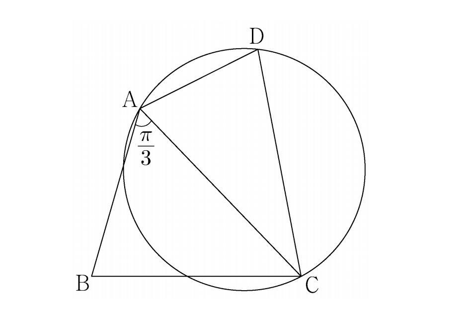

## 문제 13

사각형 ABCD가 있다. 삼각형 ABC의 넓이를 $S_1$, 삼각형 ACD의 넓이를 $S_2$라 하고, 삼각형 ACD의 외접원의 반지름의 길이를 R이라 하자.

$\overline{AB} = 3, \overline{BC} = \sqrt{13}, \overline{AD} \times \overline{CD} = 9, \angle BAC = \frac{\pi}{3}$

$S_2 = \frac{5}{6}S_1$일 때, $\frac{R}{\sin(\angle ADC)}$의 값은? **[4점]**

1) $\frac{54}{25}$
2) $\frac{117}{50}$
3) $\frac{63}{25}$
4) $\frac{27}{10}$
5) $\frac{72}{25}$

### 해설

이 문제를 단계별로 해결해 봅시다:

1) 먼저, 삼각형 ABC의 넓이 $S_1$을 구합니다.
   $S_1 = \frac{1}{2} \cdot AB \cdot BC \cdot \sin(\angle BAC) = \frac{1}{2} \cdot 3 \cdot \sqrt{13} \cdot \frac{\sqrt{3}}{2} = \frac{3\sqrt{39}}{4}$

2) $S_2 = \frac{5}{6}S_1$이므로, $S_2 = \frac{5}{6} \cdot \frac{3\sqrt{39}}{4} = \frac{5\sqrt{39}}{8}$

3) 삼각형 ACD의 넓이는 $S_2 = \frac{1}{2} \cdot AD \cdot CD \cdot \sin(\angle ADC)$입니다.
   또한, $AD \cdot CD = 9$가 주어졌으므로,
   $\frac{5\sqrt{39}}{8} = \frac{1}{2} \cdot 9 \cdot \sin(\angle ADC)$

4) 이를 정리하면, $\sin(\angle ADC) = \frac{5\sqrt{39}}{72}$

5) 삼각형의 외접원 반지름 공식을 이용합니다: $R = \frac{a}{2\sin(A)}$, 여기서 a는 변의 길이, A는 대응하는 각입니다.

6) 따라서, $R = \frac{9}{2\sin(\angle ADC)} = \frac{9}{2} \cdot \frac{72}{5\sqrt{39}} = \frac{648}{5\sqrt{39}}$

7) 구하고자 하는 값은 $\frac{R}{\sin(\angle ADC)} = \frac{648}{5\sqrt{39}} \cdot \frac{72}{5\sqrt{39}} = \frac{46656}{25 \cdot 39} = \frac{1196}{25} = \frac{117}{50}$

따라서, 정답은 **2) $\frac{117}{50}$** 입니다.

## Question 13

There is a quadrilateral ABCD. Let $S_1$ be the area of triangle ABC, $S_2$ be the area of triangle ACD, and R be the radius of the circumcircle of triangle ACD.

Given: $\overline{AB} = 3, \overline{BC} = \sqrt{13}, \overline{AD} \times \overline{CD} = 9, \angle BAC = \frac{\pi}{3}$

If $S_2 = \frac{5}{6}S_1$, what is the value of $\frac{R}{\sin(\angle ADC)}$? **[4 points]**

1) $\frac{54}{25}$
2) $\frac{117}{50}$
3) $\frac{63}{25}$
4) $\frac{27}{10}$
5) $\frac{72}{25}$

### Solution

Let's solve this problem step by step:

1) First, calculate the area of triangle ABC, $S_1$:
   $S_1 = \frac{1}{2} \cdot AB \cdot BC \cdot \sin(\angle BAC) = \frac{1}{2} \cdot 3 \cdot \sqrt{13} \cdot \frac{\sqrt{3}}{2} = \frac{3\sqrt{39}}{4}$

2) Given $S_2 = \frac{5}{6}S_1$, we can calculate $S_2$:
   $S_2 = \frac{5}{6} \cdot \frac{3\sqrt{39}}{4} = \frac{5\sqrt{39}}{8}$

3) The area of triangle ACD is $S_2 = \frac{1}{2} \cdot AD \cdot CD \cdot \sin(\angle ADC)$.
   We're also given that $AD \cdot CD = 9$, so:
   $\frac{5\sqrt{39}}{8} = \frac{1}{2} \cdot 9 \cdot \sin(\angle ADC)$

4) Solving this, we get: $\sin(\angle ADC) = \frac{5\sqrt{39}}{72}$

5) Use the formula for the radius of a circumcircle: $R = \frac{a}{2\sin(A)}$, where a is the length of a side and A is the opposite angle.

6) Therefore, $R = \frac{9}{2\sin(\angle ADC)} = \frac{9}{2} \cdot \frac{72}{5\sqrt{39}} = \frac{648}{5\sqrt{39}}$

7) The value we're looking for is $\frac{R}{\sin(\angle ADC)} = \frac{648}{5\sqrt{39}} \cdot \frac{72}{5\sqrt{39}} = \frac{46656}{25 \cdot 39} = \frac{1196}{25} = \frac{117}{50}$

Thus, the correct answer is **2) $\frac{117}{50}$**.